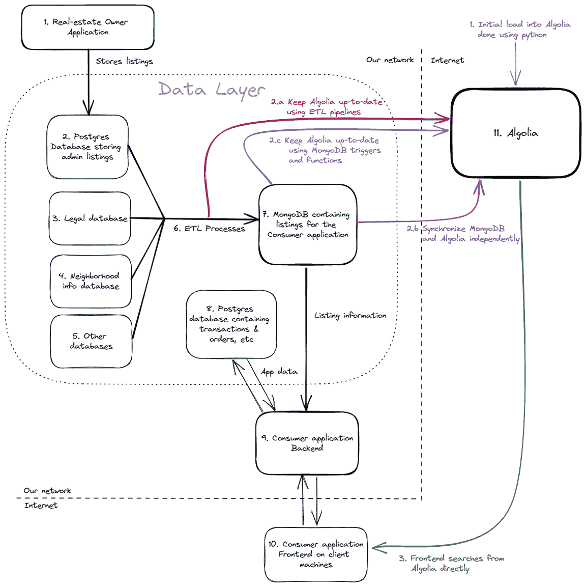

# Algolia+MongoDB–第 2 部分:建议的解决方案和设计

> 原文：<https://www.algolia.com/blog/engineering/supercharging-search-for-ecommerce-solutions-with-algolia-and-mongodb-proposed-solution-and-design/>

我们邀请 Starschema 的朋友写一个结合使用 Algolia 和 MongoDB 的例子。我们希望您喜欢这个由全栈工程师 Soma Osvay 撰写的四部分系列。

如果你想回顾或跳过，以下是其他链接:

[第 1 部分——用例、架构和当前挑战](https://www.algolia.com/blog/engineering/supercharging-search-for-ecommerce-solutions-with-algolia-and-mongodb-use-case-architecture-and-current-challenges/)

[第三部分——数据管道实施](https://www.algolia.com/blog/engineering/supercharging-search-for-ecommerce-solutions-with-algolia-and-mongodb-data-pipeline-implementation/)

[第 4 部分-前端实施和结论](https://www.algolia.com/blog/engineering/supercharging-search-for-ecommerce-solutions-with-algolia-and-mongodb-frontend-implementation-and-conclusion/)

* * *

当我们讨论将第三方索引系统集成到产品中的挑战时，我们的工程师立即提出了三个潜在的问题:

*   我们如何跨多个数据提供者维护数据完整性和数据就绪性？
*   我们如何确保我们的应用程序的性能不会因为引入第三方系统而受到影响？
*   我们如何在第三方系统上维护现有的安全和访问控制规则？

到目前为止，我们有一个**真实的单一来源**数据库(清单数据库),其中存储了所有的清单。当将 Algolia 引入生态系统时，我们必须优先保证它与数据库保持同步。这些系统之间的任何不一致都会对我们站点的 UX 产生严重影响。我们不希望最终出现搜索结果:

*   单击时抛出 404 未找到错误
*   列表本身不是最新的(即搜索结果包含不同的标题、描述等)
*   不会出现在现有的房地产列表中

所有这些情况都会导致**对我们的服务**失去信心，并可直接转化为**收入损失**。这是绝对必要的，我们都创建一个我们现有的数据集到 Algolia 的初始加载，并保持 Algolia 与该数据集中所有未来的变化保持同步。

我们的后端应用程序已经负荷过重。它使用 Kubernetes 进行水平扩展，但是我们希望避免由于服务器上的高流量而大幅增加运营成本。设计解决方案时，我们必须将尽可能多的流量转移到 Algolia。

我们还想确保我们不会损害应用程序的安全性和访问控制。目前，我们的应用程序不需要登录会话来查询列表，所以这并不重要，但如果有人登录了，那么能够使用 Algolia 存储用户的身份就很好了，这样就可以使用它来个性化搜索结果并完善我们的内部报告。

## 设计可能性

我们可以将其分解为三项任务:

1.  在 Algolia 中索引我们现有的所有列表数据。为此，我们将在 Jupyter 笔记本中创建一个 Python 脚本来开发数据加载逻辑。我们以后可以重用其中的一部分。如果你想知道我为什么在这里选择 Jupyter 笔记本，那是因为它允许快速迭代、部分执行和简单的评论系统。这在构建原型和进行代码评审时很有帮助。我将在本系列的第三篇文章中实现它。
2.  [定期更新 Algolia 指数](https://www.algolia.com/doc/guides/sending-and-managing-data/send-and-update-your-data/in-depth/the-different-synchronization-strategies/)任何列表变化。
3.  创建直接从前端搜索 Algolia 的能力，这样我们就不需要接触任何遗留的后端代码。

更新后的架构图如下所示:

让我们来看看在任务 2 中我们可以采取的不同途径的一些优点和缺点。以下是我们的一些选择:

*   **一个**。创建更多的 Python 脚本，作为我们现有 ETL 过程的一部分运行(已经将数据同步到 Mongo 中)。这可能是一个好的选择，因为 Algolia 索引与 MongoDB 数据同时更新，使它们保持同步。此外，它在我现有的 ETL 过程中作为一个单独的任务运行，因此它可以很容易地被监控和维护。另一方面，如果数据库加载任务成功，而 Algolia 任务失败，那么我们的数据集之间就会出现一些不一致。这可能需要手动校正，这给我们的团队带来了很大的负担。
*   **b** 。创建 Python 脚本，独立于我们的其他 ETL 工作流，将数据从 Mongo 同步到 Algolia。这让我们可以独立地维护和监控 Algolia，因为它会定期刷新基于 Mongo 数据库的数据。这可能会给数据平台团队带来额外的压力，因为它必须单独托管和维护。
*   **c** 。使用 [MongoDB 触发器](https://www.mongodb.com/docs/atlas/app-services/triggers/overview/)。这里的想法是，当在 MongoDB 中添加、删除或编辑记录时，它将通过数据库触发器触发调用 Algolia REST API 的函数，直接同步到 Algolia。这将根据在 MongoDB 中完成的操作自动更新我们的索引，而无需实现第三方解决方案。不过这个计划也不是没有缺点。MongoDB 操作可能需要很长时间来执行，因此性能可能会成为一个问题。触发器也可能失败，因此我们仍然必须在 MongoDB 接口中手动监控它们。

无论我们最终选择哪个选项，我们都将在本系列的第三篇文章中实现它。

最后，第四部分将着重于创建一个小型的基于 web 的前端来查询 Algolia 索引。我希望能够向我们的前端开发人员展示一个带有基本代码的工作解决方案，以便他们可以评估将其集成到我们现有的前端应用程序中所需的时间和精力。

## 数据集&用于实现的技术

为了保持实现简单，我将使用一个对 MongoDB 公开可用的数据集，它与我的生产数据相似。这背后有多种原因:

*   我希望我的脚本足够通用，将来可以用于我们的多个应用程序。从一开始就将它构建到脚本中的最佳方式是为我的最终数据集之外的东西设计和开发脚本。通过这种方式，我可以通过稍后对我的生产数据运行脚本来测试脚本的适应性。
*   我们也对这里的社区反馈感兴趣！我使用的是公共数据集，所以你可以尝试一下，告诉我们你的经历。
*   我们的 MongoDB 实例和所有 ETL 都在 VPN 后面，我坐在家里。由于我们的 VPN 很慢，我不希望在将数据从 Mongo 转移到 Algolia 时加载时间给我不切实际的性能计数器。

我决定使用 MongoDB 的官方[样本 AirBnB 列表数据集](https://www.mongodb.com/docs/atlas/sample-data/sample-airbnb/)，因为它相当接近我们现有的数据结构。我还将使用 [MongoDB Atlas](https://www.mongodb.com/atlas/database) 来托管我的样本数据库以及一个免费的 Algolia 帐户来存储记录。我可能已经是 Python 方面的专家了(这就是我们使用 Jupyter 笔记本的原因)，但我不熟悉 HTML、CSS 和 JavaScript 的前端语言，所以这将是一个测试 Algolia 的 SDK 是否像它们被认为的那样简单的好机会。

在本系列的第一篇文章中，我谈到了我们的用例、架构和我们面临的搜索挑战。

在本系列的第三篇文章中，我将实现数据摄取到 Algolia 中，并弄清楚如何保持数据最新。

在本系列的第四篇文章[中，我将实现一个示例前端，这样我们就可以从用户的角度评估产品，如果开发人员选择这个选项，就可以给他们一个先发制人的机会。](https://www.algolia.com/blog/engineering/supercharging-search-for-ecommerce-solutions-with-algolia-and-mongodb-frontend-implementation-and-conclusion/)