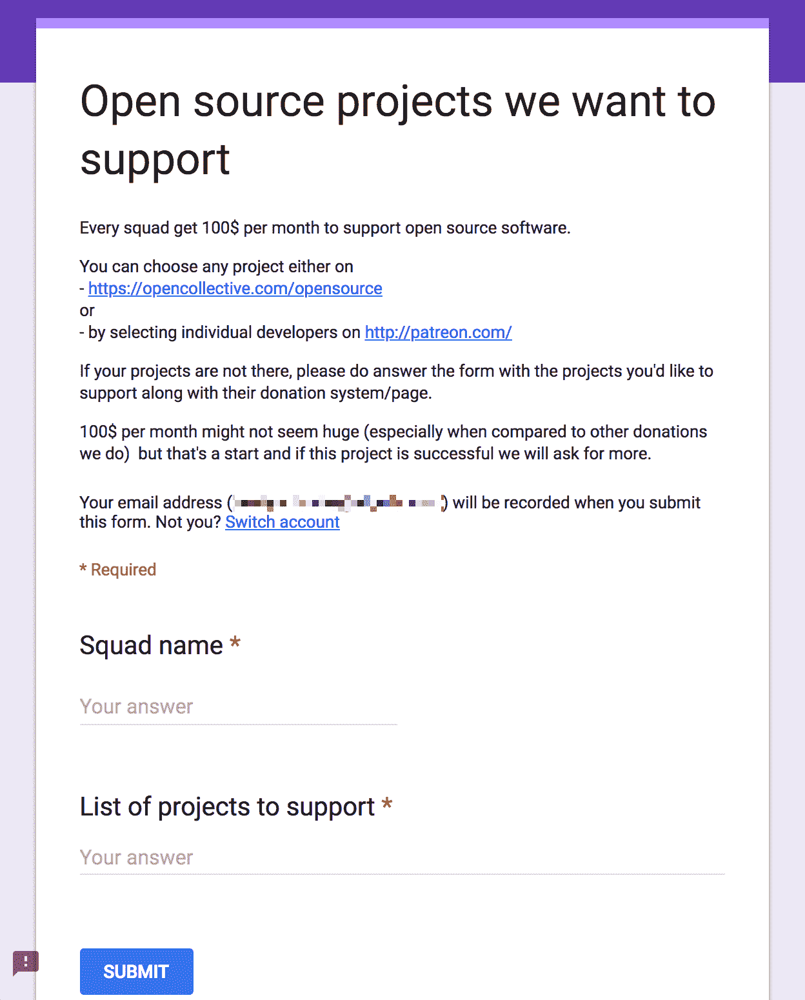
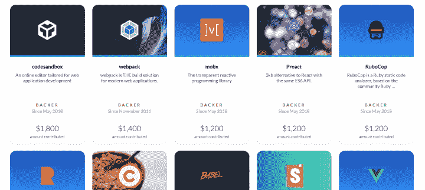

# 支持支持我们成功的开源软件- Algolia 博客

> 原文：<https://www.algolia.com/blog/algolia/supporting-open-source-projects/>

在 Algolia，我们中的许多人每天都在与开源项目合作，为其做出贡献，或者从中受益。我们都是关于帮助我们完成工作并正确完成工作的工具。

然而，我们用来在互联网上创造最快搜索体验的大部分软件并不是来自大型公司。它直接来自全世界才华横溢的开发人员的笔记本电脑，他们热衷于解决特定的问题，并与世界分享他们的解决方案。

许多开源项目仅仅由一小群开发人员保持活力和迭代，尽管他们的工作被许多其他开发人员用来创建令人敬畏的应用程序，但他们经常声称他们的努力没有报酬。

建立一个开源项目，并在 2018 年找到合适的采用水平，需要比以前更多的时间、考虑、规划和日常管理。幸运的是,“仅仅因为它是开源的并不意味着它是免费的”这种思维模式很好地适应了许多开发者和更大的公司。

像 [OpenCollective](https://opencollective.com/algolia) 这样的服务越来越多，这使得向你最喜欢或最常用的开源项目捐款变得非常容易，同时也让项目所有者了解到这些钱是如何使用的；非常透明，但也非常有用。

我们热爱我们的社区，并尽我们所能支持它；包括帮助开源项目，但是是时候进一步发展了。所以，我们想分享一下未来 12 个月我们将捐赠的项目。

首先，简单介绍一下我们是如何得出以下列表的。

这一切都始于这样一个建议:我们为 OSS 的贡献拿出一个月的预算，并在 13 个不同的团队之间进行分配([的微型团队](https://hashnode.com/post/what-does-the-engineering-culture-look-like-at-algolia-cj7vvp6xn02xcy2wtiq79enho)组成了 Algolia 这里的工程部)，让他们选择他们想要支持的项目。

一旦选票统计完毕，我们得出了一个在全公司广泛使用的 18 个项目的列表。一些项目收到了来自多个团队的投票，因此它们的权重更高，分配的金额也更大。

其他人则更具体，所以分配的金额更少，但只是为了让我们能够支持尽可能多的人，并且仍然为每个获得投票的项目提供一点财政支持，而不是在最大程度上推动更多的资金。

## 2018 年我们支持的开源项目

Babel–帮助确保我们的 JS 库向前和向后兼容。

[Preact](https://opencollective.com/preact)——在 [InstantSearch.js 的前端使用的更轻便、性能更高的 react 渲染库](https://community.algolia.com/instantsearch.js/)

[story book](https://opencollective.com/storybook)–允许您浏览组件库，查看每个组件的不同状态，并交互式开发和测试组件。也用于即时搜索网站。

[OpenStreetMap](https://www.openstreetmap.org)–这是我们获取 [Algolia Places](https://community.algolia.com/places/) 大部分数据的地方。

Cheerio——一个极好的库，使得在 NodeJS 中解析和抓取网站变得轻而易举。

[code sandbox](https://codesandbox.io/)——一个在线 IDE，具有令人敬畏的利基特性，如双向 GitHub 编辑功能。在整个公司广泛用于演示，但也通过[即时搜索模板](https://github.com/algolia/instantsearch-templates)得到支持。

因为良好的代码质量对于任何项目的健康都是非常重要的。这有助于我们的 Ruby 项目按照 Ruby 项目指南维护它们的代码标准。

[vue js](https://opencollective.com/vuejs)——我们都喜爱和珍惜的不可思议的前端库。

Scala——一种伟大的语言，由于它惊人的编译器，使我们能够简化开发过程。

[web pack](https://opencollective.com/webpack)–构建解决方案，将 JS 文件捆绑部署到任何运行 JavaScript 的设备上，从浏览器到服务器，再到桌面应用。如今，Algolia 没有一个 JavaScript 项目不使用 Webpack。

[Material ui](https://opencollective.com/material-ui)–一组强大的 React 组件，实现了谷歌材料设计规范中规定的设计标准。

Ruby Together——捐赠给这个网站，你会发现 RubyGems、Bundler 和 Ruby 社区中其他优秀共享工具的维护者。

[roll up](https://opencollective.com/rollup)–一个 JS 模块捆绑器，帮助你从原始源代码创建一个微小的有效载荷。

[Mobx](https://opencollective.com/mobx)——现代 JS 框架的状态管理库。

[Faker . js](https://opencollective.com/fakerjs)——伟大的测试需要伟大的测试数据，Faker 是确保您从其 30 多个位置和大量 API 端点的支持中获得您所需要的东西的最佳产品之一。

Pug–一种具有强大功能的模板语言，用 JavaScript 编写，设计用于 node.js 和浏览器。我们为所有组成 Algolia 社区的网站使用它。

[node mon](https://opencollective.com/nodemon)–监控源代码中的任何更改，并自动重启服务器。哦，我们用这个节省了多少时间！

[shields . io](https://opencollective.com/shields)——活在你身边的自述。我们使用 Shields 来识别所有我们自己的 oss 项目的构建状态、代码覆盖率、版本号等等。

我们不仅为这些项目提供支持，还为其他人奉献我们的时间。例如，我们想要支持的一些项目没有捐赠页面，并说，“我们更希望你花时间在问题和代码上，而不是捐钱”。

这是一个非常合理的要求，这正是我们要做的。通过与这些项目合作，并通过我们自己的 [DocSearch](https://www.algolia.com/blog/product/docsearch-150-sites-75k-searches-per-day/) 项目为许多其他人提供快速的文档搜索，Algolia 还为许多其他开发人员驱动的项目提供了专用的工程时间(这对任何公司来说都意味着金钱)。

我们非常期待 2019 年*将*加入[这个名单](https://opencollective.com/algolia#backer)。如果你现在正在向 OSS 项目捐款，或者只是想分享你自己的令人敬畏的工具列表，那么请随时在[推特](https://twitter.com/algolia)上联系我们，或者在我们的[讨论](https://discourse.algolia.com/)中，让我们知道它。