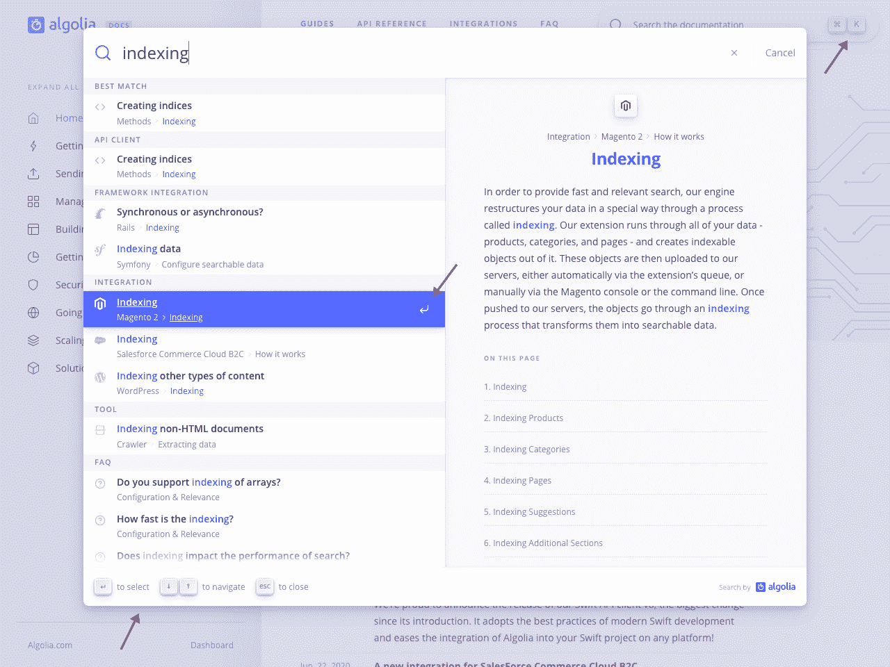
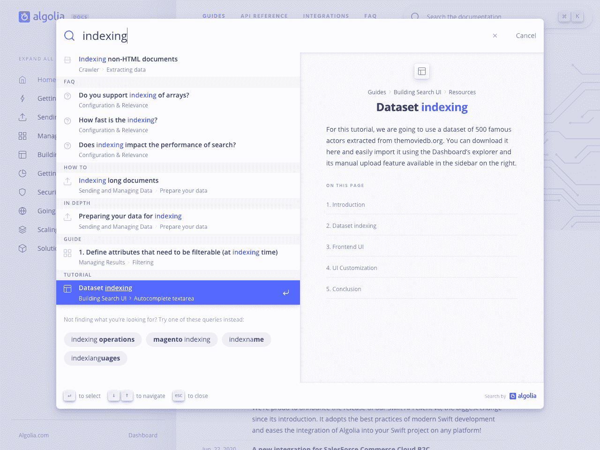
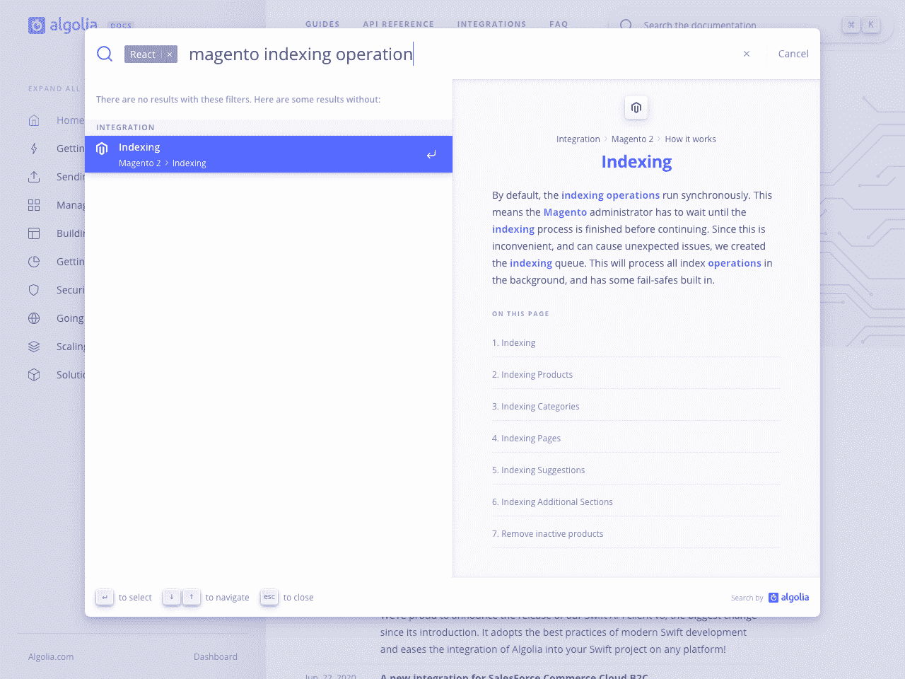
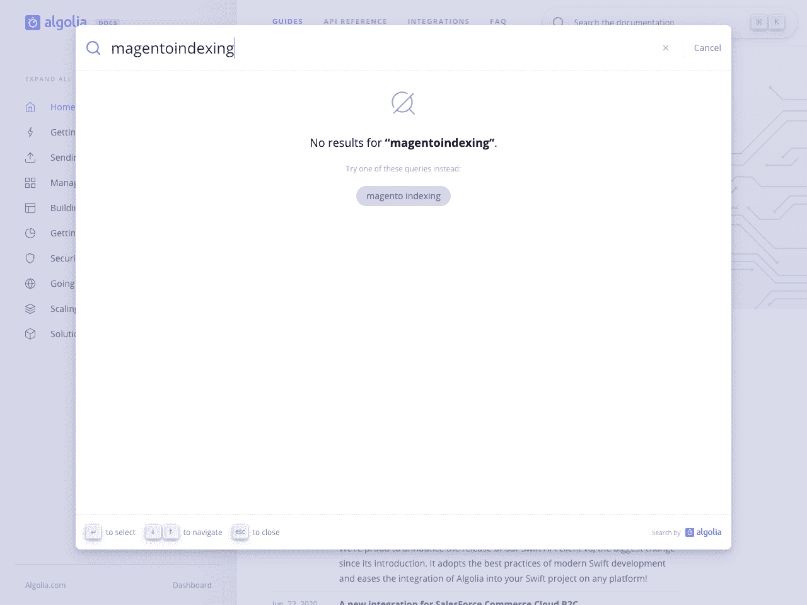
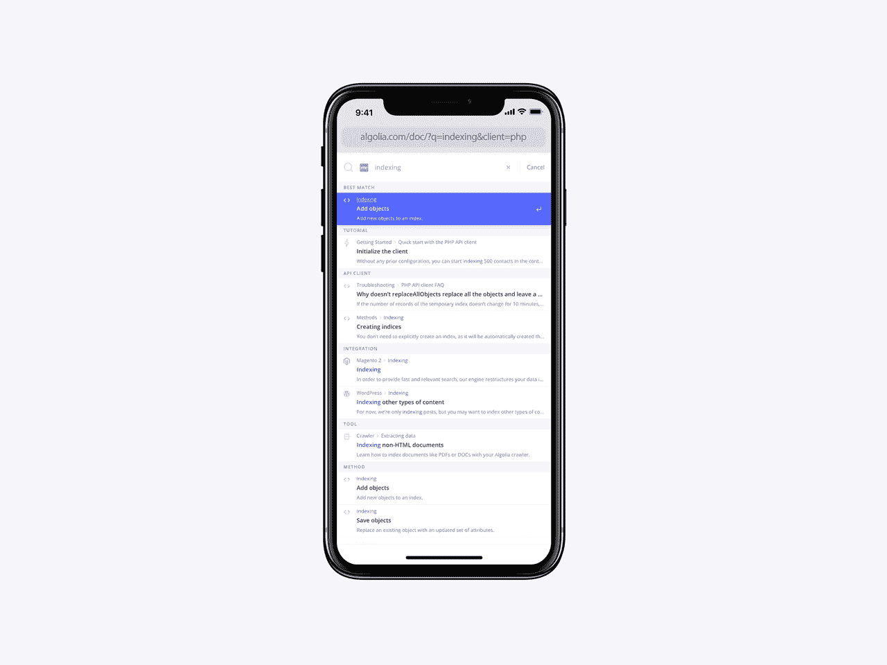
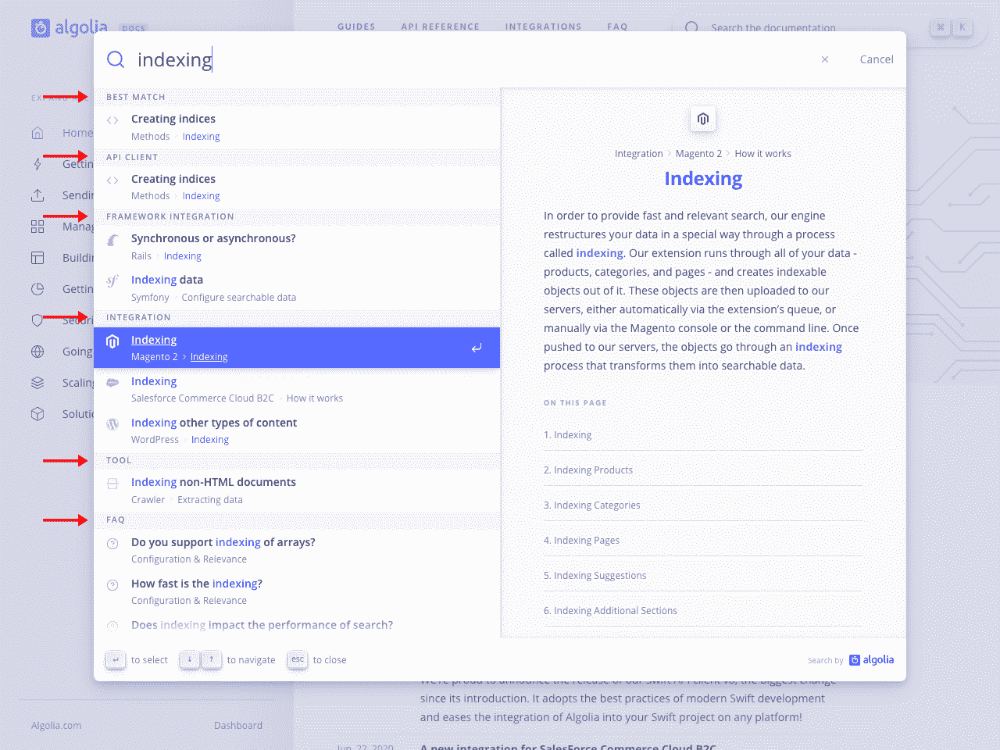
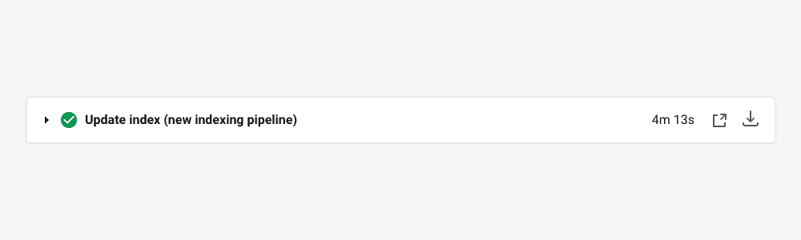

# 使用 Algolia 和自动完成功能将文档搜索提升到新的高度

> 原文：<https://www.algolia.com/blog/ux/taking-documentation-search-to-new-heights-with-algolia-and-autocomplete/>

这是精心研究的结果，旨在为我们的文档用户提供 Algolia 的最佳产品。

如果您在今天之前从未使用过 Algolia 文档搜索，我们会在滑动面板中提供搜索结果(见下图)。这种体验还不错，但是很传统；具有两组分页结果的选项卡式体验。

在相关方面，我们收到了几起投诉。现有的代码变得太复杂而无法修复。这些年来，它已经发展了很多，不再适合文档的当前状态。

在 Algolia，文档团队与 InstantSearch 和 DocSearch 团队紧密合作。通过合作和重用来自构建[自动完成 v1](https://autocomplete.algolia.com/) 和[文档搜索 v3](https://docsearch.algolia.com/) 的研究，我们能够走很多捷径。

我们在左侧显示结果列表，在右侧显示预览面板。这使您可以在决定是否要导航到相关资源之前发现更多关于搜索结果的信息。

### 一切触手可及

感谢 [Autocomplete v1](https://autocomplete.algolia.com/) ，我们现在提供了先进的自动完成体验，具有增强的可访问性和全键盘导航支持。

你几乎不需要使用鼠标。它使得优化查询的过程更加无缝。

You can virtually interact with every part of the search with your keyboard.

### 只有最好的结果

您可能会注意到搜索没有分页。这是故意的。**我们认为最好的结果应该总是出现在首页。让用户经历分页会让他们走上一条不太相关的结果的不令人满意的道路。**

相反，我们在结果列表的末尾提供了一组[查询建议](https://www.algolia.com/doc/guides/building-search-ui/ui-and-ux-patterns/query-suggestions/js/),让您细化查询并产生更好的结果。

Instead of endlessly scrolling through pages, you get to adjust your query to trigger better results.

### 敏捷过滤与快速过滤

在之前的经验中，我们自动应用了滤镜，但是是以一种不透明的方式。您不知道应用了哪些过滤器，其中一些取决于您的本地偏好。这使得该特性不可预测并且难以调试。

我们希望用户能够明确地选择过滤器，没有任何意外。我们经历了两次迭代，在收集反馈并观察人们使用它们之后，我们选择了快速过滤器。**我们建议您在键入时直接从搜索框中选择过滤器，并允许您应用或不应用它们。**您可以继续输入您的查询，并在不离开搜索框的情况下替换或删除过滤器。

Quick Filters trigger as you type to offer filters suggestions.

这是一个实验性的功能，我们渴望看到人们如何使用它。我们计划利用 Algolia 的[搜索方面值](https://www.algolia.com/doc/api-reference/api-methods/search-for-facet-values/)功能，通过提供更多允许输入错误的建议，进一步增强体验。

### 永远不会让你失望

当你登陆一个 404 页面，它却没有指引你去任何地方，这难道不令人沮丧吗？我们对无用的无结果页面也有同样的感觉。

我们不会因为你输入了“错误”的查询而惩罚你，而是通过让你知道什么是错的以及下一步该采取什么步骤来提供一种更友好和宽容的体验。每当您的过滤器没有返回给定查询的结果时，我们会立即执行另一个没有过滤器的搜索。这样，我们可以向您显示没有过滤器的匹配。

体验保持不变，我们所做的只是让你知道。

We display results even when filters get in the way.

如果即使没有过滤，搜索仍然没有结果，我们会提供[查询建议](https://www.algolia.com/doc/guides/building-search-ui/ui-and-ux-patterns/query-suggestions/js/),这样你就可以一直向前。

No results page with [Query Suggestions](https://www.algolia.com/doc/guides/building-search-ui/ui-and-ux-patterns/query-suggestions/js/) to adjust the query.

### 口袋搜索

我们重新设计和优化了平板电脑和移动体验，让您甚至可以通过手机轻松搜索。所有功能都适用于手机，包括快速过滤器。

预览面板在移动设备上毫无意义，因为你不能用键盘悬停或导航。因此，我们在搜索结果中将其替换为简短描述。

## 反思文档相关性

当你处理文档时，**你处理的是相互关联的信息片段**。这与电子商务体验有着本质的不同，在电子商务中，商品大多是独立的。

文档资源可以是系列的一部分，也可以是规范指南的附录。一个页面被分解成单个段落，以适应 Algolia 记录。当您在文档网站中搜索某个内容时，它会映射到一个搜索结果。然而，为了让你理解它，并决定在众多的点击中哪一个最有意义，你需要上下文。例如，当搜索“索引”时，您可能对索引您的数据感兴趣。然而，Algolia 没有办法知道此时你确切地在寻找什么:如何索引数据的指南、给定语言的 API 参考、定价问题等等。如果我们仅仅依靠 Algolia 的排名策略，我们将首先得到最相关的文本结果。这是一个好的开始，但还不够。

### 动态联合搜索

我们创建了一个动态联合搜索实验。我们依赖单一索引，在前端处理类别分组。没有空的或静态定位的类别，不缺乏类别之间的平衡。我们依靠 Algolia 强大的 API 在创纪录的时间内返回最佳匹配结果，并且我们用业务代码赋予它们更多的意义。

Results are categorized dynamically, to create context and help users scan them.

#### 它是如何工作的

当我们收到来自 Algolia 的点击时，我们认为它们都是相关的。我们做的第一件事是按照类型(集成、即时搜索小部件、常见问题等等)对它们进行分组。然后，我们为每个类别分配一个分数，以便在 UI 中对其进行排序。这有助于我们控制顺序，这样用户就可以期望某些类型的结果总是出现在同一个地方。指南通常在顶部，REST API 页面在底部。

我们依靠 Algolia 的第一个匹配来在顶部显示最佳匹配，但前提是分组命中的第一个结果不同。

由于我们不依赖于多索引搜索，我们无法控制每个组的点击率。这可能导致不平衡的结果，你会得到十个指南和两个 API 参考页面。这将无法呈现各种内容。因此，我们调整每组中显示的点击次数。如果在集成和小部件中有十个匹配，我们不会显示二十个匹配，因为这会隐藏第二个组并迫使用户滚动。取而代之的是，我们用总点击数除以组数来限定点击数。

当 Algolia 从单个类别返回命中结果时，该算法会显示所有命中结果，因为这可能是您正在寻找的内容类型。如果它从第二个类别返回命中，我们将每个组的命中上限设为一半。

到目前为止，这种分组和封顶逻辑创造了一种令人愉快的体验，感觉自然而透明。

**所有这些前端逻辑并不意味着我们无视 Algolia 的排名策略。**我们非常依赖 Algolia，我们提高了它在文档用例方面的排名。Algolia 返回我们知道相关的结果，所以我们有一个良好的基础开始。它还提供了一个“预先排名”,这是我们对大多数内容类型所依赖的。我们分配的许多分数是相等的，这意味着我们默认使用 Algolia 的排名来打破这些分数的平局。

## 增压索引管道

我们不能在不提及索引的情况下谈论新的搜索。这是我们重新设计的第一件东西，我们设法让它比以往更快。

### 各取所需

我们的一个难点是添加新的内容。根据页面类型的不同，我们索引数据的方式也不同。当您索引 FAQ 和 Crawler 参数时，您不会获得相同的信息。

我们的遗留索引管道是在文档中有如此多样的产品之前设计的，所以它没有针对这个用例进行优化。

新的索引管道使得添加新的内容类型变得轻而易举:**每种类型的内容都有自己的记录构建器**。如果我们需要记录一个新产品、库或集成，我们需要做的就是为它编写一个构建器。

Each content type has its own record builder.

### 这还能更快吗？

我们还通过同时生成多个记录来提高索引管道的性能。我们利用一种技术来确保所有的任务都完成了，而不需要等待所有的任务。这减轻了引擎的压力，也为我们节省了一些额外的时间。

为文档生成完整的索引需要 13 分钟以上的时间。有了新的管道，从 1，300 多页中提取数据、运行健全性检查以确保数据完整性，以及为 50，000 多条记录建立索引的时间减少到大约 4 分钟。这几乎是****的 4 倍快**。当我们只更新需要改变的记录时，索引甚至更快。在典型部署期间，增量重新索引现在只需不到 3 分钟。这让我们比以往更快地迭代和发布新内容。**

**

A full reindex with the new pipeline.

## 接下来是什么？

我们很高兴能够发布这一体验，我们认为这是打造同类最佳搜索体验的第一步，可以帮助和激励我们的用户。我们已经有了一些想法:

*   **🎙·阿尔戈利亚用[网络语音 API](https://developer.mozilla.org/en-US/docs/Web/API/Web_Speech_API) 回答&语音搜索支持**
*   💻**打开搜索支持**从浏览器的地址栏搜索 Algolia 文档

这让我们对发布[自动完成](https://autocomplete.algolia.com/)的 v1 充满信心，因为我们现在已经在几个高可见性的项目中使用了它。

我们也在努力将新的 Algolia 文档搜索的所有特性以插件的形式加入到[自动完成功能](https://autocomplete.algolia.com/)中。通过这种方式，您将能够使用基于 [DocSearch](https://docsearch.algolia.com/) 的文档站点或者直接使用库来创建类似的体验。敬请关注我们的[话语论坛](https://discourse.algolia.com/tag/autocomplete)！**