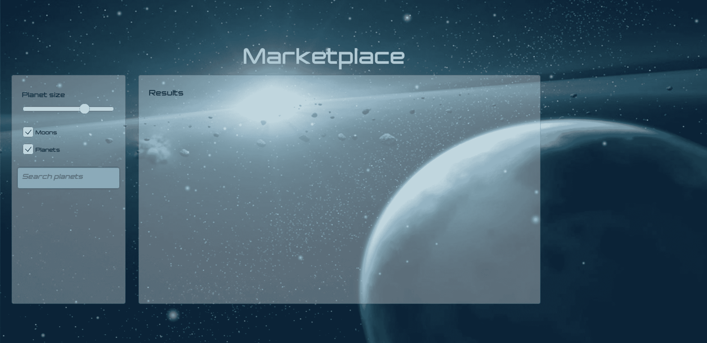
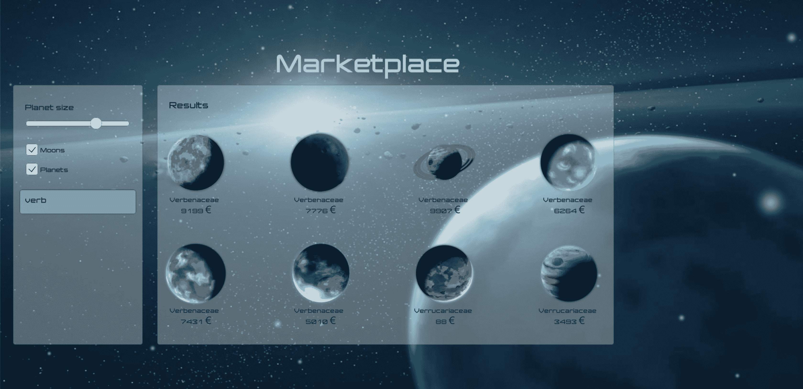

# 双引擎的故事-阿尔戈利亚和统一-阿尔戈利亚博客|阿尔戈利亚博客

> 原文：<https://www.algolia.com/blog/engineering/tale-two-engines-algolia-unity/>

游戏引擎里面的搜索引擎？ 这个想法是在阿尔戈利亚的一个非冲刺日之前形成的，这是一个阿尔戈利亚人尝试新概念的活动。

在之前的冲刺阶段，我的同事塞缪尔·博丁和我在想:阿尔戈利亚有一个 [。NET API 客户端](https://github.com/algolia/algoliasearch-client-csharp) 和[Unity](https://unity3d.com/)都支持 C#作为脚本语言——为什么不试着把它们结合在一起呢？

我们的想法是在一个 Unity 游戏场景中实现“随你搜”的体验。我们决定创建一个 **市场** ，一个在游戏中搜索的常见用例。

结果？成功。除了一个小的性能挑战，这是通过切换到异步模式解决的，在一天结束时，我们在 Unity 中有一个全功能的 Algolia 搜索，包括游戏资产和图像的索引，以及完整的搜索和结果 UI。让我们看看这是怎么做到的！

# [](#using-algolia-with-unity-getting-started)用阿洛与阿洛合一。入门！

团结不支持。NET 包管理器 NuGet。要解决这个问题，你必须直接在[【nuget.org】](https://www.nuget.org/)上下载 [Algolia 库](https://www.nuget.org/packages/Algolia.Search/) 的 zip 包，然后解压你的 Unity 项目的*Assets/Plugins*文件夹中的内容。

在这一步之后，您必须在 C#脚本中添加 `using Algolia.Search.Clients;` 语句，才能开始使用 Algolia with Unity。

既然我们已经把 Algolia 接入了 Unity，下一步就是创建游戏场景。

## [](#finding-assets)寻找资产

我们的第一个任务是找到游戏资产和一个数据集来设计我们的游戏场景。

我们从 Unity 找到了这个 [优秀的入门套件](https://assetstore.unity.com/packages/essentials/unity-samples-ui-25468) ，并把它作为我们实验的基础。好的一面是，它包含了许多 UI 元素——我们只需要重用它们来创建市场场景，并添加一个菜单来访问它！

## [](#creating-a-dataset-of-planets)创建行星数据集

在深入研究游戏设计之前，我们必须创建一个数据集。由于科幻小说是资产的主题，我们决定创建一个由行星组成的数据集。我们用强大的数据集生成器[Mockaroo](https://mockaroo.com/)创造了一千个假行星。我们接着用 [CC 图像](https://opengameart.org/content/17-planet-sprites) 来说明数据集。一旦完成，我们就准备好出发了！如果你想重用这些数据，你可以在[GitHub](https://github.com/algolia/unity-example/blob/master/src/Assets/Resources/planets.json)上找到。

# [](#crafting-the-marketplace)神石市场

最后也是最具挑战性的一步是为市场创建游戏场景。我们希望它简单:它将由一个搜索栏和一个显示结果的面板组成。为了实现这一点，我们从初学者工具包中取出 *控件* 场景并对其进行定制。结果——行星面板——看起来像这样:



搭建好场景后，需要做一点工作来使它生动起来。我们需要编写一些 C#来把空盒子变成行星。

## [](#scripting-the-as-you-type-search)为随键入搜索编写脚本

在向 Algolia 发送请求之前，我们需要捕捉用户的每一次击键。为了实现这一点，我们给 *InputField 附加了一个 C#脚本，以*catch*ValueChangeCheck()*event*。* 一切正常，我们能够检索输入的击键！用检索到的字符串向 Algolia 发出请求非常简单:

```
var results = await _searchIndex.SearchAsync(new Query(SearchInput.text)
{
    HitsPerPage = 8,
});
```

*注意:我们已经在**Start()**方法中实例化了**AlgoliaClient*和**Index**对象，以避免为每个请求创建一个客户端。**

我们让搜索工作起来，Algolia 的 C# API 返回了一个行星列表(*List<Planet>*)*)。* 现在我们不得不展示它们。我们必须创建 *游戏对象。*

我们编写了`void LoadResults(List<planets>)` 方法，该方法从 *列表<>*中创建游戏对象。你可以在[GitHub](https://github.com/algolia/unity-example)上找到源代码。这里我们只指出几个部分。简而言之，该方法在行星上循环以创建游戏对象，每个行星一个。

完美。



不，不完美。还没有:行星的显示太慢，图像刷新不稳定。

## [](#asynchronicity)不同步

我们的第一个想法是为每个星球创建两个游戏对象:一个*raw image*和一个 *Text，* ，然后做一些计算来确定它们在场景中的位置。搜索体验还可以，但是有点滞后。

所以我们对此进行了调查，发现了我们展示行星方式的一个缺陷。我们同步加载行星的纹理，这使得它看起来很慢。让搜索体验更加流畅的解决方案是异步加载行星的纹理。为了实现这一点，我们使用了来自 Unity 中的`Resources.LoadAsync<Texture2D>` 方法 *LoadTexture*

```
IEnumerator LoadTexture(RawImage image, Planet planet)
{
    var resourceRequest = Resources.LoadAsync<Texture2D>($"{planet.Path}"); ;
    while (!resourceRequest.isDone)
    {
        yield return 0;
    }

    image.texture = resourceRequest.asset as Texture2D;
    image.color = Color.white;
}
```

你可以在下面的视频中看到不同:

[https://www.youtube.com/embed/qHtWuM6E-8s?feature=oembed](https://www.youtube.com/embed/qHtWuM6E-8s?feature=oembed)

视频

完美！但是没有完成。虽然搜索体验对于我们的 POC 来说已经足够快了，但是我们还没有从主菜单中加载场景。

## [](#loading-the-scene-from-the-main-menu)从主菜单中加载场景

为了结束这个循环，我们在主菜单中创建了一个按钮来访问市场。我们附加了一个*LoadSceneOnClick*脚本到这个按钮的 `OnClick()` 事件上。顾名思义，这个脚本在按钮被点击后加载一个场景及其索引:

```
public class LoadSceneOnClick : MonoBehaviour
{
    public void LoadByIndex(int sceneIndex)
    {
        SceneManager.LoadScene(sceneIndex);
    }
}
```

我们现在已经准备好了所有的部分，让我们看看结果吧！

[https://www.youtube.com/embed/xALmioNiwS0?feature=oembed](https://www.youtube.com/embed/xALmioNiwS0?feature=oembed)

视频

# [](#are-we-done)我们完成了吗？

一天之内，我们用 Algolia 的 C# API 客户端创建了一个简单的搜索市场。我们还没完！一个有趣的方向是尝试与其他游戏引擎相同；例如，另一个项目将重现这种与[CryEngine](https://www.cryengine.com/)的集成，它也支持 C#作为脚本语言！

但真正的下一步是将 Algolia 的所有功能添加到解决方案中。我们仍然有很多可能性可以探索:在 MMO 游戏的库存中创建一个搜索，为搜索服务器添加一个 UI，添加方面和过滤，深化数据集，添加分析和个性化等等。本质上，随着你的游戏越来越复杂，你的市场，以及 Unity 中任何基于搜索的功能，都需要跟着做。祝游戏愉快！

与塞缪尔·博丁合作撰写。