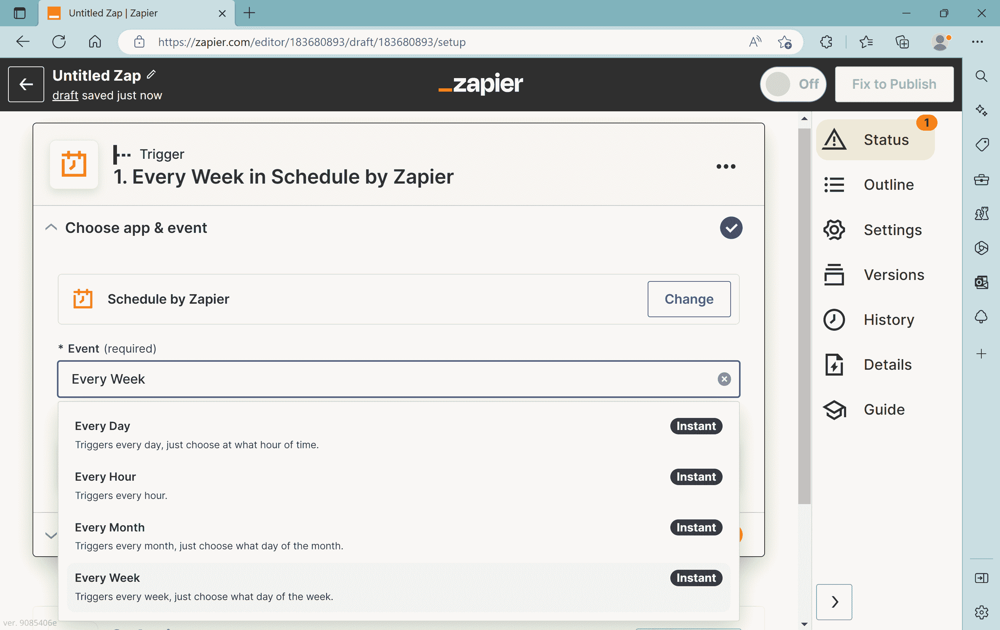
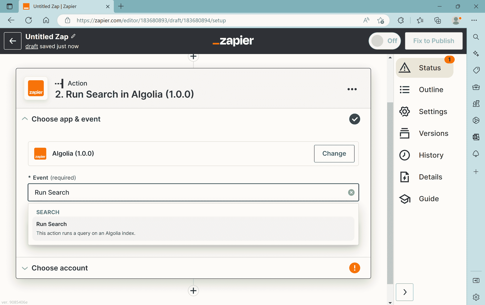
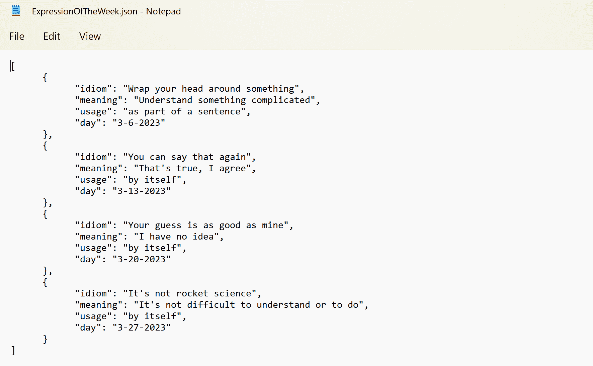
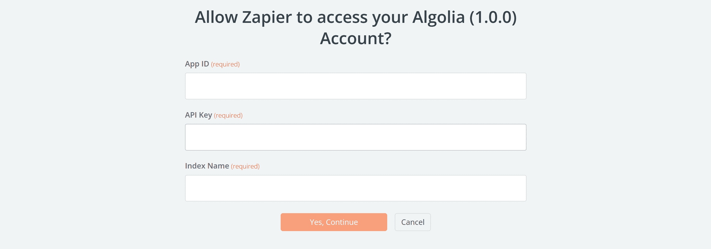
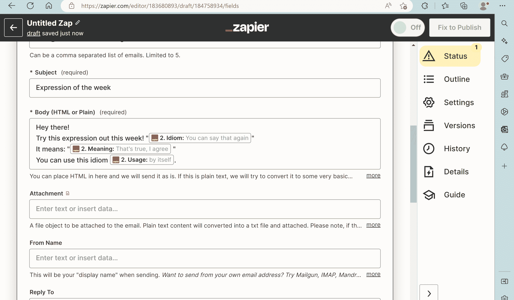
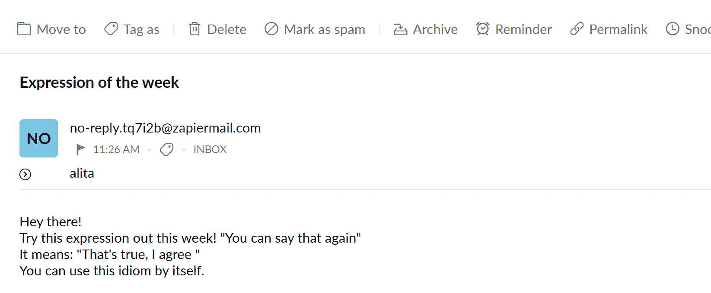
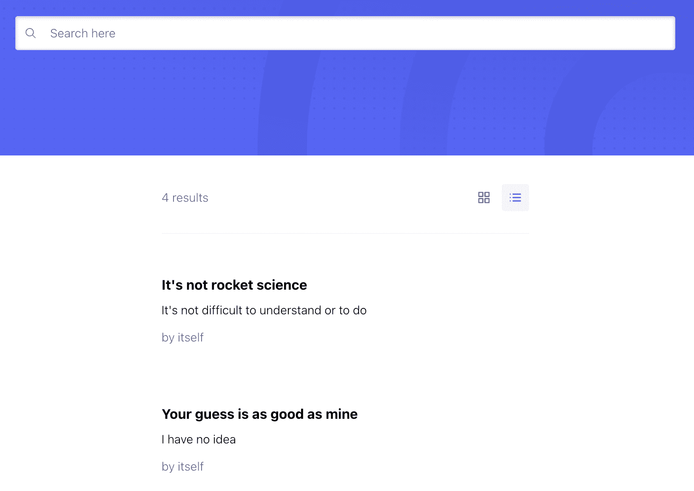

# 用 Zapier 和 Algolia 教英语

> 原文：<https://www.algolia.com/blog/engineering/teaching-english-with-zapier-and-algolia/>

在美国，3 月 11 日是国家无代码日，以鼓励更多的人在网上无代码地创建东西。为了庆祝这一天，我们邀请英语教师 Alita Leite de Silva(她不是开发人员)使用 Algolia 的 API 优先搜索工具和 Zapier 自动化平台创建一些很酷的东西。下面是阿丽塔来解释她建造了什么。

应用无处不在！有银行、组织、甚至只是发送提醒给植物浇水的应用程序。它们如此普遍，以至于像我这样的小企业现在甚至制作自己的应用程序，向客户发送重复的电子邮件或短信——毕竟，这是与客户保持联系并继续创造新业务的轻松有效的方式。

这不需要什么技巧。相信我；我一点也不懂技术！作为一名英语老师，我花很多时间发作业邮件，实际上几乎没人打开这些邮件…😒哦，教学的美妙之处。无论如何，我想也许我可以自动化这个过程，给我的学生发一封定期的电子邮件，让他们每周练习一个新的英语表达，而不用我自己浪费时间发这些邮件。然后，我们可以有一个简单的、可搜索的页面，上面有这些电子邮件中的所有英语表达，供学生参考。问题是，除了知道如何打开和关闭电脑，我没有一点发展技能；使用我教学需要的程序，如谷歌表单、文档和幻灯片；我可以发电子邮件和下载作业文件。

我还是不知道什么是代码。但我还是踏上了这段旅程，事实证明，这比看起来容易多了！还有**如果我能做到，你也能！**最简单的形式是这样的:

## [](#configure-a-no-code-platform-like-zapier)配置一个像 Zapier 这样的无代码平台

1.  找到一个工具来完成整个过程，而不需要编写任何代码。我发现扎皮尔在这里非常有帮助。如果你想跟进，你需要注册一个帐户并创建一个新的 Zap。
2.  选择一个“触发器”，基本上就是会启动整个过程的 app。我选择了 Zapier 的 Schedule，因为我希望我的“每周表达”邮件每周发送一次。
3.  现在我们需要找到一个工具来存储我们的信息，一个与 Zapier 一起工作的工具。为此，我选择了 Algolia。那边的一个朋友最近向我展示了他们正在建造一个 Algolia/Zapier 连接器，他给了我一个早期版本。如果你也想摆弄它，[你可以在这里进入](https://zapier.com/developer/public-invite/177691/fb0010adb49259e99c74297f077db281/)。
4.  之后，你需要在 Zapier 中选择一个“动作”，这是一个存储你的信息并在被触发时发送出去的应用程序。如果您点击了上面的链接并完成了整个过程，您应该可以在这里选择 Algolia。
    

## [](#add-your-algolia-data-source)添加您的 Algolia 数据源

接下来，我们需要构建我们的数据。Algolia 将让我们用一个 **JSON 文件**填充我们的数据库，这是一种我以前从未听说过的格式。**它是这样工作的:**

1.  首先，找一个地方写你的文件。一个很好的选择是微软记事本。不要使用任何带有格式选项的东西，比如 Word 或 Google Docs。
2.  整个文件将被放在方括号中。`[`是文件的开头，`]`是结尾。
3.  在方括号内，我们将列出几个`objects`，每一个代表学生将会收到的一个英语表达。对象以花括号开始和结束:`{}`。每个对象之间需要一个逗号。
4.  一定要让 JSON 有条理，间距适当，这样你就可以方便地阅读和添加。
5.  对象中的每一行都是一个标签(在引号中)，一个冒号，然后是该标签在引号中的值。我的开发人员朋友说，让标签以小写字母开头是一种习惯，通过大写接下来单词的第一个字母来替换所有空格。所以标签可能是`expressionOfTheWeek`，而不是`Expression Of The Week`。你还需要在一个对象中的每一行之间加一个逗号，这样除了最后一行之外，对象中的所有行都将以逗号结尾。JSON 描述一个人可能是这样的:

    ```
    {
     "firstName": "Jane",
     "lastName": "Doe"
 }
    ```

6.  在我的例子中，我希望 Algolia 和 Zapier 知道哪一天将哪些信息发送给我的学生，所以我在 JSON 文件中的所有对象上都有一个`day`标签，它们的值就是我希望这些表达式发出的日期。出于测试目的，最好在制作应用程序的当天发送一个对象。让我给你看看我的 JSON 是什么样子的:
    
7.  将此保存为`.json`文件。你正在使用的应用程序可能会让你先将其保存为`.txt`，但你也可以稍后在屏幕上用你所有的计算机文件对其进行重命名。确保文件的类型为“JSON 文件”。
8.  回到阿尔戈利亚。一旦你[注册了一个账户](https://www.algolia.com/users/sign_up)，它会带你完成创建应用程序和索引的过程。一旦它让你上传数据，就把我们做的 JSON 文件给它。
9.  在 Algolia 索引中，我必须添加`day`作为 faceting 的属性，这基本上意味着我将能够向 Algolia 发送一条指令，将所有搜索结果过滤为我选择的那一天的结果。这是在配置>刻面> `attributesForFaceting`下。
10.  回到 Zapier，在 Algolia connector 应用程序的选择帐户下拉菜单下，我们可以给它我们的 Algolia 凭据。
11.  现在我们的 JSON 文件已经完成，并且在正确的位置，让 Zapier 在 Algolia 运行一个测试搜索。如果您今天有一个可用的结果，Zapier 应该把它拉进来，并识别我们之前在 JSON 文件中设置的标签。
12.  接下来，你只需要设置你的电子邮件信息。在“正文”下，你可以写电子邮件并插入来自 Algolia 的信息，方法是在你开始输入时显示的下拉菜单中点击“在 Algolia 中运行搜索”。设置 Algolia 标签在句子中的显示方式，如下图所示。我们在正文框中写的内容将与电子邮件中显示的内容完全一致，因此请确保您的标点和语法正确无误🙂

## [](#putting-it-all-together)把这一切联系在一起

我们完事了。现在，通过将它发送给自己来测试一下，看看它在我们的收件箱中是什么样子！我的看起来像这样:



Zapier 将根据您的意愿随时发送这些短信或电子邮件(通过 Zapier 订阅，因为我们使用的不仅仅是免费功能)。

Algolia 的主要用途是，一旦你建立了索引，他们就会提供所有必要的工具，让你的用户(或你的应用程序，无论它如何工作)搜索这些数据。在索引中的 UI Demos 选项卡下有一个选项，可以实际制作一个页面的原型，您可以在其中搜索索引中的信息，这个页面足够好，我可以发送给我的学生，这样他们就可以自动看到所有的表达式并搜索它们，而不必查看他们的电子邮件。这是[一个干净、简单的显示器](https://www.algolia.com/interface-demos/f8cd4707-882b-466a-8ea4-30bb76f74b20):



我在经验如此之少的情况下就能做到这一点，这难道不疯狂吗？这表明我投入的几个小时(尽管这可能比大多数专业开发人员花费的时间要长一点)是值得的。毕竟技术在不断进步，时间也越来越宝贵，所以学习如何入门自动化是极其有价值的。感谢 Algolia 的同事给了我一些建议，这样我就可以专注于为我的客户提供高质量的服务，而不是手动发送重复的电子邮件。我期待着看到我的学生在工作中更加自信地使用日常英语表达，这都要归功于这样的自动化。

所以，如果你像我一样不是开发人员，不要害怕 Algolia 这样的工具，因为它们是为编码友好而设计的。通过使用像 Zapier 这样的低代码组织工具，你仍然可以自动化你的业务，并且只需要很少的时间投入就可以把时间花在更重要的事情上。那种力量就在我们(非编码)的指尖！所以为什么不试一试呢！如果你需要任何帮助，阿尔戈利亚的人会像他们和我在一起一样，很乐意为你指明正确的方向😉