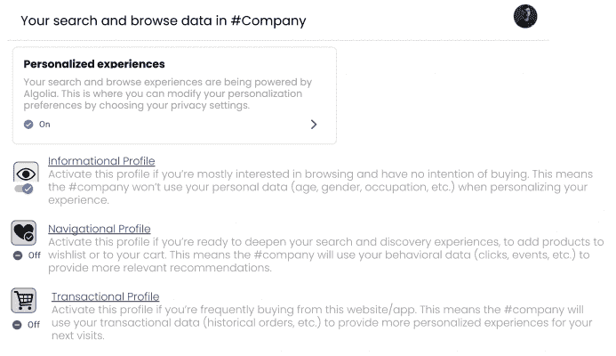
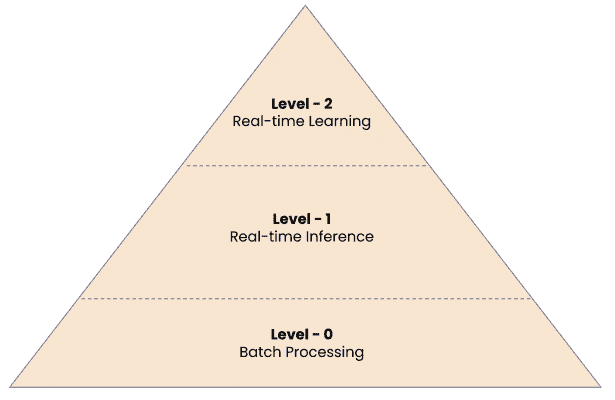
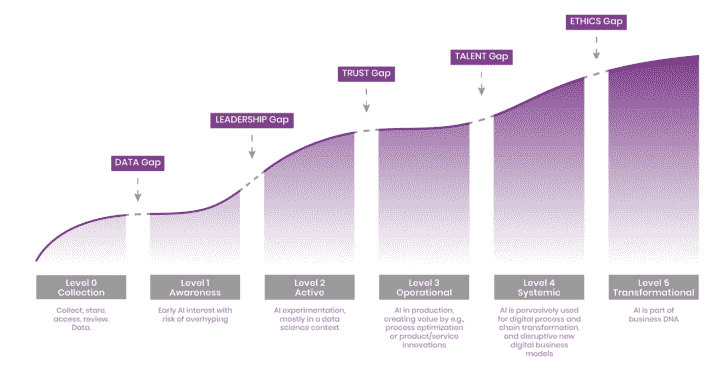
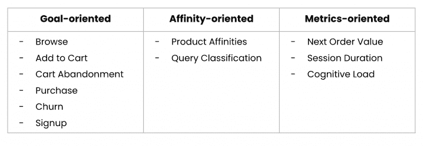
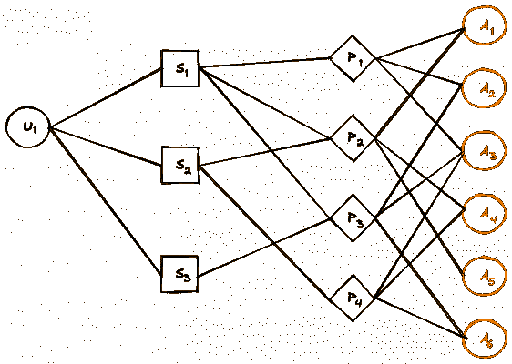
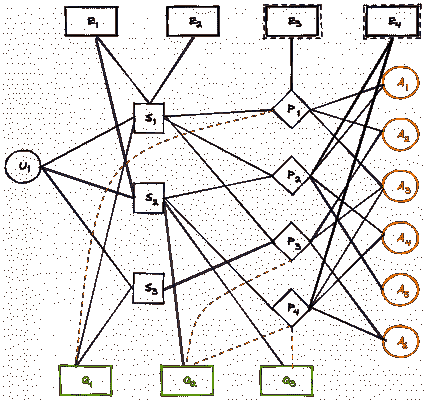
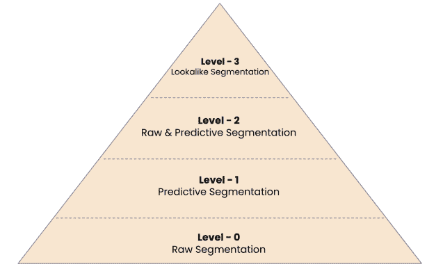
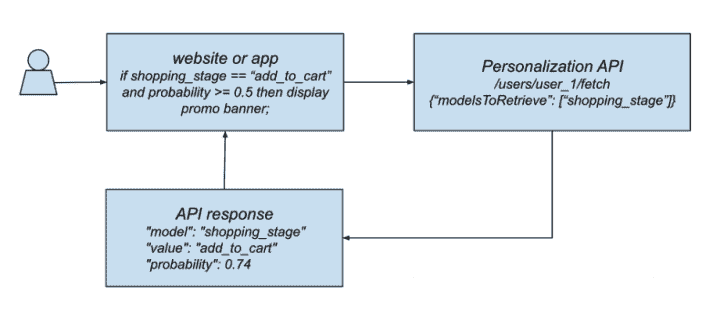

# 个性化引擎的 7 个功能障碍

> 原文：<https://www.algolia.com/blog/ai/the-7-dysfunctions-of-personalization-engines/>

你是如何看待个性化的？

在过去的几个月里，我就是这样开始与大多数客户交谈的。我仍在做这件事，因为理解客户对个性化的各种观点对我来说很有吸引力。从通过将{first name}添加到电子邮件主题来实现个性化，到根据人口统计数据手动分类用户并向他们展示定制内容，或者在电子商务网站的产品详情页面上添加“最近查看”的小部件，个性化这一广泛主题下的大量实践令人震惊。

是的，推荐引擎和更复杂的基于人工智能的个性化策略被认为是解决可扩展性的一种方法。但这些技术绝不是什么新东西。[早在 2018 年，Gartner 就发布了第一份关于个性化引擎](https://www.gartner.com/en/documents/3987480)的魔力象限报告，甚至在此之前很久，2003 年，由当时的亚马逊研究人员 Greg Linden、Brent Smith 和 Jeremy York 发表了一篇名为“[Amazon.com 推荐:单品到单品协同过滤](https://ieeexplore.ieee.org/document/1167344)”的论文。

然而，个性化仍然是客户体验的整个圣杯，制造了挫折，也助长了关于隐藏在个性化引擎领域深处的按钮、复选框或开关的神话，这些会自动神奇地导致人工智能霸主为所有人设计理想的体验。正如 Gartner 在 2019 年发现的那样，这种扭曲的观点正导致大多数营销人员放弃他们的个性化努力。

让我们务实一点。

个性化不是一个勾选框练习，而是一项复杂的任务，一个维恩图代表了三个需要回答的问题:

*   我们为什么要做个性化？
*   我们在建造什么？
*   我们如何建造它？

如果是这样的话，很明显个性化不再是营销的同义词，就像在个性化早期被认为的那样。相反，它需要产品思维，需要业务团队、产品经理和工程团队之间的密切合作，以解决与个性化相关的问题。

在与客户(尤其是电子商务行业的客户)进行了多次对话和反馈会议后，我成功地将广泛而复杂的个性化主题分解为 7 个子问题:

1.  [不尊重用户隐私](#privacy-friendly)
2.  [冷启动问题//不支持实时](#realtime)
3.  [不支持用户身份一致性](#useridentity)
4.  [难以准确预测用户意图&细分市场(针对首次访问者或回头客)](#userintents)
5.  [在编排更复杂的个性化体验方面缺乏灵活性](#composable)
6.  [在模型指标和业务指标方面不透明](#transparency)
7.  [使用方式不道德](#ethics)

我建议我们深入分析个性化引擎的 7 个功能障碍及其潜在的解决方案。到本文结束时，你将更好地理解和应用适合你自己的"*项目个性化*"的正确策略。顺便说一下，如果你想看同一主题的视频，我推荐 DevCon 上的这个演示，因为它代表了本文的基础。

## [](#1-not-respecting-user-privacy-or-the-privacy-friendly-flaw)1。不尊重用户隐私或隐私友好的缺陷

[83%的最终用户期望](https://www.3ds.com/newsroom/press-releases/ces-2020-survey-cite-research-dassault-systemes-consumers-want-personalized-products-wont-wait-them-and-expect-cost-benefit-their-data)在瞬间和数小时内实现个性化，但同时，高达 [80%的消费者对公司关于其在线数据的安全和隐私做法非常敏感](https://www.mckinsey.com/business-functions/risk-and-resilience/our-insights/the-consumer-data-opportunity-and-the-privacy-imperative)。

起初，这似乎是一个悖论:个性化用户体验，同时保护他们的数据隐私？如果确实是这样，该如何解决？

一个建议是通过允许用户选择加入和退出，并决定在什么条件下可以使用他们的用户数据简档，使个性化引擎具有隐私意识。用户可以“激活”,甚至是部分激活他们认为适合他们所处阶段的个性化级别所必需的数据。最终用户可能有权访问如下所示的隐私设置页面:



请注意信息、导航和事务配置文件。在幕后，我们可能有这些用户配置文件的以下 JSON 表示:

```
[{
  "user": "user-123",
  "informational-profile": {
    "properties": {
      "raw": {
        "device": "mobile",
        "sessionCount": 12,
        "timeOnSite": "02:03:10",
        "browser": "chrome",
        "pageviews": 32,
        "avgSessionDuration": 102,
        "lastVisit": "2022-09-11T10:12:37Z"
      }
    }
  }
},
{
  "user": "user-123",
  "navigational-profile": {
    "products": {
      "value": [
        {
          "name": "Jirgi Half-Zip T-Shirt",
          "objectID": "D05927-8161-111",
          "url": "men/t-shirts/d05927-8161-111"
        },
        {
          "name": "Boys T-Shirt",
          "objectID": "D12461-8136-211",
          "url": "boys/t-shirts/d12461-8136-21"
        },
        {
          "name": "Men shorts",
          "objectID": "D12345-5678-910",
          "url": "men/shorts/d12345-5678-910"
        }
      ],
      "lastUpdatedAt": "2021-07-11T07:07:00Z"
    }
  }
},
{
  "user": "user-123",
  "commercial-profile": {
    "orders": {
      "value": [
        {
          "total": 159,
          "products": {
            "value": [
              {
                "name": "T-Shirts",
                "objectID": "D05927-8161-111",
                "size": "L",
                "quantity": 1,
                "price": 99.00
              },
              {
                "name": "Hats",
                "objectID": "D12461-8136-211",
                "size": "M",
                "quantity": 1,
                "price": 15.00
              },
              {
                "name": "Shorts",
                "objectID": "D12345-5678-910",
                "url": "men/shorts/d12345-5678-910",
                "size": "L",
                "quantity": 1,
                "price": 45.00
              }
            ]          
          }
        }
      ],
      "lastUpdatedAt": "2021-07-12T10:03:37Z"
    }
  }
}]

```

## [](#2-no-real-time-support-or-the-cold-start-problem)2。没有实时支持或冷启动问题

理想情况下，你会希望你的个性化引擎包括:(1)实时(在线)预测和(2)实时(持续)学习。因此，就实时就绪性而言，可能有 3 个级别:

*   **0 级:批量处理**。预测每天生成一次(甚至更频繁)，并保存到数据库中。当发出 API 请求时，将提供预先生成的&保存的预测。
*   **一级:在线/实时推理能力**。当发出 API 请求时，在数据库中生成&保存(甚至缓存预测)的机制。
*   **第二级:实时学习。**除了推理是实时的，ML 模型也以连续的方式更新。



实时对预测质量的影响因用户类型而异:

*   对于第一次访问 T2 的人来说，基于会话的预测是必不可少的。实时个性化引擎将为在持续时间和正在发送的事件方面具有丰富会话的用户生成更好的预测。
*   对于产生多个会话的**回头客**或未认证用户，实时个性化引擎将能够更准确地预测他们的偏好。
*   最后，**认证用户**不仅允许我们在多种设备上协调用户身份，还使个性化引擎在展现用户意图时发挥最佳性能。

## [](#3-poor-data-quality-or-user-identity-inconsistency)3。数据质量差或用户身份不一致

数据是公司拥有的利用率最低的资产之一。它有各种大小和形状，有结构的也有无结构的。但在个性化系统的背景下，我们主要指的是以用户为中心的数据:行为、事件、点击流——这是建立集中式用户档案所需要的，其他产品和服务可以利用该档案来个性化用户体验。

根据我们在 Gartner 人工智能成熟度模型中所处的位置，我们必须考虑几个关键方面:



人们似乎期望新用户应该拥有与老用户相同的(个性化)体验，而实际上新用户几乎没有数据。显然，这是不可能的，经典的解决方案是采用混合方法:1)以内容为中心的方法，让用户第一次登陆你的网站，然后 2)一旦你对用户有了更多的了解，就把它改为以用户为中心的方法。

*   **用户身份对账**

为了阐明“用户资料”的含义，我们需要了解不同类型的用户标识符:

*   *   会话 ID =为单个会话创建的唯一标识符。
    *   设备 ID =基于浏览器或基于移动应用的唯一匿名网站或移动应用用户的标识符。这是谷歌分析用来区分网站访问者的默认标识符。
    *   用户 ID =自定义生成的 ID，用于不同设备之间的会话统一，在用户进行身份验证时设置。

一个高性能的个性化引擎应该考虑“会话统一”并处理或者至少支持用户身份一致性:

*   *   跨会话:如果用户未通过身份验证，则应该使用单个设备 ID 来跟踪来自同一用户的会话，如果用户通过身份验证，则应该使用单个用户 ID 来跟踪。
    *   跨用户状态(已验证、未验证):在用户未验证时创建的会话不应在用户验证时丢失。
    *   跨设备:一旦用户通过身份验证，来自不同设备的会话应该合并到一个用户 ID 下。

*   **组合不同的数据源**

数据存在于多个分析平台(Google Analytics 4.0/360、BigQuery)、CRMs、CDPs (Segment)等。这就引出了一个问题:真理的唯一来源是什么？如果数据是互补的，你如何把它们缝合在一起？

我们已经看到，第一步是确保用户身份的一致性。第二步是为个性化系统构建特性库。

维护和提供特性的方式在不同的项目和团队中会有很大的不同。这增加了基础架构的复杂性，并经常导致重复工作。分布式组织面临的一些挑战包括:

*   *   不重复使用特征
    *   功能定义各不相同
    *   计算特征需要很长时间
    *   训练和服务是不一致的
    *   特征衰减未知

为了解决这些问题，要素存储充当了一个中央保管库，用于存储组织内已记录、管理和访问控制的要素。

本质上，特征库允许数据工程师插入特征。反过来，数据分析师和机器学习工程师使用 API 来获取他们认为相关的特征值。

机器学习工程师花 80%的时间做特征工程，因为这是一个耗时且困难的过程。但他们这样做是因为，正如 2014 年的一篇论文“脸书预测广告点击的实用经验”所显示的那样，拥有正确的功能是开发他们的 ML 模型的最重要的事情。

作为结论，当涉及到数据和机器学习时，有一条规则要记住:垃圾进，垃圾出。我们不能通过向个性化系统扔数据来强行解决问题，并希望这会产生好的结果。我们需要先清理数据，然后再使用它。

## [](#4-poor-understanding-of-user-intents)4。对用户意图理解不足

用户意图被定义为用户一系列动作的目的。营销人员传统上一直使用一套标准的意图，主要受谷歌搜索算法的启发:导航、信息和交易。实际上，用户意图要比这复杂得多，它会因会话、网站和行业而异。

当大多数营销人员听到“基于意图的个性化”时，他们会想到推荐。但是一个高性能的个性化系统不应该仅仅局限于推荐商品。

对于电子商务旅行，我们可能会考虑以下类型的意图:(1)面向目标的意图；(2)亲和倾向；(3)面向度量的意图。值得注意的是，我们希望用户表现出多种意图，而不仅仅是一种主导意图。



用户意图可以用一个图来表示:我们可以想象每个用户(U)链接到他们的会话(S)，在每个会话期间，用户与产品(P)交互——每个产品都有自己的属性(A)。



A representation of a user intent graph: user-sessions-products-attributes

用户可以在他们的会话中做某些不一定与特定项目相关的事件:注册、搅拌或浏览。而其他链接到商品和购物车:放弃购物车、添加到购物车和结帐。

用户也可以搜索，在这种情况下，有链接到项目和项目类别的常见查询，这就是图形复杂性增加得更多的地方。



A representation of a user intent graph: user-sessions-products-attributes, events and search queries

如果你想超越产品推荐，能够准确预测用户意图对于个性化系统是至关重要的。在 REST API 格式中，您会期望类似/1/users/{identifier}/fetch 的响应:

```
{
  "user": "user_123",
  "intents": [
    {
        "intent-type": "goals",
        "value": [
            {
                "name": "product_view",
                "probability": 0.56
            },
            {
                "name": "add_to_cart",
                "probability": 0.32
            },
            {
                "name": "transaction",
                "probability": 0.12
            },
            {
                "name": "cart_abandonment",
                "probability": 0.42
            }
        ]
    },
    {
        "intent-type": "metrics",
        "value": [
            {
                "name": "next_order_value",
                "value": 100
            },
            {
                "name": "session_duration",
                "value": 125
            },
            {
                "name": "cognitive_load",
                "value": 0.12
            }
        ]
    },
    {
        "intent-type": "affinities",
        "value": [
            {
                "name": "color",
                "value": "red",
                "probability": 0.56
            },
            {
                "name": "brand",
                "value": "adidas",
                "probability": 0.55
            },
            {
                "name": "category",
                "value": "shoes",
                "probability": 0.67
            }
        ]    
      }
  ]
}

```

在实践中，您希望能够探索用户意图图，并根据任何给定的意图组合轻松提取用户:

```
intents.cart_abandonment.probability: 0.5 TO 0.9 
AND intents.next_order_value.value >= 50 
AND intents.affinities.brand.value = “adidas” 
AND intents.affinities.brand.probability > 0.5

```

这就是基于意图的细分发挥作用的地方，我们应该为我们的个性化系统考虑 4 个层次:

*   **Level-0:** 基于原始用户属性(设备、年龄、城市等)的细分。)
*   **级别 1:** 基于预测值的细分，就像我们上面看到的
*   **级别 2:** 基于原始值和预测值的分割
*   **第三级:**外貌相似者细分–识别与“目标”细分市场中的用户相似的其他用户



## [](#5-not-composable-api-first)5。不可组合(API 优先)

这就把我们带到了下一个功能障碍:一个“不可组合”的个性化系统。如果我们承认，个性化最终用户的旅程意味着不仅仅是在产品详细信息页面上显示推荐小部件，那么，作为开发人员，我们需要一种方法来编排个性化的体验，以基于预测的意图创建智能触发器。

例如，如果用户对具有以下特征的项目感兴趣:颜色:红色(56%概率)，品牌:阿迪达斯(67%概率)，我们应该有这样做的方法:



为此，我们需要一种可组合的方法，而 API 优先的架构是实现这一点的开发人员友好的方式。至少您希望能够访问:

这是你能够配置作为个性化系统一部分的机器学习模型的地方，无论我们谈论的是:经常一起购买、相关产品还是意图预测。

```
[
{
  "name": "Related Products",
  "type": "related_products",
  "compatibleSources": ["bigquery"],
  "dataRequirements" : {
     "minUsers": 10000,
     "minDays": 90 
  },
  "frequency" : “weekly”
},
{
  "name": "Affinities",
  "type": "affinities",
  "compatibleSources": ["bigquery"],
  "dataRequirements" : {
     "minUsers": 50000,
     "minDays": 30 
  },
  "frequency" : “daily”
},
…
]

```

这个 API 将允许您为经过验证的用户(userID)或匿名用户(cookieID、sessionID)请求原始和/或预测的属性。

```
{
  "user": "user_1",
  "properties": {
    "raw": {
      "lastUpdatedAt": "2021-07-11T10:12:37Z",
      "device": "mobile",
      "sessionCount": 12,
      "timeOnSite": "02:03:10",
      "browser": "chrome",
      "pageviews": 32,
      "avgSessionDuration": 102,
      "lastVisit": "2021-07-11T10:12:37Z",
      ...
    },
   "predicted": {
    ...
   }
}

```

细分用于根据原始值和预测值对用户进行分组和筛选。

```
[
{
  "segmentID": "segment_1",
  "name": "Mobile users that will complete a purchase",
  "conditions": "predictions.funnel_stage.value:transaction AND (predictions.funnel_stage.probability: 0.5 TO 0.9) AND raw.device = 'mobile'",

  "type": "computed"
},
{
  "segmentID": "segment_3",
  "name": "Users that are interested in red Adidas shoes",
  "conditions": "predictions.affinities.color.value = 'red' AND predictions.affinities.brand.value = 'adidas' AND predictions.affinities.category.value = 'shoes' AND predictions.affinities.color.probability > 0.5 AND predictions.affinities.brand.probability > 0.5 AND predictions.affinities.category.probability > 0.5",
  "type": "computed"
},
...
]

```

## [](#6-lack-of-transparency-in-terms-of-performance-metrics)6。绩效指标缺乏透明度

个性化引擎需要在衡量和交付业务结果方面值得信赖，它需要在影响的所有方面都可以验证——能够解释为什么构建 ML 模型的输入很重要，以及它们如何影响离线和在线指标方面的输出/预测。

以下是你应该从一个透明的基于人工智能的个性化引擎中期待的一些东西:

*   每个特征对模型单个预测的贡献程度(相关矩阵)
*   准确度、精确度、召回率、F1 分数(混淆矩阵)

当谈到在部署个性化系统后衡量业务结果(KPI)时，我们必须小心不要短视。让我给你举个例子:

| **点击率** | **转换率** | **平均订单值** |
| 变型 A | 变型 B | 变型 A | 变型 B | 变式 A | 变型 B |
| 10% | 20% | 10% | 5% | $50 | $100 |

许多公司只评估 CTR，并得出结论，变式 B 是胜出的一个，但如果你仔细观察，你会发现，事实上，就 CR 而言，变式 A 是最好的。是吗？事实上，如果你计算一下，你会发现本质上是一样的。

但是，如果你更进一步，看看平均订单价值，变量 B 产生的收入最多。不是因为更好的转化率，而是因为用户在购物车中添加了更多或更贵的商品，增加了平均订单价值。

总之，个性化系统应该对隐藏在引擎盖下的机器学习模型的性能以及一旦实现个性化并部署到生产中的业务结果是透明的。

## [](#7-ai-ethics-immaturity)7。艾伦理学的不成熟

假设您正在构建一个系统来对用户新闻提要中的项目进行排序。你的目标是最大化用户参与度——用户点击它的可能性。但是你很快就会意识到，仅仅针对用户参与度进行优化可能会导致可疑的道德问题，因为极端的帖子往往会获得更多的参与度，而算法会学习优先考虑极端的内容。听起来很熟悉？

不幸的是，个性化系统的道德含义是事后才想到的，只有当它伤害了公司的底线时，公司才会注意到。从你的“项目个性化”的范围界定阶段就要注意道德差距，不要让它在以后让你吃惊。

通常帮助我识别伦理盲点的一个问题是:“如果我们能建造它，我们应该吗？”换句话说，人工智能就像一把刀，既可以在手术中使用，也可以在战斗中使用。我相信开发者有责任引领人工智能的应用方式。

根据我们讨论的所有内容，很明显，构建一个高性能的个性化引擎不是一项简单的任务。有一个很好的理由:个性化不是一个勾选框练习。这是一项复杂的任务，因为每个用户都是独一无二的，需要尊重他们的隐私，同时还要提供个性化的体验。

我们一致认为，当谈到个性化时，为最终用户构建是我们的首要目标。

我们也可以承认这个过程需要多次迭代——作为开发人员，我们很少通过查看数据或甚至考虑代码的道德含义来导航这个过程。通常，会有其他人，无论是产品经理、营销分析师，甚至是数据科学家，仔细检查和总结数据，并将其转化为下一个产品发布所需的功能列表。

开发者(构建者)和最终用户之间存在差距，导致了次优产品的开发。

如果开发人员能够更好地识别用户如何与他们正在构建的产品交互的第一手资料，那会怎么样？如果开发人员可以在面向用户的产品组件中直接获得数据，会怎么样？如果开发人员可以构建这些组件来根据他们的意图自动适应用户行为，最终提供更好的用户体验，会怎么样呢？

很明显，构建一个高性能的个性化引擎不是一项简单的任务。这就是为什么在过去的一年里，我们一直在开发一种新产品，修复我们在本文中谈到的七种功能障碍。如果你有兴趣提前进入，你可以在这里登记等候名单:[https://alg.li/fixperso](https://alg.li/fixperso)