# 高性能推荐系统剖析，第二部分

> 原文：<https://www.algolia.com/blog/ai/the-anatomy-of-high-performance-recommender-systems-part-2/>

# 为您的推荐系统处理公共数据源

在本系列 的第一篇 [中，我们谈到了一个高性能推荐系统的关键组件: **(1)数据源**、](https://www.algolia.com/blog/ai/the-anatomy-of-high-performance-recommender-systems-part-1/) [(2)特征库](https://www.algolia.com/blog/ai/the-anatomy-of-high-performance-recommender-systems-part-3/)、(3) [机器学习模型](https://www.algolia.com/blog/ai/the-anatomy-of-high-performance-recommender-systems-part-iv/)、(4) [预测&行动](https://www.algolia.com/blog/ai/the-anatomy-of-high-performance-recommender-systems-part-v/)、(6)结果、(7)评估和(8) AI 伦理。

在这篇文章中，我们将深入探讨你的协同过滤推荐系统所需的公共数据源。至少，推荐引擎的输入包括用户、项目和评级:

| **用户/物品** | **U1** | **U2** | **U3** | **U4** | **U5** |
| **I1** | 1 | ❓ | 3 | 4 | ❓ |
| **I2** | 3 | ❓ | ❓ | 2 | 3 |
| **I3** | 2 | 5 | 3 | ❓ | ❓ |
| **I4** | ❓ | 4 | 1 | ❓ | ❓ |
| **I5** | 5 | ❓ | 2 | ❓ | 5 |

对于一个协同过滤系统，有三种类型的推荐系统数据集是你必须准备的:  

**1。项目数据集**  从您的内部电子商务平台或您的 CMS 平台(如 Shopify、Magento 或 WooCommerce)导出数据。包括产品目录(项目)以及价格、SKU 类型或可用性等信息。

**2。用户数据集**  关于用户的元数据可能包括年龄、性别或忠诚会员等信息，这些信息对于推荐系统来说是重要的信号。

**3。互动数据集**谷歌分析(或任何第三方分析平台)通常被认为是用户互动信息的良好来源，如位置或设备(手机、平板电脑、台式机)、页面浏览量、网站停留时间和转化率。

## [](#how-to-prepare-the-items-dataset)如何准备物品数据集

在将 *项目数据集* 发送到推荐引擎之前，您需要从一个或多个来源提取数据，并以推荐引擎能够识别的方式对其进行格式化。

让我们考虑一个简单的场景，您已经在使用 Algolia 搜索您的电子商务，并且您正在使用 [Algolia API 客户端](https://community.algolia.com/places/api-clients.html) 之一发送您的产品目录。JSON 可能是这样的:

```
[
  {
    "item_id": "0000031852",
    "title": "CeraVe Moisturizing Cream",
    "description": "Developed with dermatologists, CeraVe Moisturizing Cream has a unique formula that provides 24-hour hydration and helps restore the protective skin barrier with three essential ceramides (1,3,6-II). This rich, non-greasy, fast-absorbing formula is ideal for sensitive skin on both the face and body.",
    "price": 16.08,
    "image": "../images/0000031852.jpg",
    "categories": [
      "Beauty & Personal Care",
      "Body Creams"
    ],
    "availability": "in stock"
  },
  {
    "item_id": "0000042941",
    "title": "REVLON One-Step Hair Dryer And Volumizer Hot Air Brush, Black, Packaging May Vary",
    "description": "The Revlon One-Step Hair Dryer and Volumizer is a Hot Air Brush to deliver gorgeous volume and brilliant shine in a single step. The unique oval brush design smooth hair while the rounded edges quickly create volume at the root and beautifully full-bodied bends at the ends in a single pass, for salon blowouts at home.",
    "price": 41.88,
    "image": "../images/0000042941.jpg",
    "categories": [
      "Beauty & Personal Care",
      "Hot-Air Hair Brushes"
    ],
    "availability": "in stock"
  },
  {
    "item_id": "0000053422",
    "title": "Maybelline Lash Sensational Washable Mascara",
    "description": "Get a sensational full-fan effect with Maybelline New York’s fan favorite Lash Sensational Washable Mascara! Lashes grow in more than one layer. This volumizing mascara can unfold layer upon layer of lashes thanks to its exclusive brush with ten layers of bristle.",
    "price": 6.49,
    "image": "../images/0000053422.jpg",
    "categories": [
      "Beauty & Personal Care",
      "Makeup",
      "Mascara"
    ],
    "availability": "out of stock"
  }
] 
```

很明显，你不需要包含所有的东西——你应该对数据集中的内容有所选择，只收集对构建你的推荐系统有用的信息。例如，如果推荐引擎不是为了处理图像而构建的，那么您应该简单地忽略*【image】*元数据。

另一个选择是从您的 Shopify、Magento 或 WooCommerce 商店导出 CSV 格式的产品目录。下面是他们每个人都需要的步骤:

**从 Shopify 导出产品**

1.  从您的 Shopify 管理员，转到 **产品>所有产品** 。注意:如果您只想导出部分产品，那么您可以过滤产品列表，以查看和选择要导出的特定产品。
2.  点击**导出**。从对话框中选择您要导出的产品:当前页面**(产品的)**【所有产品】****选定产品**(您已选择的)**当前搜索**(与您的搜索和过滤器匹配的产品)。**
***   选择您想要导出的 CSV 文件类型–使用 **普通 CSV 文件** 。*   点击 **导出产品** 。*   你最终会得到一个类似于这个 的 CSV 文件 [，你可以下载下来检查。](https://help.shopify.com/csv/product_template.csv)**

 ****从 Magento 出口产品**

对于 Magento 2，数据导出是一个异步操作，它在后台执行，因此您可以继续在管理中工作，而无需等待操作完成。以下是步骤:

1.  在管理侧栏上，转到**系统>数据传输>导出**。
2.  在导出设置部分，将**实体类型**设置为“产品”。
3.  接受默认的**导出文件格式**CSV。
4.  默认情况下，实体属性部分按字母顺序列出所有可用的属性。您应该选择要包括在导出中的特定属性。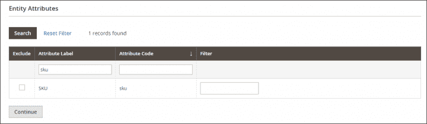
5.  向下滚动，点击页面右下角的 **继续** 。默认情况下，所有导出的文件都位于*<Magento-root-directory>/var/export*文件夹中。如果启用远程存储模块，所有导出的文件都位于 *<远程存储根目录> /import_export/export 文件夹* 。

**从 WooCommerce 出口产品**

WooCommerce 有一个内置的产品 CSV 导入器和导出器，您可以按照下面的步骤来使用:

1.  转到: **WooCommerce >产品**。
2.  选择顶部的**导出**。将显示导出产品屏幕。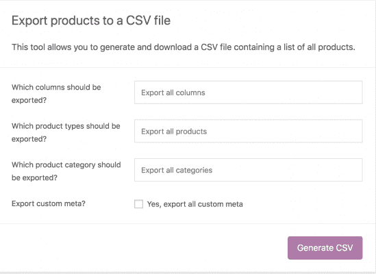
3.  选择导出所有列、导出所有产品或导出所有类别。或者使用下拉菜单选择要导出的列、产品或类别。
4.  如果您想为您的推荐系统添加更多元数据，请勾选**导出自定义元数据**。
5.  选择**生成 CSV** 并等待导出完成。

最后但同样重要的是，您可能已经在使用 Google Merchant Center，在这种情况下，您已经在 [拥有一个产品提要](https://support.google.com/merchants/answer/7052112?hl=en) ，您可以在您的推荐系统中重用它。

## [](#how-to-prepare-the-users-dataset)如何准备用户数据集

虽然 *条目数据集* 更容易生成或导出，但当涉及到使用 *用户* *数据集、* 时，事情变得有点复杂，主要是由于隐私限制而不是技术限制。显然，从机器学习的角度来看，用户的元数据越多越好。然而，这并不总是可能的，您必须在如何处理用户数据(例如，从用户处收集的或关于用户的信息，包括设备信息)方面保持透明。

2006 年，[](https://www.wired.com/2010/03/netflix-cancels-contest/)披露了近 50 万客户的不充分匿名信息。在 [网飞的 100 万美元竞赛](https://en.wikipedia.org/wiki/Netflix_Prize) 期间，为了改进其推荐系统，一些研究人员能够重新识别用户。它显然侵犯了用户的隐私，诉讼结束时网飞支付了 900 万美元来解决诉讼。

在欧盟，许多个人数据被视为敏感数据，并受到特定处理条件的限制。当讨论个人身份信息(PII)时，我们需要区分已认证、未认证或匿名用户。

这里我想强调一个细微差别——根据 [欧盟法规](https://ico.org.uk/for-organisations/guide-to-data-protection/guide-to-the-general-data-protection-regulation-gdpr/what-is-personal-data/what-is-personal-data/) ，匿名化是创建匿名信息的过程，即“与已识别或可识别的自然人无关的信息”或“以数据主体不可识别或不再可识别的方式匿名的个人数据”。虽然我们认为未经认证的用户是匿名的，但值得注意的是，确保 100%匿名是很难实现的。

| **未认证/匿名** | **已认证** |
| *cookie_id* | *用户标识* |
| *session_id* | *名和姓* |
| *装置装置装置* | *家庭住址* |
| *国家* | *电子邮件地址* |
| *城市* | *电话号码* |
|  | *护照号码* |
| *驾驶证号码* |
| *社会保障号* |
| *一张脸的照片* |
| *信用卡号* |
| *账号用户名* |
| *指纹* |

在这个阶段需要做出一个重要的设计决策: *你应该为经过认证的用户还是未经认证的用户构建你的推荐系统？* 如果你选择认证用户，你有更多的元数据可以支配，理论上，你的推荐系统可能会更准确，但缺点是看到推荐的用户数量会非常非常少。

另一方面，用匿名用户元数据构建推荐系统只会为你的推荐带来更广泛的受众，即使准确度可能没有那么高。

这是在实施推荐模型的早期阶段需要做出的妥协。当然，在后期阶段，如果投资回报值得的话，可以考虑混合方法。

**从 Google Analytics 导出未经认证的用户**

[用户浏览器报告](https://support.google.com/analytics/answer/6339208?hl=en) 让您隔离和检查个人，而不是聚合用户行为。个人用户行为与客户端 ID(已验证)或用户 ID(匿名)相关联。

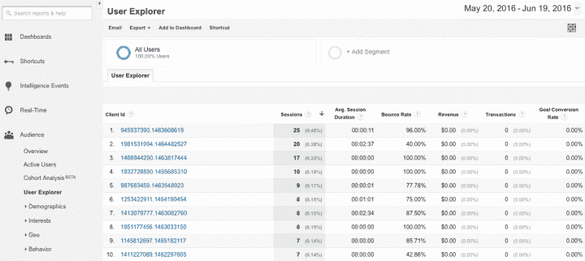

对于每个客户端或用户 ID，您会看到以下数据:  

| **User Data **(在上面的屏幕图像中点击客户端 Id 时可见) | **互动数据** |
| 

*   设备类别
*   设备平台
*   采集日期
*   频道
*   源/媒体
*   战役

 | 

*   上次查看日期(用户上次启动会话的时间)
*   会话
*   平均值。会话持续时间
*   跳出率
*   收入
*   交易
*   目标转化率

 |

此外，当您基于人口统计、技术和行为信息的任意组合对用户浏览器报告进行细分时，您会有一个与该细分相关联的所有 id 的列表，您可以导出这些 id。请注意，2019 年发布的谷歌分析 4 (GA4)引入了一些重要的细微差别——用户浏览器是分析部分可用的技术之一。

然而，仪表板中的导出功能仅限于您可以获得的几个列/维度，这对于我们的 *用户数据集来说并不真正有用。T55*

解决方案是使用谷歌分析报告 API v4。但是有一个警告:默认版本不从用户浏览器报告中导出任何客户端 id，您必须通过创建定制维度来使这些 id 可用。这允许分析 API 在客户端 ID 或会话级别导出数据，而不是仅返回聚合数据。从谷歌分析管理面板的 进入 **管理** 部分。在 **属性** 部分，转到 **自定义定义>自定义尺寸** 。增加以下维度:

*   **ClientID 与用户范围**    从 **自定义定义** 部分，转到 **自定义维度** 部分，点击**+新建自定义维度** 按钮。添加名称*【ClientID】*并选择用户范围。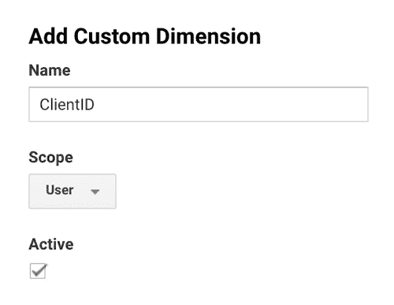

*   **SessionID 与会话范围**从 **自定义定义** 部分，转到 **自定义尺寸** 部分，点击**+新建自定义尺寸** 按钮。添加名称*【Session id】*并选择会话范围。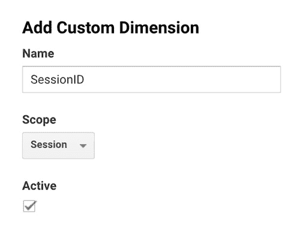

*   **(可选)带有用户范围的 UserID。**    从 **自定义定义** 部分，转到 **自定义尺寸** 部分，点击**+新建自定义尺寸** 按钮。添加名称 *【用户 id】*并选择用户范围。这个自定义维度将包含来自 CMS 的用户 id。它应该只在将 GA 连接到其他平台时使用，如 Shopify、Magento 或 WooCommerce。

添加完所有维度后，您的表将类似于下图。

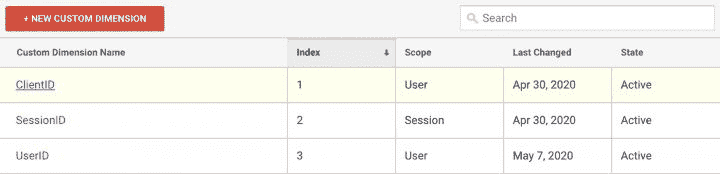

接下来，您需要设置客户端 ID 和会话 ID 跟踪。如果 Google Analytics tracker 直接包含在您网站的源代码中，您可以通过修改现有代码来添加自定义维度值。

复制下面的脚本，将视图 id(应该是类似于*UI-xxxxx-01*)替换为与您的网站对应的视图 id。此外，用步骤 1 中创建的实际维度索引替换“维度 1”、“维度 2”和(可选)“维度 3”。你可以阅读更多关于 [用 gtag.js](https://www.simoahava.com/analytics/add-clientid-to-custom-dimension-gtag-js/) 添加客户 ID 到自定义维度。

```
<!-- Global site tag (gtag.js) - Google Analytics -->
<script async src="https://www.googletagmanager.com/gtag/js?id=UA-XXXXXXXX-Y"></script>
<script>
    window.dataLayer = window.dataLayer || [];
    function gtag() { dataLayer.push(arguments); }
    gtag('js', new Date());

    // Maps 'dimension1' to client id, 'dimension2' to session id and 'dimension3' to user id.
    gtag("config", "UA-XXXXXXXX-Y", {
        custom_map: {
            dimension1: "clientId",
            dimension2: "sessionId",
            dimension3: "userId", // Remove this line if you're not using the UserID custom dimension 
        }
    });

    // Sends an event that sets the dimensions
    gtag("event", "custom_set_dimensions", {
        sessionId: new Date().getTime() + "." + Math.random().toString(36).substring(5)

        // Remove following line if you're not using the UserID custom dimension
        userId: '## Replace with User ID from your CMS ##'
    });
</script>

```

最后一部分包括创建可用于验证 Google Analytics 报告 API 和访问数据的 API 凭证。参见 [关于如何访问分析报告 API](https://developers.google.com/analytics/devguides/reporting/core/v4/quickstart/service-py) 的谷歌文档。

您可以使用下面的 Python 脚本为您的协同过滤推荐系统创建一个匿名的 *用户数据集* 。该脚本使用 Google Analytics 数据创建一个 dataframe，并将其保存为 csv 文件。

```
from apiclient.discovery import build
from oauth2client.service_account import ServiceAccountCredentials
import pandas as pd

SCOPES = ['https://www.googleapis.com/auth/analytics.readonly']
KEY_FILE_LOCATION = '<REPLACE_WITH_JSON_FILE>'
VIEW_ID = '<REPLACE_WITH_VIEW_ID>'
CUSTOM_DIMENSION_USER = '<REPLACE_WITH_CUSTOM_DIMENSION_INDEX, ex. ga:dimension1>'

def initialize_analyticsreporting():
  """Initializes an Analytics Reporting API V4 service object.

  Returns:
    An authorized Analytics Reporting API V4 service object.
  """
  credentials = ServiceAccountCredentials.from_json_keyfile_name(
      KEY_FILE_LOCATION, SCOPES)

  # Build the service object.
  analytics = build('analyticsreporting', 'v4', credentials=credentials)

  return analytics

def get_report(analytics):
  """Queries the Analytics Reporting API V4.
  The API returns a maximum of 100,000 rows per request. If you have more data, you have to implement pagination:
  - https://developers.google.com/analytics/devguides/reporting/core/v4/basics#pagination
  - https://developers.google.com/analytics/devguides/reporting/core/v4/rest/v4/reports/batchGet#ReportRequest.FIELDS.page_size

  Args:
    analytics: An authorized Analytics Reporting API V4 service object.
  Returns:
    The Analytics Reporting API V4 response.
  """
  return analytics.reports().batchGet(
      body={
        'reportRequests': [
        {
          'viewId': VIEW_ID,
          'dateRanges': [{'startDate': '7daysAgo', 'endDate': 'today'}],
          'metrics': [{'expression': 'ga:sessions'}],
          'dimensions': [{'name': CUSTOM_DIMENSION_USER}, {'name': 'ga:country'}, {'name': 'ga:deviceCategory'}],
          'pageSize': 10000
        }]
      }
  ).execute()

def parse_response(response):
  """Parses the Analytics Reporting API V4 response and returns it in a Pandas dataframe.

  Args:
    response: An Analytics Reporting API V4 response.
  Returns:
    Pandas dataframe with the data.
  """
  df = pd.DataFrame() 

  for report in response.get('reports', []):
    columnHeader = report.get('columnHeader', {})
    dimensionHeaders = columnHeader.get('dimensions', [])
    metricHeaders = columnHeader.get('metricHeader', {}).get('metricHeaderEntries', [])

    for row in report.get('data', {}).get('rows', []):
      dimensions = row.get('dimensions', [])
      dateRangeValues = row.get('metrics', [])

      entry = {}
      for header, dimension in zip(dimensionHeaders, dimensions):
        entry[header] = dimension

      for i, values in enumerate(dateRangeValues):

        for metricHeader, value in zip(metricHeaders, values.get('values')):
          entry[metricHeader.get('name')] = value

        df = df.append(entry, ignore_index=True)
    return df

def main():
  analytics = initialize_analyticsreporting()
  response = get_report(analytics)
  df = parse_response(response)
  print(df.count())
  print(df.head(10))
  df.to_csv("data.csv")

if __name__ == '__main__':
  main()
sample_read_ga_data.py
Displaying sample_read_ga_data.py.
```

 **从 Shopify** 导出客户

您可以通过以下快速步骤导出所有客户及其详细信息的 CSV 文件:

1.  从你的 **Shopify admin** ，转到 **客户** 。
2.  点击 **导出** 。
3.  点击 **所有客户** 导出您店铺的所有客户。
4.  选择 **普通 CSV 文件** 格式。
5.  点击 **导出客户** 。

正如您可以从 [这个模板](https://help.shopify.com/csv/customer_template.csv) 中看到的，有很多列您实际上并不需要——例如，在您的 *用户数据集* 中包含全名或电子邮件地址作为推荐系统的输入是没有意义的。

**从 Magento 导出客户**

类似于从 Magento 2 中导出产品，您可以将 **实体类型** 设置为 **【客户主文件】** ，您将获得一个客户列表，您可以在您的推荐系统中进一步清理和使用该列表。

**从 WooCommerce 导出客户**

**从 WooCommerce 手动导出客户:**

 **1.  进入 **WooCommerce >出口** 。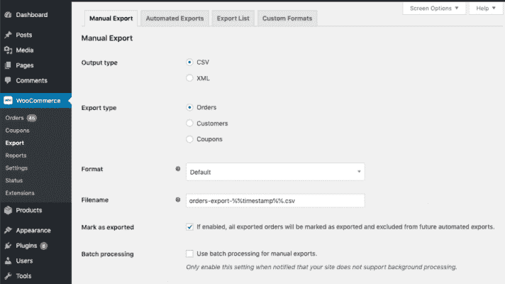
2.  在 **手动导出** 选项卡上，更新以下设置:
    1.  **输出类型** :选择以 CSV 格式导出文件。
    2.  **导出类型** :选择要导出的客户。
    3.  **格式** :选择一种 [**预定义的**](https://docs.woocommerce.com/document/ordercustomer-csv-export/#formats-predefined) 或 [**自定义的**](https://docs.woocommerce.com/document/ordercustomer-csv-export/#formats-custom) 格式。
    4.  **文件名**:输入本次导出生成文件的名称。
    5.  **标记为导出** :启用，确保导出的数据不包括在以后的导出中。 [**点击此处了解有关此设置的更多信息。**](https://docs.woocommerce.com/document/ordercustomer-csv-export/#mark-exported)
    6.  **批量处理** :仅当您的站点 **不支持**[**后台处理**](https://docs.woocommerce.com/document/ordercustomer-csv-export/#faq-loopback) 时启用。

3。点击 **导出** 。

## [](#how-to-prepare-the-interactions-dataset)如何准备交互数据集

数据集拼图的最后一块是生成 *交互数据集。* 根据 Builtwith.com 的数据，有近 3000 万个网站在使用谷歌分析，因此，为我们使用谷歌分析报告 API v4 的推荐系统介绍导出 *用户行为* 的最佳方式是有意义的。

我们已经介绍了用户数据集部分的大部分流程，您可以使用相同的 Python 脚本来导出将进入推荐系统的关键事件。如果你想添加额外的列，你可以看看 [维度&度量浏览器](https://ga-dev-tools.appspot.com/dimensions-metrics-explorer/) 。

```
from apiclient.discovery import build
from oauth2client.service_account import ServiceAccountCredentials
import pandas as pd

SCOPES = ['https://www.googleapis.com/auth/analytics.readonly']
KEY_FILE_LOCATION = '<REPLACE_WITH_JSON_FILE>'
VIEW_ID = '<REPLACE_WITH_VIEW_ID>'
CUSTOM_DIMENSION_USER = '<REPLACE_WITH_CUSTOM_DIMENSION_INDEX, ex. ga:dimension1>'
CUSTOM_DIMENSION_SESSION = '<REPLACE_WITH_CUSTOM_DIMENSION_INDEX, ex. ga:dimension2>'

def initialize_analyticsreporting():
  """Initializes an Analytics Reporting API V4 service object.

  Returns:
    An authorized Analytics Reporting API V4 service object.
  """
  credentials = ServiceAccountCredentials.from_json_keyfile_name(
      KEY_FILE_LOCATION, SCOPES)

  # Build the service object.
  analytics = build('analyticsreporting', 'v4', credentials=credentials)

  return analytics

def get_report(analytics):
  """Queries the Analytics Reporting API V4.
  The API returns a maximum of 100,000 rows per request. If you have more data, you have to implement pagination:
  - https://developers.google.com/analytics/devguides/reporting/core/v4/basics#pagination
  - https://developers.google.com/analytics/devguides/reporting/core/v4/rest/v4/reports/batchGet#ReportRequest.FIELDS.page_size

  Args:
    analytics: An authorized Analytics Reporting API V4 service object.
  Returns:
    The Analytics Reporting API V4 response.
  """
  return analytics.reports().batchGet(
      body={
        'reportRequests': [
        {
          'viewId': VIEW_ID,
          'dateRanges': [{'startDate': '7daysAgo', 'endDate': 'today'}],
          'metrics': [
                {'expression': 'ga:productListViews'},
                {'expression': 'ga:productDetailViews'},
                {'expression': 'ga:productAddsToCart'},
                {'expression': 'ga:productCheckouts'},
                {'expression': 'ga:itemQuantity'},
                {'expression': 'ga:itemRevenue'}
            ],
          'dimensions': [
              {'name': CUSTOM_DIMENSION_USER},
              {'name': CUSTOM_DIMENSION_SESSION},
              {'name': 'ga:productSku'}
            ],
          'pageSize': 10000
        }]
      }
  ).execute()

def parse_response(response):
  """Parses the Analytics Reporting API V4 response and returns it in a Pandas dataframe.

  Args:
    response: An Analytics Reporting API V4 response.
  Returns:
    Pandas dataframe with the data.
  """
  df = pd.DataFrame() 

  for report in response.get('reports', []):
    columnHeader = report.get('columnHeader', {})
    dimensionHeaders = columnHeader.get('dimensions', [])
    metricHeaders = columnHeader.get('metricHeader', {}).get('metricHeaderEntries', [])

    for row in report.get('data', {}).get('rows', []):
      dimensions = row.get('dimensions', [])
      dateRangeValues = row.get('metrics', [])

      entry = {}
      for header, dimension in zip(dimensionHeaders, dimensions):
        entry[header] = dimension

      for i, values in enumerate(dateRangeValues):

        for metricHeader, value in zip(metricHeaders, values.get('values')):
          entry[metricHeader.get('name')] = value

        df = df.append(entry, ignore_index=True)
    return df

def main():
  analytics = initialize_analyticsreporting()
  response = get_report(analytics)
  df = parse_response(response)
  print(df.count())
  print(df.head(10))
  df.to_csv("interactions.csv")

if __name__ == '__main__':
  main()
sample_read_ga_interactions.py
Displaying sample_read_ga_interactions.py.
```

| **事件** | **触发** | **参数** |
| 添加 _ 付款 _ 信息 | 当用户提交他们的支付信息时 | 优惠券，货币，项目，付款类型，价值 |
| 添加 _ 运输 _ 信息 | 当用户提交他们的运输信息时 | 优惠券，货币，项目，运输层，价值 |
| 添加到购物车 | 当用户向购物车添加商品时 | 货币、项目、价值 |
| 添加到愿望列表 | 当用户向意愿列表添加项目时 | 货币、项目、价值 |
| 开始 _ 结帐 | 当用户开始结账时 | 优惠券、货币、项目、价值 |
| 生成 _ 销售线索 | 当用户提交表单或信息请求时 | 价值，货币 |
| 购买 | 当用户完成购买时 | 从属关系、优惠券、货币、项目、交易标识、运输、税收、价值(必需参数) |
| 退还 | 当退款发出时 | 从属关系，优惠券，货币，项目，交易标识，运输，税收，价值 |
| 从购物车中删除 | 当用户从购物车中移除商品时 | 货币、项目、价值 |
| 选择 _ 项目 | 当从列表中选择一个项目时 | 项目，项目列表名称，项目列表标识 |
| 选择 _ 促销 | 当用户选择促销时 | 项目，促销标识，促销名称，创意名称，创意时段，位置标识 |
| 查看 _ 购物车 | 当用户查看他们的购物车时 | 货币、项目、价值 |
| 查看 _ 项目 | 当用户查看项目时 | 货币、项目、价值 |
| 查看 _ 项目 _ 列表 | 当用户看到商品/供应的列表时 | 项目，项目列表名称，项目列表标识 |
| 查看 _ 促销 | 当向用户显示促销时 | 项目，促销标识，促销名称，创意名称，创意时段，位置标识 |

零售和电子商务应用程序应记录下列事件。记录事件及其规定的参数确保了报告中最大的可用细节，并提高了协同过滤推荐系统的整体性能。

虽然更多的用户交互增加了推荐系统的准确性，但你可能会考虑尝试更少更基本的交互，比如产品详情页面浏览量(针对未经认证的用户)和/或订单(针对经过认证的用户)。这里的直觉是，推荐系统将能够仅基于隐含的评级来推荐相关项目，例如:产品详细页面视图和购买历史。

**从 Shopify 导出订单**

您可以导出订单及其交易历史，也可以仅导出订单的交易历史:

1.  从 **订单** 页面，点击 **导出** 。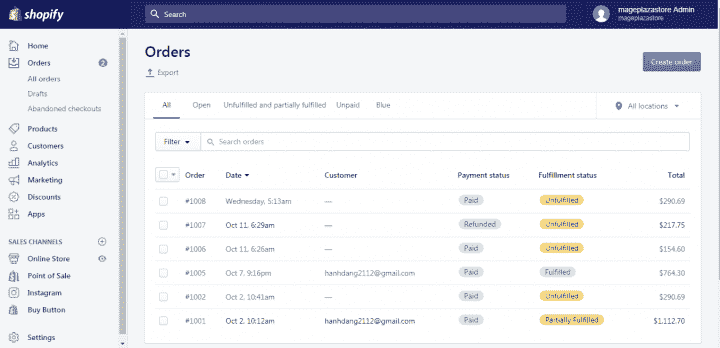
2.  在 **出口订单** 窗口:
    *   为您想要导出的订单选择选项。例如，如果您想按日期导出订单，则单击 **按日期导出** 订单，并设置您要导出的订单的开始和结束日期。
    *   下下**导出为**下，选择一种文件格式。
3.  如果你想下载所有关于你的订单的信息，那么点击 **导出订单** 。如果您只想下载您的交易信息，则点击 **导出交易历史** 。

**从 Magento 导出订单**

**在你的 Magento 2 后端，转到 **销售>订单** ，点击 **出口** 下拉，勾选 CSV。**

 **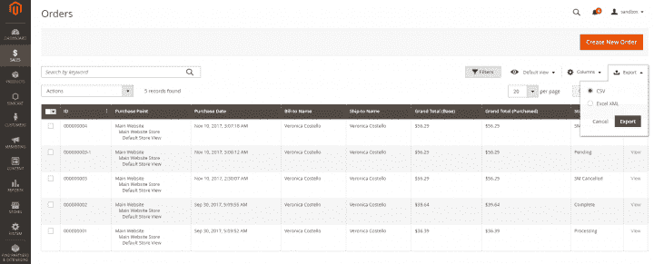

**从 WooCommerce 出口订单**

您可以按照与 [导出客户](https://docs.google.com/document/d/1LXp6yRqxMeyM8il4GSJsPHCj6_bPOUj15ck7k3vz5mk/edit#add%20link%20later) 相同的步骤从 WooCommerce 导出订单，唯一不同的是选择 **导出类型** 的“订单”。    记住，对于你的协同过滤推荐系统的第一次迭代，你可能需要清理 *交互数据集* 导出直到它只包含: *UserId，Date，ProductIds。*

## [](#putting-it-all-together)综合起来

如果您达到了这一点，您应该有 3 个 CSV 文件，每个文件的结构如下:

| ***物品数据集*** |
| *ItemId* | *标题* | *描述* | *价格* | *其他项目元数据(……)* |

| ***用户数据集*** |
| *UserId* | *国家* | *城市* | *其他用户元数据(……)* |

| ***交互数据集*** |
| *ItemId* | *UserId* | *时间戳* | *事件类型* | *其他交互元数据(……)* |

请注意，如果您没有(或不想包含)任何用户元数据，完全可以忽略 *用户数据集* 。

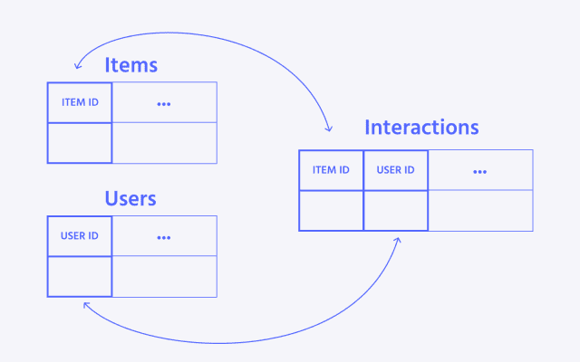

互动是构建用户评级矩阵(URM)的基础。只需使用用户标识-项目标识对，您就可以创建第一个版本的 URM /基线模型。其他特性可以一个一个地添加，同时在每一步测量模型的性能。

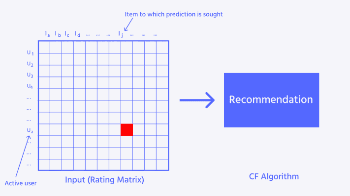

从所有可用的数据集中，可以很容易地将数字或一次性编码的属性添加到模型中。其他的则需要额外的处理——例如应用自然语言处理从文本数据中提取嵌入内容，或者用计算机视觉处理产品图像。

在本系列的下一篇博文中，我们将专注于为我们的协同过滤推荐系统准备数据集和探索特征工程，这是构建高性能机器学习模型的关键一步。

敬请期待！

还有，如果有问题:[https://twitter.com/cborodescu](https://twitter.com/cborodescu)******