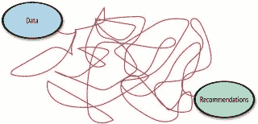
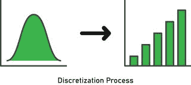
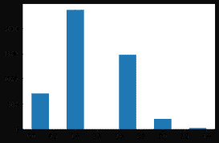
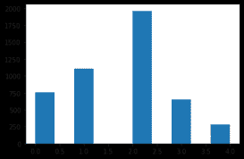
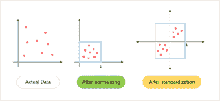
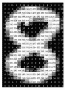

# 高性能推荐系统剖析-第三部分- Algolia 博客

> 原文：<https://www.algolia.com/blog/ai/the-anatomy-of-high-performance-recommender-systems-part-3/>

# 进入推荐系统的工程特征

在本系列 的第一篇 [中，我们谈到了一个高性能推荐系统的关键组件:(1)](https://www.algolia.com/blog/ai/the-anatomy-of-high-performance-recommender-systems-part-1/) [数据源、](https://www.algolia.com/blog/ai/the-anatomy-of-high-performance-recommender-systems-part-2/) (2) **特征库**、(3) [机器学习模型](https://www.algolia.com/blog/ai/the-anatomy-of-high-performance-recommender-systems-part-iv/)、(4 & 5) [预测&行动](https://www.algolia.com/blog/ai/the-anatomy-of-high-performance-recommender-systems-part-v/)、(6)结果、(7)评估和(8) AI 伦理。

在这第三篇文章中，我们将深入探讨推荐系统的特征工程这一主题。虽然从原始数据到推荐的路径要经过各种工具和系统，但该过程涉及两个数学实体，它们是任何推荐系统的面包和黄油: **特征** 和 **模型。**



特征是原始数据的数字表示。特征工程是在给定数据、模型和任务的情况下组合最合适的特征的过程。在基本的协同过滤场景中，我们实际上没有特征，因为评级实际上是标签。

基于内容的系统处理各种各样的物品描述和关于用户的知识。特征工程包括将这些不同类型的非结构化数据转换成标准化的描述。尽管可以使用任何类型的表示，比如多维数据表示，但最常见的方法是从底层数据中提取关键字。

项目有多个字段，其中列出了各种属性。例如，书籍有描述、标题和作者。在某些情况下，这些描述和属性可以转换成关键字。

| **ItemID** | **标题** | **作者** | **描述** | **流派** | **价格** |
| 0000031852 | 2034:下一次世界大战的小说 | 美国海军上将詹姆斯·斯塔夫里迪斯·阿克曼号 | 来自两位前军官和获奖作家，这是一部令人毛骨悚然的真实地缘政治惊悚片，想象了 2034 年美国和中国在南中国海的海军冲突，以及从那里通往噩梦般的全球大灾难的道路。 | 惊悚片&悬疑片 | 17.84 美元 |

另一方面，当属性包含数字量(如价格)或从可能性的小宇宙(如类型)中提取的字段时，您可以直接使用多维(结构化)表示。

除了描述商品，你还需要收集用户资料。比如[movie lens](https://grouplens.org/datasets/movielens/1m/)，一个经典的用户属性推荐数据集， 包含了性别、年龄、职业三个用户属性。因为这些是单标签属性，所以可以在预处理过程中使用 [一键](https://en.wikipedia.org/wiki/One-hot) 编码对它们进行编码。

| **用户标识** | **性别** | **年龄** | **职业** |
|  | 男/女 | * 1:“18 岁以下”  * 18:“18-24 岁”  * 25:“25-34 岁”  * 35:“35-44 岁”  * 45:“45 | * 0:“其他”或未指定
* 1:“学术/教育工作者”
* 2:“艺术家”
* 3:“文书/行政”
* 4:“学院/研究生”
* 5:“客服”
* 6:“医生/保健” 12:“程序员”
* 13:“退休”
* 14:“销售/营销”
* 15:“科学家”
* 16:“个体户”
* 17:“技术员/工程师”
* 18:“工匠” |

最后，并不是所有的特征都是平等的。您可以应用特性 **权重、** 根据特性的重要性给出不同的权重，或者应用特性 **选择、** 根据相关性包括或排除属性。

现在让我们探索推荐引擎中最常见的项目和用户属性的特征工程方法。

## [](#numerical-features)数字特征

### [](#discretization)离散化

项目数据集中包含的价格属性是一个 **连续变量** ，因为它可以取不可数的一组值，并且可以包含给定范围内的任何值。为了将这种原始特征转换成机器学习模型可以接受的格式，您将使用 **量化:** 本质上，将连续值映射到离散值。从概念上讲，这可以被认为是 [统计箱](https://en.wikipedia.org/wiki/Data_binning) 的有序序列。



宁滨有三种典型的方法:

*   **统一:** 所有箱柜宽度相同
*   **基于分位数:** 所有箱都有相同数量的值
*   **基于 K-均值:** 每个仓属于最近的一维 K-均值聚类

统一宁滨是最简单的方法。它使用公式将一系列可能的值划分为宽度相同的 *N* 个箱

![\[width = \frac{maxvalue-minvalue}{N}\]](img/65e5d34736595027f681850c6fbce337.png "Rendered by QuickLaTeX.com")

其中 *N* 为区间数。

*N* 通常是通过实验确定的——这里没有经验法则。

例如，如果变量 interval 为[10，110]，并且您想要创建 5 个容器，这意味着`110-10 / 5 = 20`，因此每个容器的宽度为 20，间隔为[10，30]，[30，50]，[50，70]，[70–90]和[90，110]。

统一、分位数或 k 均值宁滨的代码和直方图如下:

```
from sklearn.preprocessing import KBinsDiscretizer
# create the discretizer object with strategy uniform
discretizer = KBinsDiscretizer(bins, encode='ordinal', strategy='uniform') # replace "uniform" with "quantile" or "kmeans" to change discretization strategies
data_disc= discretizer.fit_transform(data)
```

| **统一(垃圾箱= 10)** | **分位数(仓= 10)** | **K-均值(仓= 10)** |
|  |  |  |

### [](#normalization-and-standardization)规范化和标准化

讨论最多的两种缩放方法是**(将值重新缩放到[0，1]的范围内)和 **标准化** (将数据重新缩放到平均值为 0，标准差为 1)。以下是数据经过规范化和标准化后的可视化表示:**

 **

您可以对页面浏览量、点击量和交易量等特征使用归一化，因为这些值不是正态(高斯)分布的，大多数时候它们是长尾。

这是归一化的公式:

![\[{X}' = \frac{X-X_{min} }{X_{max}-X_{min}}\]](img/32490b73ed2bbcbcf446b1229a8f358c.png "Rendered by QuickLaTeX.com")

其中*Xmax*和*Xmin*分别为特征的最大值和最小值。

```
# data normalization with sklearn
from sklearn.preprocessing import MinMaxScaler

# fit scaler on training data
norm = MinMaxScaler().fit(X_train)

# transform training data
X_train_norm = norm.transform(X_train)

# transform testing data
X_test_norm = norm.transform(X_test)

```

标准化对客户评论很有用，因为数据遵循高斯(正态)分布:


其中 *μ* 是特征值的平均值，𝝈是特征值的标准差。注意，在这种情况下，这些值不限于特定的范围。

```
from sklearn.preprocessing import StandardScaler

# fit on training data
scale = StandardScaler().fit(X_train)

# transform the training data 
X_train_stand = scale.transform(X_train)

# transform the testing data 
X_test_stand = scale.transform(X_test)

```

## [](#categorical-features)分类特征

通常，特征被表示为分类值，而不是连续值。在上面的例子中，用户可以拥有诸如性别([男性、女性])、年龄([18 岁以下、18-24 岁、25-34 岁])和职业([其他、学术/教育工作者、艺术家、职员/管理人员]，…)等特征。这样的特征可以有效地编码为整数，例如，[男性，18-24 岁，文书/管理]可以表示为[0，1，3]，而[女性，25-34 岁，学术/教育工作者]可以表示为[1，2，1]。

我们有几个将分类特征转换成整数的选项:

*   使用普通编码器。 该估计器将每个分类特征转换为一个新的整数特征(0 到 n _ categories–1)

```
from sklearn.preprocessing import OrdinalEncoder

user_data = [['male', '18-24', 'clerical/admin'], ['female', '25-34', 'academic/educator']]
encoder = OrdinalEncoder().fit(user_data)
encoder.transform([['female', '25-34', 'clerical/admin']])

# array([[0., 1., 1.]]

```

*   使用 scikit-learn 估计器。这个估计器使用一个“K 选一”的方案，也称为一键编码或虚拟编码，将类别转换为整数。

```
from sklearn.preprocessing import OneHotEncoder

user_data = [['male', '18-24', 'clerical/admin'], ['female', '25-34', 'academic/educator']]
encoder = OneHotEncoder().fit(user_data)
encoder.transform([['female', '25-34', 'clerical/admin'],['male', '25-34', 'academic/educator']]).toarray()

# array([[1., 0., 0., 1., 0., 1.], [0., 1., 0., 1., 1., 0.]])

```

## [](#text-embedding)文字嵌入

这些方法——标准化、规范化和分类特征——用于组合特征。它们都依赖于对语言的语义理解。让我们来看看如何阅读基于文本的内容。

自然语言处理(NLP)是人工智能的一个子领域，它使计算机能够理解和处理人类语言。有两种技术可以完成这项任务:对未处理的文本应用词袋模型，并对文本进行预处理，以便稍后使用神经网络模型。

### [](#bag-of-words)袋字

词汇袋模型是最常用的流程，因为它易于实施和理解。这个想法是为句子和文档创建一个出现矩阵，而不考虑语法或词序。

```
from sklearn.feature_extraction.text import CountVectorizer

corpus = ["From two former military officers and award-winning authors, a chillingly authentic geopolitical thriller that imagines a naval clash between the US and China in the South China Sea in 2034–and the path from there to a nightmarish global conflagration."]

vectorizer = CountVectorizer(stop_words=None, ngram_range=(1, 1), min_df=1, max_df=1)
# stop_words - Please see the following guidelines before choosing a value for this param: https://scikit-learn.org/stable/modules/feature_extraction.html#stop-words
# ngram_range - Provides the range of n-values for the word n-grams to be extracted. (1, 1) means the vectorizer will only take into account unigrams, thus implementing the Bag-of-Words model
# min_df && max_df - The minimum and maximum document frequency required for a term to be included in the vocabulary

X = vectorizer.fit_transform(corpus)

print(vectorizer.get_feature_names())
'''
['2034', 'and', 'authentic', 'authors', 'award', 'between', 'chillingly', 'china', 'clash', 'conflagration', 'former', 'from', 'geopolitical', 'global', 'imagines', 'in', 'military', 'naval', 'nightmarish', 'officers', 'path', 'sea', 'south', 'that', 'the', 'there', 'thriller', 'to', 'two', 'us', 'winning']
'''

print(X.toarray())
#[[1 3 1 1 1 1 1 2 1 1 1 2 1 1 1 2 1 1 1 1 1 1 1 1 3 1 1 1 1 1 1]]

```

产生的频率用于训练分类器。请注意，因为不需要对句子进行预处理，所以这种方法会带来一系列缺点，比如结果向量的稀疏表示、理解文本数据的能力差，以及在处理大量文档时性能不佳。

### [](#preprocessing-text)预处理文本

预处理句子的标准顺序是记号化、去掉不必要的标点和停用词、词干化、词条化。

标记化包括把句子变成单词。来自`nltk package`的`word_tokenizer`对字符串进行标记，以分离除句点以外的标点符号。

```
import nltk
nltk.download('punkt') # a pre-trained Punkt tokenizer for English
from nltk.tokenize import word_tokenize

text = "From two former military officers and award-winning authors, a chillingly authentic geopolitical thriller that imagines a naval clash between the US and China in the South China Sea in 2034–and the path from there to a nightmarish global conflagration."

tokens = word_tokenize(text)
print(tokens)
'''
['From', 'two', 'former', 'military', 'officers', 'and', 'award-winning', 'authors', ',', 'a', 'chillingly', 'authentic', 'geopolitical', 'thriller', 'that', 'imagines', 'a', 'naval', 'clash', 'between', 'the', 'US', 'and', 'China', 'in', 'the', 'South', 'China', 'Sea', 'in', '2034–and', 'the', 'path', 'from', 'there', 'to', 'a', 'nightmarish', 'global', 'conflagration', '.']
''' 

```

#### 不同的包都有预定义的停用词。另一种方法是定义一个与语料库相关的自定义停用词列表。

```
nltk.download('stopwords') # 2,400 stopwords for 11 languages
from nltk.corpus import stopwords
stop_words = set(stopwords.words('english'))
tokens = [w for w in tokens if not w in stop_words]

print(tokens)
'''
['From', 'two', 'former', 'military', 'officers', 'award-winning', 'authors', ',', 'chillingly', 'authentic', 'geopolitical', 'thriller', 'imagines', 'naval', 'clash', 'US', 'China', 'South', 'China', 'Sea', '2034–and', 'path', 'nightmarish', 'global', 'conflagration', '.']
'''

```

通过去除后缀和前缀，将语料库中的单词缩减到它们的根。词干分析器查找常见后缀和前缀的列表，并删除它们。

```
from nltk.stem.porter import PorterStemmer #there are more available

porter = PorterStemmer()
stems = []
for t in tokens:    
    stems.append(porter.stem(t))

print(stems)
'''
['from', 'two', 'former', 'militari', 'offic', 'award-win', 'author', ',', 'chillingli', 'authent', 'geopolit', 'thriller', 'imagin', 'naval', 'clash', 'us', 'china', 'south', 'china', 'sea', '2034–and', 'path', 'nightmarish', 'global', 'conflagr', '.']
'''

```

词汇化与词干化有相同的预期输出:将单词简化为一个公共基或其词根。然而，lemmatizer 考虑到了单词的形态分析，对所有词形变化使用相同的词根。

```
nltk.download('wordnet') # a dictionary is needed for a Lemmatizer
from nltk.stem import WordNetLemmatizer

lemmatizer = WordNetLemmatizer()
lemmas = []
for t in tokens:    
    lemmas.append(lemmatizer.lemmatize(t))
print(lemmas)

'''
['From', 'two', 'former', 'military', 'officer', 'award-winning', 'author', ',', 'chillingly', 'authentic', 'geopolitical', 'thriller', 'imago', 'naval', 'clash', 'US', 'China', 'South', 'China', 'Sea', '2034–and', 'path', 'nightmarish', 'global', 'conflagration', '.']
'''

```

## [](#image-encoding)图像编码

在进入这个话题之前，你必须了解计算机“看”图像的方式。每个图像被表示为 1 或 3 个像素矩阵。每个矩阵代表一个 **通道。** 对于黑白图像，只有一个通道，而对于彩色图像，有三个:红、绿、蓝。每个像素依次由 0 到 255 之间的数字表示，表示颜色的强度。



### [](#pixel-values-as-features)像素值作为特征

从图像中检索特征最简单的方法是重新排列所有像素，生成一个特征向量。对于灰度图像，这可以使用 NumPy: 轻松实现

```
import skimage
from skimage import data, io # data has standard test images
import numpy as np
from matplotlib import pyplot as plt
%matplotlib inline

camera = data.camera() 
io.imshow(camera)
plt.show()

print(camera.shape) # (height, width)
# (512, 512)
features = np.reshape(camera, (512*512))
print(features.shape, features)
# ((262144,), array([156, 157, 160, ..., 121, 113, 111], dtype=uint8))

```

相同的技术可用于 RGB 图像。然而，更合适的方法是通过使用来自所有通道的像素的平均值来创建特征向量。

```
import skimage
from skimage import data, io # data has standard test images
import numpy as np
from matplotlib import pyplot as plt
%matplotlib inline

astronaut = data.astronaut() 
io.imshow(astronaut)
plt.show()

print(astronaut.shape) # (height, width, no. of channels)
# (512, 512, 3)
feature_matrix = np.zeros((512, 512)) # matrix initialized with 0
for i in range(0, astronaut.shape[0]):
    for j in range(0, astronaut.shape[1]):
        feature_matrix[i][j] = ((astronaut[i, j, 0]) +(astronaut[i, j, 1]) + (astronaut[i, j, 2])) / 3

print(feature_matrix)
'''
array([[65.33333333, 26.66666667, 74.33333333, ..., 35.33333333,
        29\.        , 32.66666667],
       [ 2.33333333, 57.33333333, 31.66666667, ..., 33.66666667,
        30.33333333, 28.66666667],
       [25.33333333,  7.66666667, 80.33333333, ..., 36.33333333,
        32.66666667, 30.33333333],
       ...,
       [ 6.66666667,  7\.        ,  3\.        , ...,  0\.        ,
         0.33333333,  0\.        ],
       [ 3.33333333,  2.66666667,  4.33333333, ...,  0.33333333,
         1\.        ,  0\.        ],
       [ 3.66666667,  1.66666667,  0.33333333, ...,  0\.        ,
         1\.        ,  0\.        ]])
'''

```

### [](#edge-detection)边缘检测

边缘是图像中亮度和颜色急剧变化的一组点。有不同的边缘检测技术，最常用的是 Canny 边缘检测算法。下面是它如何工作的概述:

1.  使用高斯滤波器降噪
2.  梯度计算
3.  非最大值抑制(该算法遍历梯度强度矩阵上的所有点，并找到边缘方向上具有最大值的像素)
4.  双阈值(将像素分为两类:强和弱)
5.  滞后边缘跟踪(当且仅当有另一个强像素作为其邻居时，将弱像素转换为强像素)

```
import skimage
from skimage import data # data has standard test images
import cv2
from matplotlib import pyplot as plt
%matplotlib inline

camera = data.camera() 
# from skimage import color # the image should be grayscale for Canny
# camera = color.rgb2gray(camera) # however this one already is
edges = cv2.Canny(camera,100,200) # thresholds for the hysteresis procedure

plt.subplot(121), plt.imshow(camera, cmap = 'gray')
plt.title('Original Image')
plt.subplot(122), plt.imshow(edges, cmap = 'gray')
plt.title('Edge Image')
plt.show()

```

## [](#final-word-and-feature-stores)

不同的项目和团队维护和提供特性的方式可能会有很大的不同。这增加了基础架构的复杂性，并经常导致重复工作。分布式组织面临的一些挑战包括:

*   特征未被重用
*   特性定义不同
*   计算特征需要很长时间
*   训练和发球不一致
*   特征衰减未知

为了解决这些问题，一个 **特征库** 作为一个中心库，用于存储一个组织内的文档化的、管理的和访问受控的特征。

| **特征存储** |
| **名称** | **描述** | **元数据** | **定义** |
| *平均 _ 用户 _ 订单 _ 价值* | *一个用户的平均订单值。* | 为什么将特征添加到模型中，它如何有助于概化，负责维护特征数据源的组织中的工程师姓名，输入类型，输出类型。 | 在运行时环境中执行并应用于输入以计算特征值的版本化代码。 |

本质上，特征库允许数据工程师插入特征。反过来，数据分析师和机器学习工程师使用 API 来获取他们认为相关的特征值。

此外，应对要素存储中的要素值进行版本化，以确保数据分析师能够使用与用于训练先前模型版本的要素值相同的要素值来重新构建模型。给定输入的特征值更新后，先前的值不会被删除；相反，它是用时间戳保存的，表明它是何时生成的。

在过去的几年里，分析师和工程师发明、试验并验证了各种适用于特性工程的最佳实践。在本文中，我们研究了规范化、标准化和分类特性。其他实践包括生成简单的特性、重用遗留系统、在需要时使用 id 作为特性、尽可能减少基数、谨慎使用计数、在必要时进行特性选择、仔细测试代码、保持代码、模型和数据同步、隔离特性提取代码、将模型和特性提取器序列化在一起，以及记录特性的值。

功能工程是一个创造性的过程，作为一名机器学习工程师，你最有资格确定哪些功能适合你的推荐模型。

在本系列的下一篇文章中，我们将专注于构建协同过滤推荐模型，这将是一件轻而易举的事情，因为我们已经解决了特征工程的问题。敬请期待！还有如果有什么问题，可以在[Twitter](https://twitter.com/cborodescu)上问我。**