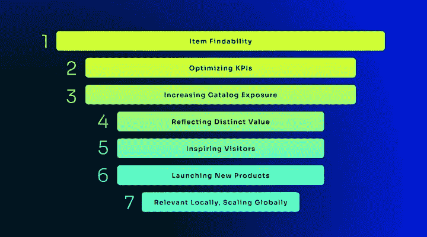
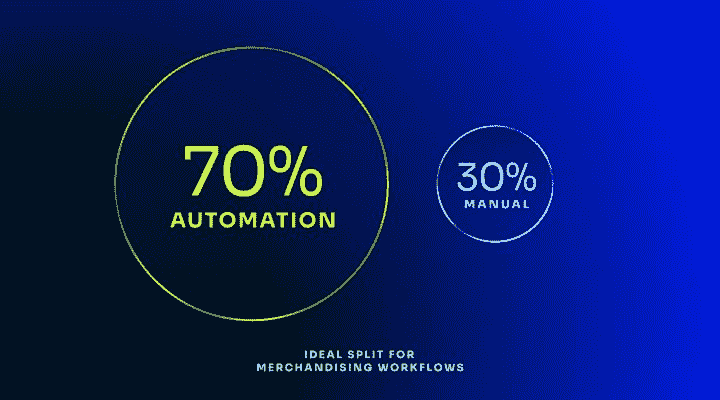

# 数字商品销售的变化|

> 原文：<https://www.algolia.com/blog/ecommerce/the-changing-face-of-digital-merchandising/>

*这一分为二的专题深入探讨了数字商品销售的转型之旅，以推动积极的电子商务体验。第 1 部分根据我们的客户以及他们如何考虑开发他们的销售策略，揭示了最重要的销售任务。第 2 部分将解构推动业务成果所需的卓越数字销售平台的核心组件。*

在封锁期间，网上购物激增，但此后需求模式发生了很大变化。作为观察到的主要趋势的一部分，消费者已经重新回到商店，同时继续期待出色的数字体验。通货膨胀仍然居高不下，全球经济形势依然动荡，所有这些都影响着购物行为。除了寻找最划算的交易之外，还有一种越来越明显的趋势，那就是将他们的购买分散到几家网上商店。

这为在线零售商创造了一个复杂的等式，现在比以往任何时候都更需要 [提高盈利能力是关键](https://www.algolia.com/industries-and-solutions/ecommerce/) 。这种业务需求需要得到公司所有职能部门的支持，在公司中，所有员工都在建立并优先考虑他们的目标，以获得更多收入、更好的运营效率和更少的支出。一个比其他行业更迫切需要转型的特殊行业是数字营销。

为什么？数字销售商有能力影响几乎整个网上购物过程。他们的战略和活动推动业务成果。以至于他们的角色已经从内容网站管理员转变为多渠道产品发现战略家。他们在购买过程中创造的体验对业务有直接影响。首先，让我们看看这个小组的首要任务是什么。

## 按重要性排列的销售任务

根据 Algolia 最近进行的一项调查，以下是我们客户群中的业务员根据价值和重要性排列的前 7 项任务。不足为奇的是，虽然“物品可查找性”排在首位，但我们还发现，优先级因业务规模和阶段而异，例如，“在全球扩展的同时与本地相关”对 SMB 公司来说不太重要(与企业同行相比，SMB 公司可能不在全球范围内运营)。

Top 7 tasks ranked by value and importance.

相反，他们最常见的挑战是:

*   **产品量/品类** 创造了新的可扩展性挑战
*   **营销能力差** 缺乏高级工具或解决方案
*   **缺少持续优化的数据**
*   **重复性/手动任务因** 大量产品而恶化

总体来看，销售工作流程分为两大类:自动化和手动。根据我们的调查对象，两者之间的理想比例是大约 70%自动化和 30%手动。对自动化的强调将允许人们专注于更具战略性和/或更复杂的任务。大多数团队认为他们没有达到理想的比例，目前做了太多的手工工作。他们希望实现更多的自动化，但经常发现自己专注于紧迫的日常任务。更具体地说，他们的工作流将是一个混合体，其中手动任务仍然为异常或非典型的实例提供价值，以反映在他们的自动化流程中。

另一个重要的相关维度是创意和数据驱动的活动/策略之间的动态关系。大约 70%的人认为数字销售是一种数据驱动的活动。客户发现，通过使用大数据，他们可以获得最成功的答案来完成上述关键任务，如优化 KPI 等。另一方面，创造力在一些事情上扮演着重要的角色，比如对新信息、类别等的实验进行构思。，建立视觉体验，如页面布局和产品图像，以及其他目标，如建立差异化的品牌形象和竞争优势。

这是一个 [艺术与科学的理想融合](https://www.algolia.com/ecommerce-merchandising-playbook/?PROD_algolia_com_merch_playbook%5Bmenu%5D%5Btype%5D=Business%20goals) 根据手头的问题，一个优先于另一个。一家企业零售品牌的实验负责人说:“ *这一切都是为了确保网站是商品化的或风格化的，这样产品才能以一种特定的方式得到推广和视觉展示，从而促进销售和交易* 。”

在 Algolia，我们相信这可以通过 *智能销售能力* 来实现，这些能力利用数据和人工智能的组合力量来构建快速、相关、可扩展和高转化的体验。在本系列的第 2 部分(即将推出！)，我们将分享旨在帮助商家取得成功的高性能数字销售解决方案中不可或缺的关键原则！