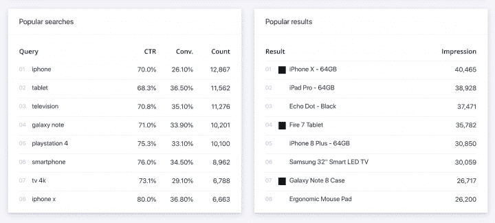
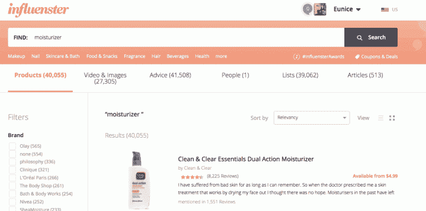

# 电子商务营销指南| Algolia

> 原文：<https://www.algolia.com/blog/ecommerce/the-guide-to-e-commerce-merchandising/>

实体零售商并不是唯一能够利用产品、服务等的战略布局来促进购买者旅程的零售商。电子商务和在线零售商可以通过在线销售对他们的商店进行数字化管理，以确保关键产品和促销活动得到充分强调。

## 什么是网络营销？

在线销售或电子商务销售是在网站上构建、组织和管理产品供应的过程，以实现特定的商业或营销目标。这个过程通常包括管理促销、管理搜索结果和测试改进，以引导用户完成他们的客户之旅。

## 为什么网上销售很重要？

在当今 [竞争激烈的电子商务格局](https://econsultancy.com/how-ecommerce-sites-can-rise-above-price-driven-competition/) 中，营销人员必须为顾客提供独特的购物体验。建立有效和差异化的用户体验不仅能提高转化率，还能创造持久的品牌形象，让顾客长期回头客。

[网上销售](https://www.algolia.com/industries-and-solutions/ecommerce/digital-merchandising/)也有助于企业实现其战略商业目标。营销活动可以通过促销和特别活动直接在网站上实施，您可以突出战略合作伙伴关系，以确保您和您的合作伙伴的成功。

销售流程有助于电子商务企业管理大量不断变化的库存。例如，季节性产品或清仓商品可以战略性地放置和促销，以确保库存及时周转。

## 4 网上营销策略

在线销售是一个持续不断的迭代过程。这里有四个战略最佳实践，你可以遵循来提高你的努力:

### 1。聚焦首页

作为从搜索、社交媒体等进入你的电子商务网站的入口，主页必须提供引人入胜的互动体验，以最大限度地降低跳出率，吸引顾客浏览网站。主页应该:

*   **讲一个品牌故事。品牌故事有助于吸引顾客，让你在竞争中脱颖而出，并向他们展示为什么他们应该和你一起购物。**
*   **展示系列产品和特色产品。主页是突出您希望客户参与的机会的绝佳位置。当顾客进入网站时，摆放得当的产品和促销罐会立即抓住他们的注意力。**
*   确保主页是可扫描的。这个页面应该提供简洁而有用的信息，让客户可以快速浏览，很好地了解你的情况，以及他们可以在你的网站上做什么或找到什么。
*   **包括 CTA**和。主页上的行动号召可以鼓励客户采取某些行动。这也为他们提供了一条清晰的途径。
*   **加入“社会证明”客户生成的内容(评论、社交媒体照片等)进一步吸引您的客户，并验证您产品的质量和实用性。**
*   确保搜索栏可见。通过确保搜索栏易于查找和使用来锁定搜索者。

### 2。撰写强有力的产品描述

产品描述通常是顾客了解他们感兴趣的产品的第一个地方。你可以把这想象成销售代表在网上向感兴趣的顾客推销产品。

描述应该包含关于产品用途、规格、材料、生产和益处的有用信息。你还应该强调运输和生产时间，特别是如果你提供免费运输。所有这些都应该用与你的品牌声音相匹配的信息性语气来完成，这样客户会感到与你有联系。

### 3。使用在线视觉营销

在线视觉营销是在网站上战略性地展示视觉和设计元素的过程。有效地实现这一点可以帮助传达品牌形象，验证品牌的合法性，并增加客户的参与度。

网站上使用的照片以及总体设计是这一过程的关键。除了获得高质量的产品图片和通过设计进行思考，重要的是迭代和调整视觉设计网站，以确保它是最有效的。这些变化应该通过 [A/B 测试](https://www.algolia.com/doc/guides/ab-testing/what-is-ab-testing/) 来衡量对 KPI 的影响。消费者对这些类型的变化很敏感，很难预测对他们行为的影响，因此量化措施可以确保变化产生积极影响。

### 4。根据电子商务客户数据更新您的销售策略

作为一个在线零售商，你可以有效地 [跟踪你的顾客从搜索到购买的每一个举动](https://blog.algolia.com/internal-site-search-analysis/) 。这对于确定销售策略、尝试不同的布局和产品描述、制定未来产品供应策略等都是非常有价值的信息。此外，电子商务网站可以使用社交媒体重定向像素来运行重定向/再营销活动，并收集人口统计信息。

## 搜索如何推动电子商务的营销努力

搜索日益成为客户购买之旅的入口。然而，许多营销人员没有充分利用搜索，结果他们错过了销售机会。搜索营销(Search merchandising)允许对搜索体验进行管理，以推动业务和营销目标。

这里有一些网站搜索可以用来改善销售流程的有效方法:

*   **个性化定制用户体验** 。线上和线下营销的一个关键是向顾客提供 [个性化](https://blog.algolia.com/personalized-merchandising-e-commerce/) 和相关产品。网站搜索允许您在用户搜索时向他们推销特定的产品。如果用户有你的商店的历史，你可以使用过去的购买行为来提供他们更有可能购买的相关内容。
*   **推荐同类产品** 。当客户在站点搜索界面中查看产品时，这使您能够立即向他们展示其他相关产品。这增加了他们找到想要的产品并最终购买的机会。
*   **在搜索结果中显示横幅** 。当用户搜索某些查询或查询组时，可以显示自定义横幅。例如，当客户搜索与类别相关的产品时，可以向他们推送特定类别的促销信息。

*   **推广特定产品** 。出于各种原因，企业通常喜欢促销特定的产品——季节性、节假日、新的产品线等等。有了网站搜索，这些类型的促销可以针对特定的查询或查询组。促销也可以基于用户简档来定制。
*   **使用滤镜和刻面** 。过滤器和方面允许用户通过产品类别快速缩小搜索范围，方面允许用户基于多个不同的搜索维度来这样做。这些可以通过向客户突出或推销某些类型的产品来构建。
*   **针对热门或值得关注的查询** 重定向到特定的 URL。当用户搜索您的企业指定为重要的特定产品时，您可以将他们重定向到包含产品和品牌相关内容的页面，以满足他们的需求。这对于与交叉销售和追加销售可能性较高的品牌或商品相关的查询尤其有用。
*   **使用自动完成和查询建议** 。 [自动完成和查询建议](https://blog.algolia.com/introducing-query-suggestions-better-autocomplete/) 让您不仅可以通过加快搜索过程来提高点击率，还提供了一个将用户推向特定产品的机会。用户在搜索时会主动寻找产品，因此这为引导他们的产品探索之路提供了一个很好的机会。
*   **在搜索** 中提供文字和视觉建议。包括视觉助手，如产品图片或高亮显示的结果，可以吸引用户对这些产品的注意，并增加他们点击它们的可能性。这有助于在推广产品的页面上获得更多流量。

*   **收集并展示客户评论** 。顾客评论提供社交证明。然而，他们不必局限于产品页面。当用户搜索时动态显示它们可以快速验证他们正在搜索的产品。

## 利用出色的网站搜索进行电子商务营销

搜索是在线销售流程的重要组成部分。 观看我们的网络研讨会“ [加速购物车之路](https://video.algolia.com/watch/ArPEHmRktDcRimA39ZUmf3) ”，了解如何利用搜索吸引用户并增加销售额。