# 网站搜索的(几乎)终极指南

> 原文：<https://www.algolia.com/blog/product/the-ultimate-guide-to-site-search/>

我们认为说我们是网站搜索专家是公平的。我们拥有大大小小 9000 多家客户，包括一些世界顶级品牌，如安德玛、鳄鱼、Medium 和 Twitch。

那么，为什么我们称之为几乎终极指南呢？

首先，因为网站搜索是一个复杂的话题。搜索 UX 由[研究公司](https://www.nngroup.com/)和[机构](https://baymard.com/)研究。相关性本身就是一个[值得一书的主题](https://www.manning.com/books/relevant-search)。这样的例子不胜枚举。

其次，搜索是由各种各样的人构建和使用的，从开发人员和产品技术人员到销售人员和数字团队。为不同的搜索用户和专家写一本指南看起来会非常不同。

最后，搜索特定于您的行业、用例以及项目的复杂性。我们一直在为电子商务巨头提供[开发者文档搜索](https://docsearch.algolia.com/)，以及高度[丰富和个性化的体验](https://resources.algolia.com/customer-stories-repo/lacoste-en)。为每个用例编写一个指南可能会有好几本书。

然而，这篇文章的目的是给你一个基本的工具包，让你能够:

1)了解网站搜索最重要的方面

2)准备好评估您正在使用或计划使用的工具，以及

3)确定有机会改进您的网站搜索及其结果的领域

说到这里，让我们开始吧。

## 我们所说的站点搜索是什么意思？

首先，让我们确定术语。

我们的工作定义是:网站搜索是一种功能，它使用户能够快速、有针对性地搜索网站或应用程序的内容或产品目录。

十多年来，谷歌一直在以极快的速度提供超相关的 as-you-type [网站搜索建议](https://www.nngroup.com/articles/site-search-suggestions/) (也称为查询建议)。我们对这种功能已经习以为常，甚至不再注意到它。

[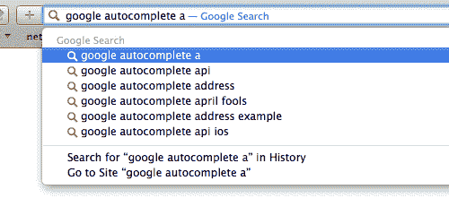](https://blog-api.algolia.com/wp-content/uploads/2020/08/google_autocomplete.gif)

在另一个不同的使用案例中，亚马逊彻底改变了我们的购物方式。为了提供对他们庞大目录的访问，他们建立了一个快速自动建议下拉菜单和强大的动态细化。

我们在这里关注的正是这种类型的搜索:它将人们与产品、内容和关键的结构化数据联系起来。它快速、可靠，可在多个平台上工作，并提供高度相关的结果。

在 Algolia，我们通常称之为“搜索”，并有一个单独的基于爬虫的解决方案，称为[站点搜索](https://www.algolia.com/products/search-and-discovery/hosted-search-api/)。人们也称之为[站内搜索](https://www.searchenginejournal.com/on-site-search-seo/309189/#close)、内部站点搜索、自定义内部搜索、网站搜索，但为了清楚起见，我们将使用最常用和众所周知的术语:“站点搜索”。

## 伟大站点搜索的要素

“伟大”对网站搜索意味着什么？

您可以为用户提供最精致的站点搜索体验，但是这种体验昂贵且难以构建，更难维护、优化和分析。

另一方面，您可以应用一个开箱即用的搜索工具，它非常容易实现、使用和修改，但是会使用户体验变得暗淡，或者更糟，变得不相关。

优秀的网站搜索应该对最终用户来说是相关的、丰富的和吸引人的，但对企业来说也是易用的、敏捷的和高效的。

### 以下是优秀网站搜索的关键要素

对用户而言:

1.  相关性:只显示最相关的结果
2.  **速度:**现代用户不等待；他们反弹
3.  **大 UX/UI:** 让它丰富、美丽、迷人
4.  **发现功能:**用户可以从中获得阅读或购买的灵感
5.  **全渠道可用性:**用户可以在任何设备上找到他们需要的东西
6.  **个性化:**让用户感到被了解、被理解和高效

对于企业而言:

1.  **分析:**这样你就可以最大化业务成果
2.  **销售/促销能力:**这样你就可以控制你的产品
3.  **对开发者和非技术用户的易用性**

### 站点搜索相关性

出色的数字体验与高搜索相关性最直接相关。无论你提供的是产品、新闻、课程还是食谱，你越善于确定用户的意图并为他们提供相关的结果，用户体验就越好。人工智能在现代关联策略中起着关键作用。

#### 语篇关联性

产品的名称、品牌、描述中的关键词——我们称之为属性——构成了文本相关性。以下是一些与文本相关的元素:

**允许输入错误**:即使用户拼错了一个单词或使用了停用词(the、and、at、with…)，也能正确理解用户的意图。

[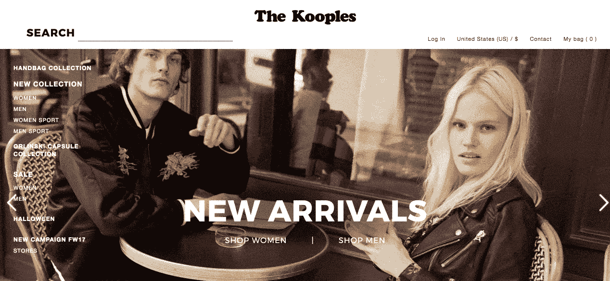](https://blog-api.algolia.com/wp-content/uploads/2020/08/image3.gif)

**同义词**:向用户提供一个同义词结果(例如，当他们输入“夹克”时，一件皮大衣)。这包括前缀搜索(如果您的用户搜索裤子，那么搜索“p”、“pa”、“pan”应该显示“pants”和“pants”的结果)。

**复数**:确保复数被考虑在内(搜索“暖脚器”会显示暖脚器)。

#### 业务相关性

为了创造良好的用户体验，为用户提供他们最有可能采取行动的内容或产品是非常重要的。您可以使用季节性、受欢迎程度或点击率等业务指标来调整相关性，还可以使用站点搜索来推广和过滤项目。

[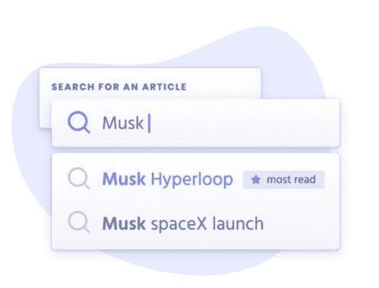](https://blog-api.algolia.com/wp-content/uploads/2020/08/image4.png)

#### 定期调整和优化

定期评估调整相关性的机会非常重要。转到[搜索分析](https://www.algolia.com/doc/guides/getting-analytics/search-analytics/out-of-the-box-analytics/)查看以下内容的结果:

1)您最常用的搜索

2)具有高点击位置的搜索(例如，最受欢迎的项目在位置 6 而不是 1)

3)没有结果的最受欢迎的搜索

通过这种方式，您可以识别没有为用户提供正确结果的搜索，然后调整您的相关性。定期调整搜索很重要，因为用户的需求和搜索模式会随着时间而变化。当你的网站内容或产品目录有较大变化时，做 18 也很重要。

### 伟大的 UX/UI

在一个理想的世界里，你的大多数客户会在第一次尝试时找到他们想要的东西，并且它会出现在前三个搜索结果中。但是如果他们被迫继续寻找，不满将会抬头(随之而来的是，跳出率和网站废弃率的增加)。

让您的用户能够找到他们想要的东西，并以直观的方式进行提炼，这是充分利用您的搜索的关键。以下是方法。

#### 显示第一次击键的结果

就像在真实的对话中一样，让最终用户感觉到 UI 对他们的意图和查询做出了反应是很重要的。不要等到第二次或第三次击键才返回结果！

[即打即搜](https://uxmag.com/articles/designing-search-as-you-type-suggestions)的体验鼓励用户输入两倍的搜索词，这反过来会产生更多相关的搜索结果。

【T2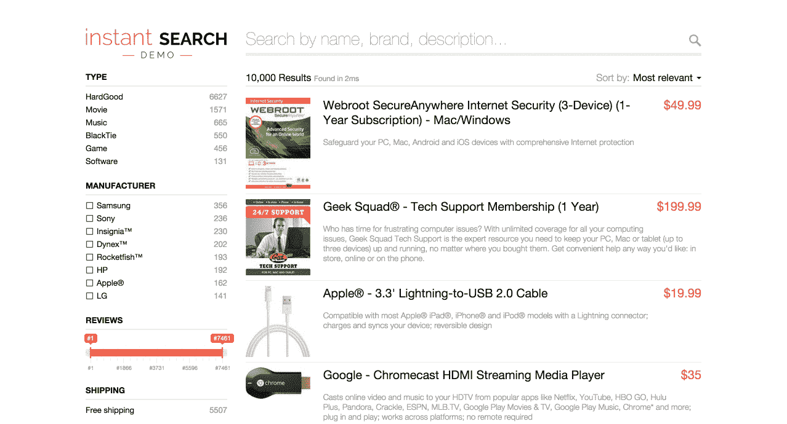

#### 显示并突出显示可搜索的属性

假设你的顾客正在搜索你的目录寻找舒适的家居服，并寻找用氨纶制成的物品。如果你只是简单地显示含有氨纶的衣服的结果，但是用户不明白为什么这些结果会出现，他们可能会认为他们遇到了搜索错误，并失望地放弃你的网站。这就是为什么显示和突出显示可搜索的属性总是最佳实践，在这种情况下，在结果中突出显示“spandex”。

[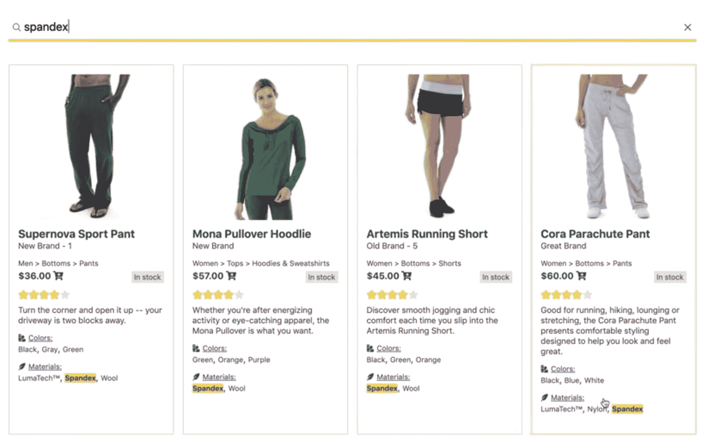](https://blog-api.algolia.com/wp-content/uploads/2020/08/image11.png)

#### 使用联合搜索

联合搜索让你可以向用户展示你创建的所有优秀内容。用户的查询可以显示您的数字财产上任何产品或内容目录的结果。看看 PubNub 如何让他们的用户从不同的内容来源发现相关的结果:电子书、博客、文档、解决方案。

[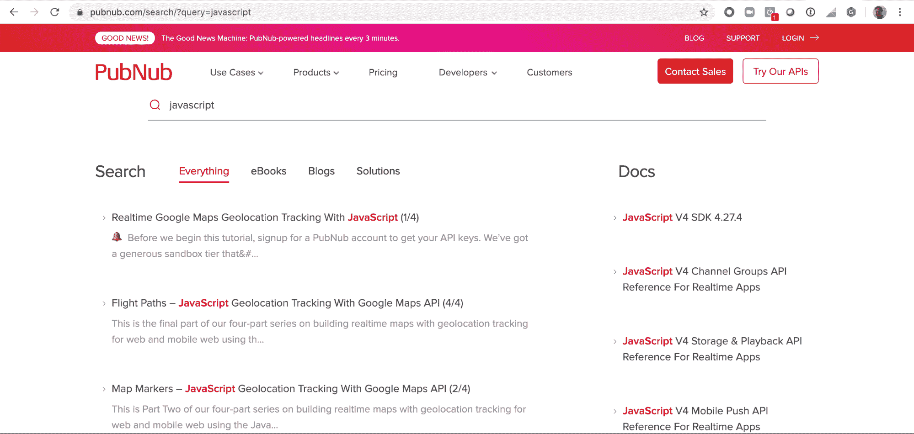](https://blog-api.algolia.com/wp-content/uploads/2020/08/image8.png)
https://www . algolia . com/doc/guides/solutions/gallery/federated-search/

### [T7<path fill-rule="evenodd" d="M4 9h1v1H4c-1.5 0-3-1.69-3-3.5S2.55 3 4 3h4c1.45 0 3 1.69 3 3.5 0 1.41-.91 2.72-2 3.25V8.59c.58-.45 1-1.27 1-2.09C10 5.22 8.98 4 8 4H4c-.98 0-2 1.22-2 2.5S3 9 4 9zm9-3h-1v1h1c1 0 2 1.22 2 2.5S13.98 12 13 12H9c-.98 0-2-1.22-2-2.5 0-.83.42-1.64 1-2.09V6.25c-1.09.53-2 1.84-2 3.25C6 11.31 7.55 13 9 13h4c1.45 0 3-1.69 3-3.5S14.5 6 13 6z">T9</path>](#personalization)个性化

考虑一下这个:

像亚马逊和网飞这样的在线巨头已经把个性化的搜索和发现体验变成了必须。但是在开始个性化之路之前，了解你的用户、他们的需求和信号是至关重要的。

*   定义**你的产品或内容的哪些属性**对个性化最重要:品牌、颜色、产品类型、尺寸、作者、它们的组合……有时重要的是你的客户的购买历史，有时是他们的品牌亲和力。
*   决定**什么样的用户操作**对个性化最重要:点击“添加到购物车”比用户打开产品页面更有意义吗？
*   **使用 A/B 测试**评估您的个性化策略对您的搜索指标的影响。假设您想要基于两个视图(例如，用户是否看到了产品页面或登录页面)和点击(用户点击了什么)来个性化搜索结果。A/B 测试这一策略，看看它是否会对您的搜索指标产生积极影响。然后，作为下一个测试，您可能会测试基于转换数据的个性化结果，比如当用户向购物车添加商品或购买商品、观看视频或阅读文章等。
*   **迭代！**无论你实施什么策略来改善用户体验，一定要做好测试、调整和迭代的计划。第一次几乎不可能把所有事情都做对，所以迭代对于从搜索中获得实际的商业结果是必不可少的。

    > 了解[迪卡侬如何通过个性化搜索将转化率提高 50%](https://resources.algolia.com/customer-stories-repo/decathlon-singapore)

### 全渠道搜索

客户之旅从搜索开始。随着全球超过 38 亿互联网用户在网上搜索任何东西，伟大的搜索不仅必须以即时的方式满足用户的意图，而且必须在用户发现自己的任何地方:无论是在他们的手机、平板电脑还是笔记本电脑上。

#### 移动搜索

打造卓越的全渠道搜索始于移动。用户在移动中，时间更紧迫，容易被通知分散注意力，所以他们在你的应用上的体验必须尽可能完美和无摩擦。

然而，移动带来了独特的挑战，从更小的屏幕到连接挑战。这里有一些克服它们的建议——你可以在这本电子书中找到更多。

*   让你的搜索栏突出且位置恰当:

*   除了 1-2 个“丰富”的搜索结果(有几个属性和一张图片)，一个很好的选择是**显示查询建议**:用户可能已经想到的完整查询。

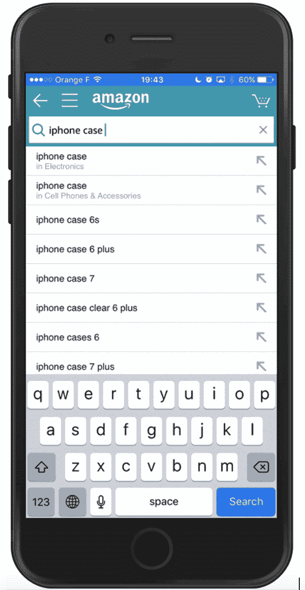

#### **充分利用设备功能。**

尽可能使用:

*   钱包/Apple Pay/Google Pay，而不是要求用户输入信用卡号码
*   GPS 来预填地址
*   生物传感器，而不是询问密码
*   用于输入的语音、语音转文本和图像

[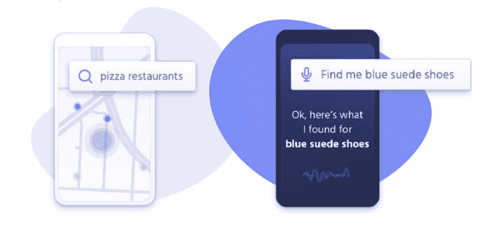](https://blog-api.algolia.com/wp-content/uploads/2020/08/image6.png)

所有这些都减少了摩擦，提供了更好的用户体验。

> 了解 Lacoste 如何利用网站搜索[将移动转化率提高 62%](https://resources.algolia.com/customer-stories-repo/lacoste-en) 。

#### 语音搜索

直到最近，消费者不得不在键盘或屏幕前与品牌建立关系并做出购买决定。起点总是一个搜索框。

但今天，对话式搜索——用户与技术互动，并以自然对话的形式获得回应——成为上下文相关和个性化互动的渠道，包括搜索和发现。

语音搜索影响到每个拥有网站、手机或语音应用的人。

这为人类如何与品牌和企业互动开辟了一个新的可能性世界。然而，与传统的文本搜索相比，成功的语音搜索更具挑战性:

*   语音查询比基于关键字的搜索更复杂；用户通过自然语言使用更丰富的词汇。
*   对于纯语音界面，您只能向用户返回一个结果，这需要更高的相关性。
*   结果必须以消费者看来的思维速度交付，模仿自然语言对话的速度和风格。

现代搜索和发现技术必须应对这些挑战，以确保每种终端用户体验不仅实用，而且令人愉快。

> 了解 WW(前 Weight Watchers)如何使用语音搜索来增强用户的数字体验。

### 搜索，可以，但是发现呢？

用户通常会访问您的网站或其他数字资产，以便:

1.  搜索，努力找到他们想要的东西..某一品牌、颜色和尺寸的一条牛仔裤)，或者
2.  **浏览**，可能想要得到某样东西，但不确定是什么(例如，一套商务休闲装，可能包括一条牛仔裤)。

您应该允许用户从搜索或导航开始，然后通过利用其他策略进一步细化他们的结果，例如在用户执行搜索后提供方面，或者使方面可搜索:

[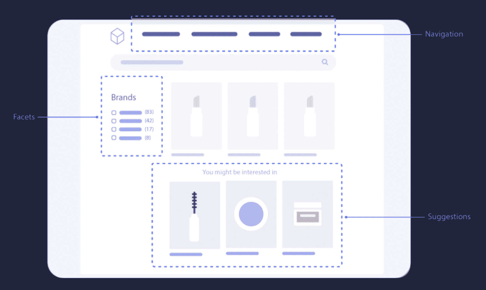](https://blog-api.algolia.com/wp-content/uploads/2020/08/image12.png)

换句话说，你应该为他们提供统一的搜索和发现体验。

### 搜索分析

应该对网站搜索进行衡量，并将其作为发展业务的杠杆。定义 KPI，然后分析你的搜索，这是从你的网站搜索中获取价值的关键的第一步。输入搜索分析。

搜索分析应该让你能够跟踪用户的每一次搜索:他们得到的结果，没有结果，“空”的结果，等等。通过将用户的搜索分解成流行搜索、点击位置、“无结果”数量和过滤器使用等指标，它可以帮助您对用户的行为进行建模。

【T2

搜索分析将让你更客观地思考如何构建你的产品数据，以及如何配置你的排名和相关性。

您将看到您的产品是否得到了正确的描述或表示，正确的产品是否出现在您的搜索结果中，以及根据搜索结果，您是否有太多的一种产品而没有足够的另一种产品。

### 推销你的产品，推广你的内容

您的业务团队可以使您的搜索结果策略与您的目录、收入目标、促销活动和营销策略保持一致。例如，您可以:

1.  运行季节性活动:
    [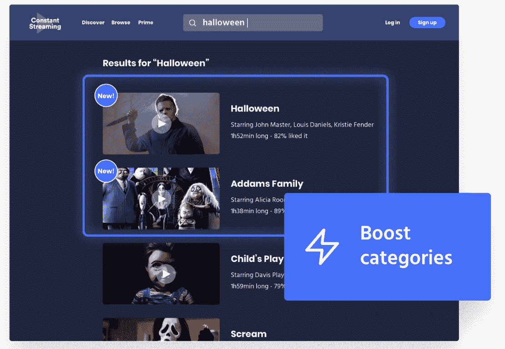](https://blog-api.algolia.com/wp-content/uploads/2020/08/Screen-Shot-2020-08-09-at-10.48.24-PM.png)
2.  从搜索结果中隐藏项目: [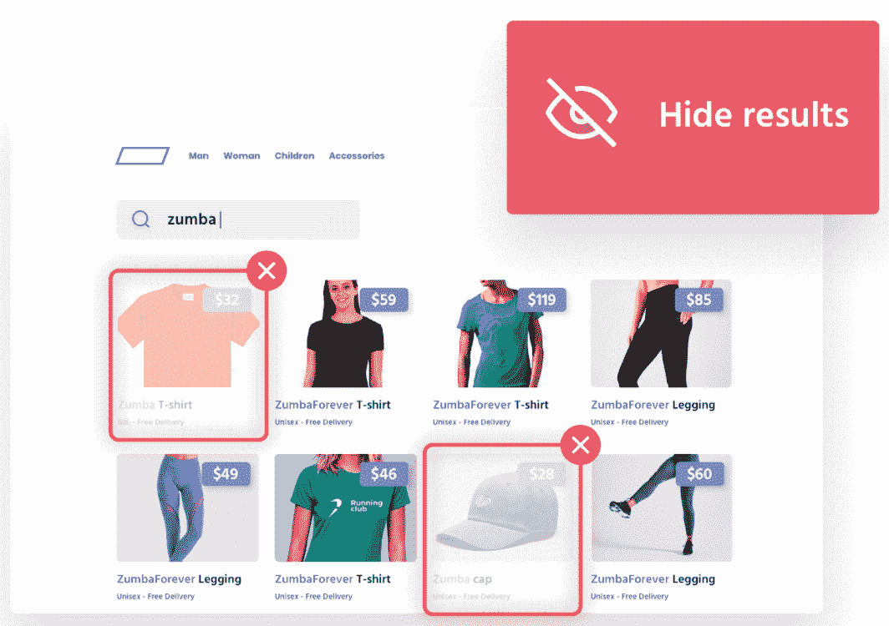](https://blog-api.algolia.com/wp-content/uploads/2020/08/Screen-Shot-2020-08-09-at-10.48.39-PM.png)
3.  Pin 项目:

[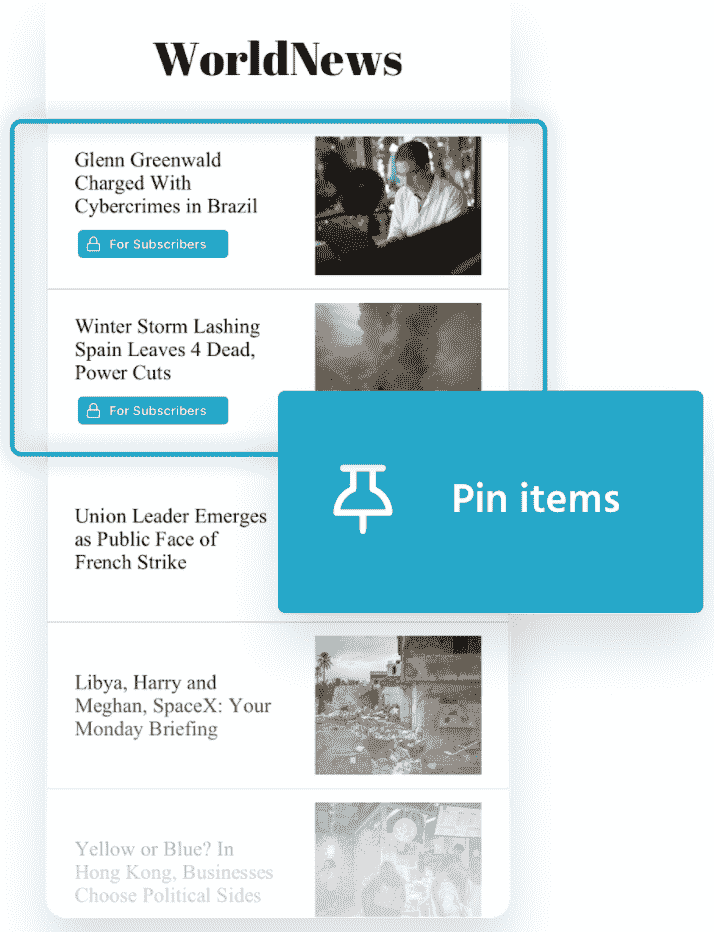](https://blog-api.algolia.com/wp-content/uploads/2020/08/Screen-Shot-2020-08-09-at-10.48.58-PM.png)

### 方便开发者和企业用户使用

在每一次出色的用户搜索体验背后，都有忙碌的团队:开发或实施、维护搜索技术的开发人员，以及拥有搜索数据并希望深入了解这些数据的业务团队(产品经理、业务员、电子商务营销人员和全渠道策略师)。

*   开发人员希望解决方案能够跨平台和设备轻松实现和维护，同时保持对微调、发展和创新的控制。
*   业务利益相关者希望了解并调整用户体验，而不必了解背后的技术，也不需要依赖 IT/开发人员来做出改变。

伟大的网站搜索意味着平衡两者的需求。

想充分利用你的网站搜索吗？

让您的业务团队(数字战略家、产品经理、业务员、营销人员和内容编辑)能够管理和优化您的搜索。首先，他们是为你的产品或内容定义增长策略的人。其次，他们最直接负责投资回报和改善业务成果。最后但并非最不重要的一点是，这将释放宝贵的 IT/开发团队时间，用于改善用户体验。

## 总之…

虽然一开始考虑网站搜索的所有这些方面可能会让人不知所措，但请记住，它们可以按照对您的业务和带宽有意义的顺序分阶段解决。把它看作一个容易的成功路线图:每一次迭代都将有助于更快乐的用户和更好的业务结果。它的美妙之处在于，通过网站搜索，一个可以直接转化为另一个。

如果你想知道你的网站搜索在所有这些元素中处于什么位置，我们有一个简单、免费的自助式搜索评分器。

> [5 分钟给自己的搜索打分！](https://grader.algolia.com)

请不要犹豫给我们这个帖子的反馈和建议:hey@algolia.com。