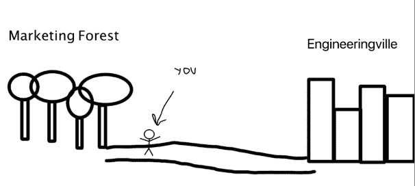

# 开发者关系的何人、何事、何地、何时和为何

> 原文：<https://www.algolia.com/blog/algolia/the-who-what-where-when-and-whys-of-developer-relations/>

2018 年 9 月，我坐在巴黎一个公园的长椅上，旁边坐着一位和蔼的老太太。问题是，我不会说法语，她也不会说英语。不管怎样，我们试图进行一次谈话。当她谈到我只能猜测她的孙子们有多棒时，我问自己:我是怎么走到这一步的？

今天，我是一名开发者拥护者。在过去的生活中，我是一名软件工程师。如果你允许的话，我会告诉你我在过去几个月里学到了什么，并分享一些可能对你有帮助的信息。

## 谁是开发商关系？

你！我！所有人！这就是开发商关系让我措手不及的地方。任何人都可以参与倡导社区的过程。事实上，如果你渴望成为一名官方的开发者拥护者，我认为最好的开始时间是… *现在*！找到你感兴趣的项目，和/或你有兴趣接触的观众，并进行互动！

## 什么是开发者关系？

这是我问过自己也问过别人的问题，每个人回来都有不同的答案。问题是，开发者关系对不同的人来说意味着很多不同的东西。这个角色很大程度上依赖于你工作的产品或项目、你团队的氛围、公司的主动性，最重要的是，你所服务的社区的动态。

换句话说，我认为开发人员宣传/关系/布道就是**发现并交付最有效的方法来支持开发人员社区**。

## 开发商关系在哪里？

那么开发者关系在更大的技术生态系统中处于什么位置呢？广义地说，开发者拥护者是比传统工程师更接近市场营销的工程师。一种可视化开发倡导者职责的方法看起来有点像这样:

对于对公开演讲、写内容(比如这个博客！)并且对支持开发人员更感兴趣，可以考虑离开工程城，进入营销领域，在那里他们的技能可以得到更好的发挥。开发者关系的另一个很好的类比类似于超人和克拉克·肯特之间的关系。开发倡导者可以过着工程师的生活，但是经常被要求转换到超人模式，去参加会议或者承担更广泛的创造性责任。

## 什么时候是开发者关系？

据我所知，开发者福音始于 20 世纪 80 年代的苹果公司，创始人是迈克·博伊奇。从那时起，这个职业就一直在发展，并且随着技术的发展而发展，因为你提倡技术！这在今天是一个非常令人兴奋的领域，因为开发者关系给了你很多机会去学习新工具，结识新朋友，并通过公开演讲、写作、阅读，当然还有编码来发挥你的创造力。

*Brandon West 在这里有一个关于 DevRel [历史的精彩演讲。](https://www.youtube.com/watch?v=vFGDzaLiAnM)*

## 为什么是开发者关系？

最重要的问题是**为什么**。*为什么是开发者关系？*关于“为什么”的问题在于它是极其动态的。没有两个人会有相同的“为什么”,因为没有两个人有相同的投入和动机。在组织层面，这变得更加复杂。所以，请允许我告诉你我自己的“**为什么**”，希望能帮你找到你的。

让我们回到几个月前我坐的那张长椅上。我以前从未去过巴黎，作为一名软件工程师，我一直感到不满足。我喜欢这份工作解决问题的一面，但我觉得缺少了一些东西。我想要一个能让我变得多才多艺的角色，去尝试许多不同的事情，接触来自世界各地的不同的人。我想拥有一份能让我教很多东西，甚至学到更多东西的职业。当我坐在那张长椅上的时候，我:

*   我去了伦敦的一个会议，了解了文档中的移情作用
*   与三个不同的工程团队坐在一起，为他们每天面临的 GitHub 问题出谋划策，尽可能做出最好的产品
*   参加与其他组织的合作会议，集思广益，寻找增强开发人员体验的创造性方法
*   学到了很多营销知识，特别是向不同受众讲述故事的微妙之处，以及品牌一致性的重要性，并帮助为巴黎的开发者活动设计了标语
*   看了史奇雷克斯在拉斯维加斯 AWS re:Invent 的表演
*   使用和学习 Algolia API 编写任意数量的演示应用程序
*   编辑社区贡献者的博客，讨论我们试图向他们的读者传达什么价值
*   从终身贡献者那里了解开源
*   与才华横溢的人建立了无数的联系，激励我学习新的想法
*   为我们办公室的工程师与城市中的其他人建立了一个联系框架
*   为公司内部的人建立了一个内部交流思想的渠道
*   帮助人们构建他们的 Algolia 实现
*   我参加过多次会议，在那里我可以和其他开发者直接交流

还有更多！成为一名开发者倡导者很有趣，但绝不容易。我非常感谢过去几个月我所做的一切，我对接下来的几个月更加兴奋。