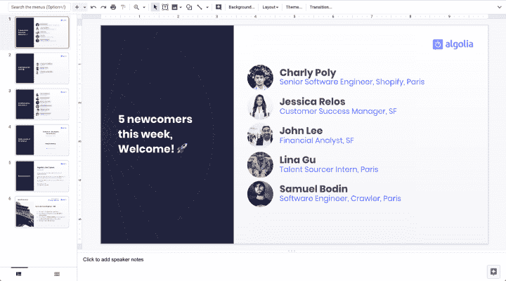
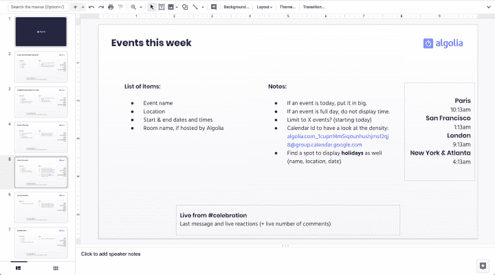
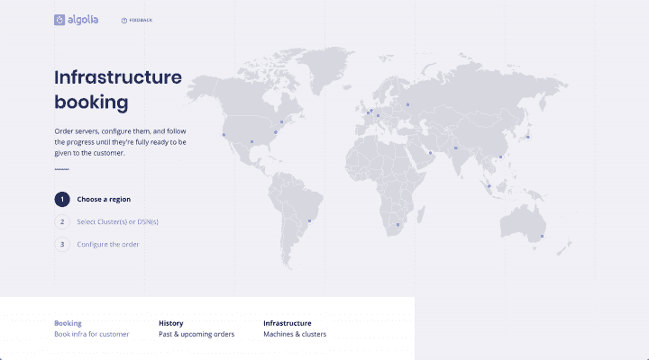
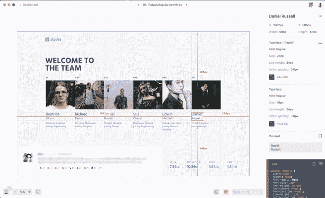
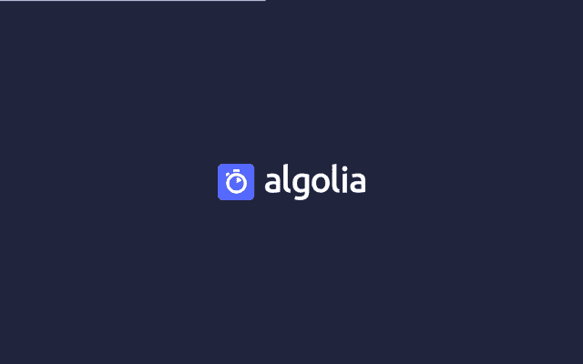
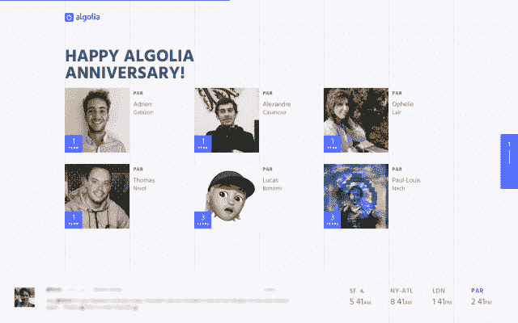
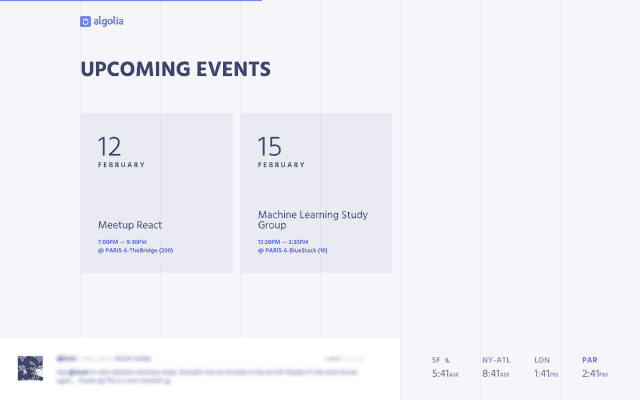
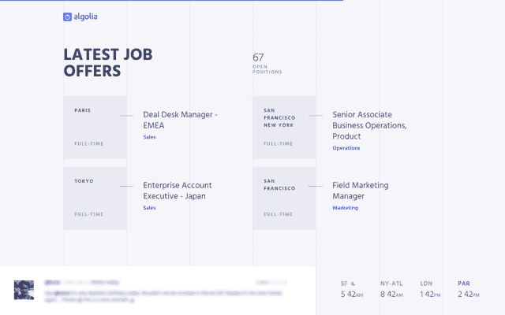

# 如何在工作时间为兼职项目腾出时间

> 原文：<https://www.algolia.com/blog/engineering/unlock-time-side-projects-working-hours/>

Algolia 是一家快速扩张的公司:当我在 2017 年 8 月加入时，我们大约有 120 人，到我写这篇文章时，我们已经增长到 300 人。我们在世界不同的地方有很多办公室，这意味着不同的时区，所以很容易感到失落，与彼此的日常生活脱节。这对新员工来说尤其如此。这可能属于我所在的内部工具团队的范围，因为我们的任务是提高生产力和内部沟通。我们想创造一些东西来“欺骗”距离，让人们感觉他们更像是属于一个公司。

我们首先想到的是一个循环播放一周活动的电视新闻屏幕:人们的生日、招聘纪念日、新员工、活动和聚会、候选人现场面试、职位空缺以及时区——集中公司一周的亮点似乎是帮助文化升级工作的一个好步骤。

现在每个办公室都安装了屏幕！

这个项目花了 10 天时间才完成，从手动更新谷歌幻灯片到全自动解决方案 today.algolia.com。然而，我们不得不面对的挑战是为它腾出时间，而我们的产品路线图已经相当雄心勃勃。当你没有工作时间的时候，这里有一些关于如何开展兼职项目的建议。

## 从概念证明(POC)到路线图

第一步是验证项目的附加值。我花了几分钟在谷歌幻灯片上建立了一个幻灯片平台，上面有生日和本周的事件，每周五下午还会更新一些。这都是手动操作，但电视屏幕在我们的巴黎办公室得到了积极的关注，使得几周后自动操作成为合法的。

为此，我需要释放一些我没有的工作时间，因为这个项目完全偏离了路线图。这个策略是在我空闲的时候建立一个 POC，并把它展示给内部工具团队的经理兼技术主管 Baptiste Coquelle。它只不过是一个 API，处理数据并证明我们可以自动化一切，使它成为一次性项目，将维护时间减少到零。由于该项目对 Algolia 的文化意义重大，并且已经得到了良好的规划和控制，这是一个双赢的局面，并使 Baptiste 明显地得到了验证。

## 优化生产时间

尽管我的经理同意给这个项目一些时间，但仍然有很多事情要做。Algolia 的设计师与许多团队合作，通常有很多事情要做。我和设计师 Nicolas Meuzard 谈过这个项目。他对此印象深刻，并希望做出贡献。为了防止这个兼职项目占用他的时间，我们需要快速工作，快速发货。我们使用了一些策略来优化我们的协作，减少来回奔波的次数。

### 铺路

第一步是给 Nicolas 构建 UI 所需的所有信息。为此，我使用 Google Slides 并在每个屏幕上创建一个页面，写下 API 返回的简单数据模式，并为特定的视图逻辑添加一些注释。这是在关于项目目标和全球形式的一些快速聊天之后——那里不需要其他文件，因为大局对我们两个都足够清楚。

### 重用 UI 元素

Nicolas 重新使用了我们以前一起做的内部工具的布局，使它成为下一个项目将依赖的内部设计系统的第一步。主网格是相同的，我们从营销网站的全球设计系统中获取颜色和字体，只留下一些 UI 元素来定制和组装，以构建最终的 UI。

### 任职值

在 Algolia，我们使用 Sketch 来设计 ui，尽管我对它有足够的信心，但它仍然不是开发人员工作的最佳选择。尽管 Sketch 有一些不错的导出特性，但它们仍然离我们很近，很快就会增加构建完整样式表的延迟。

Zeplin 被标榜为“设计师和开发人员之间的终极协作工具”，它让我可以访问所有的值，如边距和填充，元素之间的距离，以及与字体相关的度量，这些都可以在右窗格中一目了然地看到。它还导入和计算本地草图文件，使其无缝集成到 UI 设计人员的工作流中。在我这边，我现在完全自主地构建 UI。使用泽普林的决定是显而易见的。

### 处理更正和反馈

正如任何涉及设计的项目一样，最初的模型和实际版本之间存在差距。电视屏幕的颜色校准不同于电脑屏幕的颜色校准，我们在 Algolia 有不同型号的电视屏幕，所以我们必须解决对比度问题，使它们看起来都很好。纵横比也不一致，所以我们必须重新定位一些元素并创建一些新的响应规则。人们不能正确地阅读我们的第一个分页，所以我们也必须迭代。再添加一些像这样的小细节，你很快就会在发布前有两个星期的额外延迟(特别是因为我们没有全职工作)。

因此，我们决定一次性收集所有的修复和反馈。为此，我在桥上坐了一整天，这是我们巴黎办公室的主要房间，屏幕就在这里，所有员工都来这里喝咖啡休息。许多人带着小小的反馈自然而然地来到我这里。

一天结束时，我和尼古拉斯在屏幕前坐了半个小时，实时调整小问题。第二天，他把设计的最后一次迭代发给了我，我在旅途中实现了它。它看起来像这样:

## 为副项目解锁时间提示

以下是我在不影响计划项目的情况下，在紧迫的时间期限内完成附带项目的最佳建议:

*   展示对公司的价值。创建世界上最简单的概念验证，以围绕项目制造轰动和刺激。
*   制定一个好的计划和一个简单的时间表，让你的团队和你的经理更容易同意。
*   预见和你一起工作的其他人的需求和限制。知道他们需要在繁忙的工作时间之外抽出时间。提前与他们交谈，获得他们的认同。
*   使用简单的工具，使你能够从其他专业人员(在我的例子中，是我们的设计师)那里接管部分项目。
*   实时沟通和修复，而不是异步。
*   了解项目需要什么，去掉不必要的步骤。在我们的情况下，这意味着没有测试，因为它不是一个面向客户的生产应用程序，或者没有广泛的响应，因为它只适用于电视屏幕。

## 早餐吃文化攻略

这个项目在 Algolia 可行的另一个原因是内部工具团队比其他开发团队有更少的约束，这使得我们更容易变得敏捷。我们也没有技术上的限制，所以我们可以选择我们最擅长的语言和库。

Algolia 非常重视信任和所有权，鼓励人们从事与公司相关的兼职项目。然而，我们知道并不是所有的公司或团队，甚至时间框架都支持这样的计划。我曾经在一家服务公司工作，那里没有副业文化，因为每一个工作时间都需要被证明是合理的。然而，我仍然设法处理一些内部项目:我在空闲时间预测并准备了一个 POC，以最终获得 CTO 的批准，并腾出工作时间来完善它们。如果你能证明这对公司有价值，而且事情可以轻松完成，同时不影响你的日常工作，你就有可能成功。