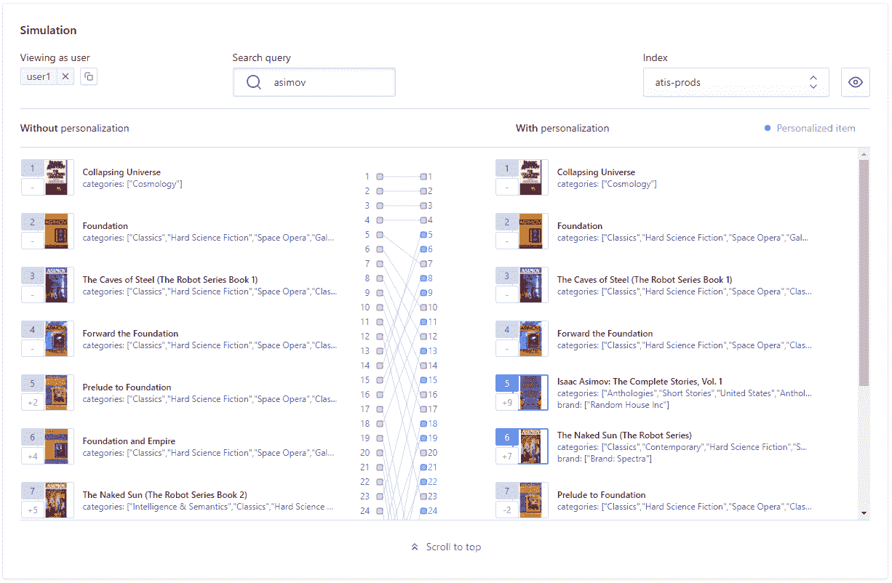
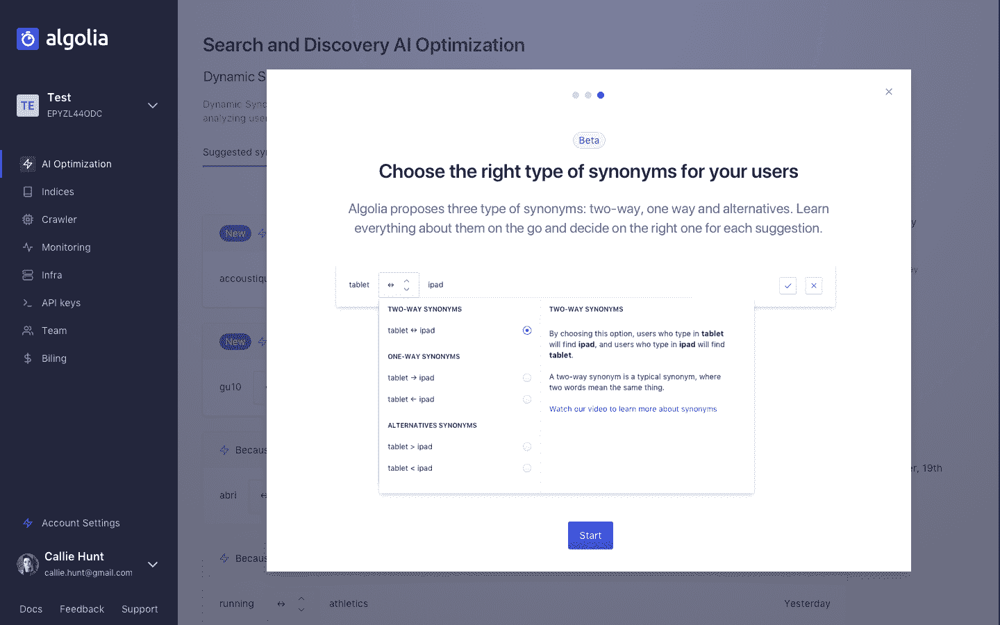
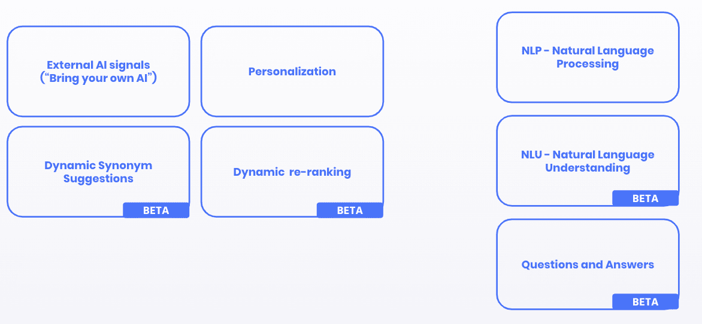
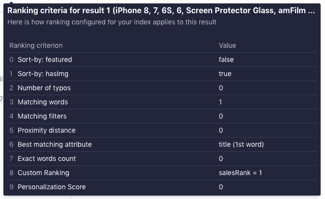

# Algolia 如何使用人工智能提供更智能的搜索- Algolia 博客

> 原文：<https://www.algolia.com/blog/ai/using-ai-to-deliver-smarter-search/>

人工智能是 Algolia 战略的重要组成部分。我们不断投资于人工智能，以增强和扩展我们现有的经过战斗考验的解决方案，解决搜索中最复杂的问题。每年有 1 万亿次搜索，每天有六分之一的网络用户和 9，000 多名客户，我们可以访问强大的数据集，使我们能够开发市场上最全面的智能自动化功能套件，同时保持我们严格的数据隐私政策。

## 为什么 AI 在搜索中很难

搜索是一个复杂的问题，也是一项重要的业务优势。正如《相关搜索》(Relevant search)一书的作者、著名的相关性专家道格·特恩布尔(Doug Turnbull)所说:“提供真正相关的搜索体验一直难以实现，如果不是大多数组织的一个关键盲点的话。”即使是消费级搜索的市场领导者，如网飞和亚马逊 [也在努力用他们的人工智能栈](https://www.technologyreview.com/2020/05/11/1001563/covid-pandemic-broken-ai-machine-learning-amazon-retail-fraud-humans-in-the-loop/) 优化和调整他们的搜索结果。

建立伟大的搜索引擎需要公司通过解决多个问题来发展他们的相关性:  

*   **干净的结构化数据。** 搜索数据——通常是大量的数据——在用作搜索输入之前需要被索引和清理。例如，产品可能缺少某些“属性”，如颜色或材料，或者描述混乱，需要进行组织和结构化，以便搜索引擎能够识别它们。自定义代码和 AI 可以用来从算法上解决这个问题，从而节省大量的时间和资源。
*   **用户意图检测。人类以“杂乱”的方式进行搜索:我们使用不同的同义词来描述同一件事(“红裤子”代表“红裤子”)，我们打错别字(“咕咕”代表“烹饪”)，并且提出问题，而不是键入或说出干净的搜索术语。此外，我们说不同的语言，有各自的特点，如很长的单词或不带空格的单词。这就是自然语言处理(NLP)的用武之地，NLP 是人工智能的一个分支，帮助阅读、理解和理解人类语言。**
*   **成绩排名(和重新排名)。** 一旦搜索引擎“理解”了用户的意图，它就需要返回经过排序的结果，这样用户就能感觉到它们与自己的查询最相关。 [单独的排名公式](https://blog.algolia.com/how-algolia-tackled-the-relevance-problem-of-search-engines/) 是一个重大的挑战:即使是其中最好的，也会有主配置没有覆盖的边缘情况。  此外，呈现与用户最相关的结果只是等式的一半。在这种情况下，企业希望对结果进行重新排序，以提供针对“业务相关性”进行优化的结果:可用性、利润、受欢迎程度等指标。 微调排名公式逐个查询非常耗时:这就是人工智能可以用来分析用户行为并根据发现建议改进排名的地方——然后迭代和自我学习以进一步改进。
*   **透明度。鉴于上述每一个问题的复杂性，对于企业来说，理解人工智能的每一层如何影响搜索结果，它们如何在编排中协同工作，以及最重要的是，能够根据研究结果做出改变，都是至关重要的。甚至在人工智能出现之前，好的搜索解决方案只为开发者提供相关性理解和优化。复杂的排名公式(例如，为每个文档分配一个唯一的分数，并混合许多信息，如属性权重、单词之间的接近度等。)实际上是一个黑箱，使得搜索团队几乎不可能理解为什么结果以某种顺序出现，以及如何调整以实现预期的相关性。**

为了成功应用人工智能，它需要解决上述每一个问题，同时确保所有人工智能算法整体上工作良好。换句话说:为了提供高质量的消费级搜索，推动可衡量的商业结果，公司需要一种全面的人工智能方法。

这就是为什么 Algolia 建立了一个 AI 算法家族 来解决搜索最重要的方面。把它想象成一个搜索的 AI 工作室: **一组解决大多数复杂搜索问题的** ，打包在一个 **易用灵活的 API 里面。**

## 2020 年阿哥利亚的 AI 平台

2020 年，我们将继续增强现有的人工智能实践，并扩展到新的实践:  

*   **自然语言处理** (NLP)是人工智能的一个分支，帮助阅读、理解和理解人类语言。Algolia 的搜索引擎使用先进的机器学习算法来自动识别通常难以破译的单词，例如日语和汉语等亚洲语言中没有空格的单词，或者德语、荷兰语、芬兰语和瑞典语等日耳曼语。一个例子是经常被引用为最长的荷兰语单词:Kinder carnavals opto cht voorbereidings werkzaamheden plan，意思是“儿童狂欢节游行的准备活动计划”。
*   **Automated personalization**. Personalizing search results is a surefire way to improve the user experience and maximize business KPIs. Algolia’s automatic personalization analyzes user signals (like a click on a product page, a purchase, an add to cart, an add to wishlist, etc.) to deduce a profile for each user according to a business configuration, and serve a personalized search and discovery experience for each user, while preserving user privacy. What’s unique about Algolia is how we handle the ranking. We are able to personalize *while respecting all other key elements of relevance*. Our customers can understand how results are ranked based on personalization *and* each relevance factor (textual factors like synonyms, plurals, lemmatization, *and* business relevance factors like margin or popularity). They can then iterate and adjust to get to that perfect search result formula.

    Personalization simulator showing the impact of personalization for one user on the right column

*   **动态同义词建议。** 配置同义词是提高搜索相关性、增加其商业影响力的最重要——也是最复杂——的方法之一。然而，搜索中的同义词不是基于字典的；它们特定于每个业务和每个用例。这使得它成为一个耗时的手动过程，即使对了解其内容和产品目录的专家来说也很困难。Algolia 根据真实用户如何使用同义词建立了一个简化的推荐流程，然后很容易接受或拒绝这些推荐。这项功能目前处于测试阶段。 
*   **动态重新排名，** 本季度内测，根据分析用户行为的发现 *建议改进查询排名。* 例如，如果特定查询的第三个结果是点击次数最多的结果，推荐或自动化会将其移动到第一个位置。随着对来自用户行为的额外反馈循环的分析，该特征将在准确度和精确度上有所提高。按照白盒方法，客户将对算法计算完全透明，并有能力覆盖行为。此外， *Algolia 是唯一的解决方案，可以让您确切地知道这些计算如何影响体验* 。
*   **语音和自然语言理解。** 用户越来越多地以自然语言而非关键词的形式表达查询，尤其是语音搜索。因为搜索引擎习惯于理解和处理关键词，所以我们在 查询到达搜索引擎之前，引入一层 AI 来分析用户意图 *。这个新的 NLU 引擎启用了新的对话界面，其中搜索和 NLU 结合起来，以增强对方。Algolia 的 NLU 引擎检测 *意图* 和 *实体* 来了解用户真正想要的是什么，例如识别说“在我的购物车中添加一件价格低于 500 美元的上等黑色连衣裙”的用户想要执行与说“给我看看所有黑色连衣裙”的用户不同的动作*
*   **结合 Algolia 与客户的 ML/AI 模型和技术** 。Algolia 客户可以使用任何数据点(点击率、产品或内容受欢迎程度等。)，甚至将自己 ML 模型的结果插入到 Algolia 的可扩展排名公式中，以增强自己的反馈回路。随后，Algolia Analytics 和 A/B 测试套件有助于直接衡量他们决策的影响。

我们的愿景是能够在 Algolia 中使用任何类型的定制人工智能算法。我们在这个方向上发布的第一步是在我们的引擎中高效地处理数百万条规则；我们的客户可以使用这些规则作为他们的人工智能算法的输出，来重新排列结果，提升类别等。

## 透明易懂

我们清楚地陈述了人工智能功能做什么，它们在哪里以及如何影响体验，并且我们清楚地陈述了它们如何与其他功能一起工作。我们确保我们的客户对如何计算他们的相关性有透明度，而不是盲目信任他们不理解的算法。我们将这种 **称为白盒方法** ，我们认为这是保持客户授权、接受迭代方法见解教育以及信任 Algolia 的关键。

Showing how textual relevance (criteria 0-7), custom ranking (8) and personalization (9) generated a specific query result position.

  白盒方法对于持续改进至关重要。如果一家公司不能告诉你为什么结果按特定顺序排列，你就不可能测试其他方法来调整和改善结果。

## 接下来是什么

我们将继续探索、开发和拓宽我们的 AI studio:一套集成算法，帮助我们的客户利用人工智能的力量，同时保持易用性和灵活性作为设计原则。

例如，我们与 [OpenAI](https://beta.openai.com/) 是发布合作伙伴，将他们的技术捆绑在我们的搜索引擎之上。目标是能够提供用户问题的答案，以及用户需要分析的结果列表(类似于谷歌对类似“为什么富兰克林·罗斯福支持成立联合国”这样的查询所做的事情)。您可以想象这种技术在帮助中心的环境中是如何有用的，对降低支持成本有重大影响，或者对新闻机构来说，让读者回来了解最新的事实。

我们正在评估许多其他人工智能解决方案，包括但不限于:

*   **人工智能驱动的数据清理和结构化**
*   **动态营销建议**:根据特定查询确定要推广的类别
*   **自动配置可搜索属性**(排名公式中最重要的元素之一，如产品名称或类别)，确保它始终反映用户的搜索方式
*   **动态过滤器优化**确保您在 UI 中显示的顶级过滤器值与您的用户行为相匹配  

随着人工智能的不断成熟，我们将继续努力降低搜索的复杂性，让我们的客户能够为他们的用户提供最佳的搜索和发现体验。随着自然语言处理(NLP)在分析意图方面变得更好，我们将更接近对话搜索中双向对话的理想状态。最终，我们人类将会像与人类助手一样与软件互动。请继续关注 Algolia 为这一不远的场景铺设的路线图。