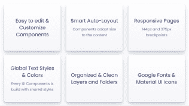
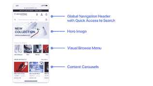
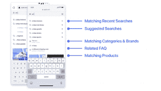
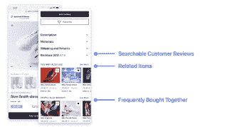
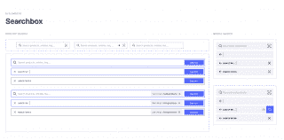

# 使用 UI 套件创建出色的电子商务搜索和发现体验- Algolia 博客

> 原文：<https://www.algolia.com/blog/ecommerce/using-ui-kits-for-creating-great-ecommerce-search-and-discovery-experiences/>

# 为移动和网络定制页面和组件设计，应用行业最佳实践指南

有效的消费者搜索和发现产品的过程是任何电子商务网站成功的关键。用于搜索的 UI 套件包含可视和交互式组件以及屏幕布局，以确保一流的在线体验。

根据消费者洞察作家 谷歌的 Alistair Rennie 和 Jonny prot heroe， “随着互联网的发展，它已经从一个比较价格的工具转变为一个比较一切的工具。这一点在我们多年来看到的购买行为变化中显而易见……”

考虑周全的电子商务用户体验至关重要，因为 Rennie 和 Protheroe 称之为购买之旅的“ [【凌乱中间](https://www.thinkwithgoogle.com/consumer-insights/consumer-journey/navigating-purchase-behavior-and-decision-making/) ”:在线购物阶段，人们探索和评估他们的产品购买选项，在这里他们容易受到推荐、评级和评论的影响。

推动客户穿越混乱的中间地带的潜在功能是搜索。顾客来到一个电子商务网站寻找完美的商品。他们查看自己的搜索结果，这些结果可能包括从产品、功能和价格到评论、送货成本以及送货或取件选项的所有内容。如果满意，他们会继续搜索，直到找到他们想要的，但前提是搜索体验符合他们的期望。客户希望相关内容立即出现在他们的指尖。他们还不断评估网站整体用户体验的精细程度，以及公司的品牌和声誉。

# 为什么要用 UI 套件进行搜索？

用户界面套件有助于购物体验的设计，让顾客可以轻松查看所有需要的细节，以便在杂乱的信息中筛选。本质上，套件 **清理了混乱，** 为购物者的理想商品指明了一条清晰的道路，同时让他们享受进一步的购物探索和发现，并将他们转化为忠诚的顾客。

秘密在于设计的简单性和恰当的导航功能(搜索栏、小平面、产品类别和菜单)。最好的设计围绕着容易获得产品推荐和相关项目。它结合了突出相关或相关内容的视觉技术。它可能包含联合搜索，允许购物者找到非产品项目，如文章和常见问题解答以及产品，理想情况下，所有这些都由一个令人愉快的搜索和发现体验提供。

UI 套件还可以帮助 web 和移动设计人员创建和定制包含行业最佳实践的体验，从而在赢得网站访问者的同时最大化投资回报率。

# 奥利亚方法

如果你在网上搜索，你会发现大量针对电子商务的 UI 套件。他们倾向于专注于增强全球在线购物体验，而不是 **创建有效的搜索、浏览和转换功能** 。

在 Algolia，我们注意到这些广受关注的 UI 套件非常受欢迎，并意识到我们可以创建自己的版本，专门针对我们的强项搜索和发现。建立一流搜索的电子商务网站会给客户留下深刻印象并赢得他们的信任，最终增加收入并建立品牌忠诚度。我们的使命一直是让公司创造伟大的搜索体验，所以这是合乎逻辑的下一步。

在过去的几年里，我们一直在简化我们的软件，让开发人员更容易、更快地构建出色的搜索和发现体验——无论有没有搜索框。例如，我们增加了相关性功能，如[商品销售](https://www.algolia.com/doc/guides/managing-results/rules/merchandising-and-promoting/)[人工智能驱动的](https://www.algolia.com/blog/ai/what-is-ai-powered-site-search/) 推荐，以及升级了我们的 [即时搜索](https://www.algolia.com/products/instantsearch/) 和 [Algolia 自动完成](https://www.algolia.com/doc/guides/building-search-ui/ui-and-ux-patterns/autocomplete/js/)

然而，我们也意识到，在创建有效的用户界面和 UX 时，我们还没有足够重视让业务团队、设计师和开发人员设想一个强大的前端体验。我们确定在这方面需要更多的指导和资源，并着手实现这一目标。

# 介绍我们的第一个 UI 套件

我们创建了一个免费开源的 [电子商务搜索和发现 UI 套件](https://www.algolia.com/doc/guides/solutions/ecommerce/ui-kits/) ，让 web 和移动设计人员与业务利益相关者和开发人员无缝协作，建立一流的搜索 UI/UX，其中还包含搜索框之外的功能。

该套件旨在提高购物者对速度和相关性、搜索和浏览导航等的感知。 例如，我们加入了个性化产品传送带和包含交叉销售推荐的产品详情页面。我们还提供了让购物者搜索顾客产品评论的功能，以及轻松定位实体店的功能，顾客可以在实体店挑选自己购买的商品。

该 UI 套件包含两种资源:

*   **可定制的屏幕布局** 除了你自己的网站模型之外，你还可以根据自己的品牌和用途轻松定制
*   **一个 UI 组件库** ，例如搜索栏、细化列表和传送带，您可以选择这些组件来定制现有屏幕或在创建原始模型时使用

该套件还提供了关于最佳页面布局和组件的 最佳实践建议 ，以用于您的特定行业和产品类型。

# 基于最佳实践

该 UI 套件诞生于多年来对我们阿尔戈利亚 UX 最佳实践的监控以及对搜索和发现模式的研究。此外，我们还纳入了行业领导者引用的关键发现，如谷歌 (在其[【UX 零售剧本 :取悦用户的最佳实践集](https://services.google.com/fh/files/events/pdf_retail_ux_playbook.pdf) ) 和 贝玛研究所(在其 [电子商务 UX 研究文章](https://baymard.com/blog) )。

受 Brad Frost 的 [原子设计](https://bradfrost.com/blog/post/atomic-web-design/) 概念的启发，我们的 UI 套件是 100%可定制和优化的，以反映现代工作流设计。我们确保满足这八项关键要求:

# 这个 UI 套件里有什么？

您的设计师可以访问移动、web 和桌面平台的完整搜索和发现解决方案的 30 多个响应屏幕模型。这些布局体现了购物者在访问现代电子商务网站时期望找到的用户体验模式。

设计师可以使用这些原型作为预构建的起点，然后对它们进行定制，以反映行业规范和品牌。

零售网页设计选项包括:

*   带有全球导航标题的主页布局和为探索而构建的用户定制的传送带
*   具有查询建议功能的多类别自动完成(“预测搜索”)搜索框
*   一个适合搜索和浏览的产品列表页面，带有过滤器和排序面板
*   一个包含推荐的产品详情页面，让购物者搜索用户评论
*   一个商店定位器，如果购物者更喜欢挑选商品，它可以让他们找到最近的实体商店

这里有一个移动主页设计的例子，它有一个内容转盘(可以由 Algolia 的 [搜索个性化](https://www.algolia.com/products/personalization/) )支持:

#### 添加 [自动完成](https://www.algolia.com/blog/ux/what-are-predictive-search-and-autocomplete/#:~:text=Autocomplete%2C%20or%20predictive%20search%2C%20is,thus%20improving%20the%20user%20experience.) 功能可以增强电子商务网站的可用性。您可以在一个视图中向购物者显示查询建议、特定品牌、产品类别页面、常见问题解答和商品，所有这些都可以使用 [Algolia 自动完成](https://www.algolia.com/doc/guides/building-search-ui/ui-and-ux-patterns/autocomplete/js/) 轻松构建。

#### 这是我们 UI 工具包中的一个移动自动完成搜索栏:

在你网站的商品详情页面上，你可以让用户搜索顾客评论，同时查看交叉销售建议(相关商品和经常一起购买的商品，由 [Algolia 推荐](https://www.algolia.com/products/recommendations/) ):

*   ## 可混配组件

除了响应式页面布局之外，设计人员还会喜欢访问各种用于页面布局和导航的用户界面组件。这些组件都是使用自动布局和变体构建的，从简单到复杂。它们可以根据需要进行调整、混合、匹配和移动，以反映您的网站结构和品牌。 这种灵活性适用于页面、搜索栏和设计元素。

这里有一个示例搜索框，有手机和桌面的变体:

*   ## 简化的设计者-开发者协作

我们的 UI 套件还可以帮助促进设计和业务团队之间的对话，最终及时创造出一个出色的解决方案。设计师可以创建第一个可行的版本来展示管理，然后逐步简化后面的迭代。 当一切都被批准后，开发人员可以访问度量和代码片段，以平稳地过渡到开发阶段。

# 接下来是什么？

我们将改进 UI 工具包的视图和组件，并为构建工具包中的视图创建一个 UX 见解和建议的“剧本”。 此外，工具包将不再严格包含设计工具；我们正在创建开发者“模板”,提供可用的代码来实现视觉效果。T31

# 如何入门

准备好查看 Algolia 的 UI 套件了吗？在 Figma 我们的网站上可以看到。

如果你是一名设计师，你可以从预先设计的模型开始，定制它们以适合你的公司品牌，或者你可以将 UI 组件添加到你自己的模型和设计系统中

如果你是一名开发人员，开始浏览工具包的内容以获得灵感，看看你最终会构建什么。

我们希望您能深入了解并探索 UI 套件。 [现在就来看看](https://www.algolia.com/doc/guides/solutions/ecommerce/ui-kits/#how-to-use-the-ui-kit) ！

# 你怎么看？

因为我们正处于持续开发模式，所以我们希望听到您对我们 UI 套件的体验:

*   这对您的设计团队或业务人员有什么帮助？
*   有什么你认为缺少的东西吗？

请在我们的 [社区](https://discourse.algolia.com/t/ecommerce-search-discovery-ui-design-kit/12973) 分享你的想法。