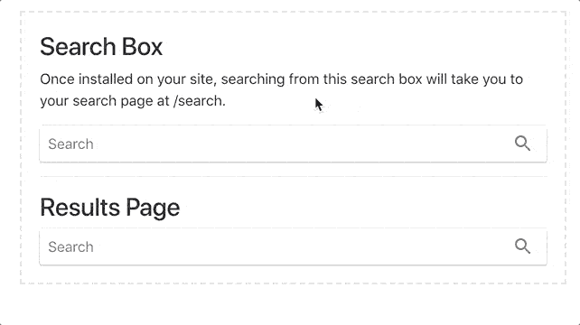
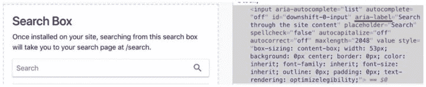
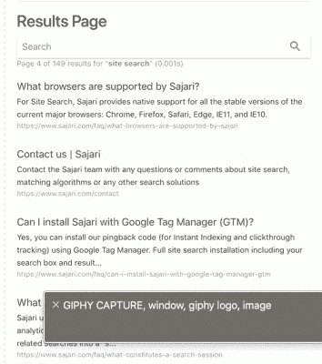

# 搜索的网页内容可访问性指南(| Algolia

> 原文：<https://www.algolia.com/blog/ux/web-content-accessibility-guidelines-wcag-how-to-make-site-search-work-for-people-with-disabilities/>

全球约有[10 亿残疾成年人](https://www.who.int/news-room/fact-sheets/detail/disability-and-health) 可以访问您的网站和应用程序搜索功能吗？

例如，用户是否可以轻松地看到搜索栏，并使用文本选项导航到他们想要查找的内容？他们有足够的时间在你的网站上完成他们的目标吗？你的视觉效果容易被视力受损的人看到吗？

## 【网页无障碍(很多)】

如果你是这些人中的一员，那么残疾人能够像健全人一样访问网络对你来说显然是非常重要的。网站越能确保他们的服务和产品是可访问的，并准备好帮助所有用户，对残疾人就越好。(有些公司因不采用标准而起诉 的可能性越小。)

## 残疾类型

在设计可访问的网站和界面时，开发人员和设计人员应该注意用户可能会有各种残疾、暂时的限制和情况问题，包括:

*   视觉相关损伤(如色盲)
*   听觉障碍(如耳聋或重听)
*   认知障碍(如痴呆)
*   神经损伤(如光敏性癫痫、自闭症、癫痫发作障碍)
*   言语障碍(如口吃)
*   身体损伤(如手臂骨折)
*   与年龄相关的损伤(如各种疾病)
*   丢失的眼镜(临时)
*   工作空间明亮的阳光(情境)
*   网速慢(情景模式)
*   无法播放音频描述的环境(情景)

## 主要玩家:W3C 和 ADA

为了帮助用户，鼓励公司满足 [网站内容无障碍指南](https://www.w3.org/TR/2018/REC-WCAG21-20180605/) (WCAG)和 [美国残疾人法案](https://www.ada.gov/) (ADA)网站和应用的数字标准。

WCAG 指南由 [万维网联盟](https://www.w3.org/) (www。W3.org)，该组织致力于开发互联网的国际标准。这些准则定期更新；例如，该组织最近从版本[WCAG 2.1](https://www.w3.org/WAI/WCAG21/Understanding/)转移到了版本[WCAG 2.2](https://www.w3.org/WAI/WCAG22/Understanding/)。

ADA 的一套指南适用于网站和其他数字体验，但 ADA 并没有明确提供数字无障碍成功标准。网络符合 ADA 基本上意味着符合 WCAG 标准。

## WCAG 一致性原则

就数字无障碍问题而言，WCAG 成功标准由四大支柱组成。为了符合可访问性指南，网站必须:

### 可感知

根据 W3C 的说法，“信息和用户界面组件必须以用户可以感知的方式呈现给用户……它不可能对他们所有的感官都是不可见的。”一个例子: 使用 [重排](https://www.w3.org/WAI/WCAG21/Understanding/reflow.html) 放大文本有助于视力受损的人避免滚动问题，清楚地看到字符，并成功阅读内容。另一个有用的步骤:提供额外的输入方式(例如，一个指针)而不仅仅是一个键盘。

### 可操作性

数字无障碍专家表示，用户必须能够轻松地“操作”用户界面中的组件，并成功导航。

### 可以理解

人们必须能够理解信息以及界面如何工作。W3C 的一个有助于轻松理解的建议是确保所有观众有合适的 [阅读水平](https://www.w3.org/WAI/WCAG22/Understanding/reading-level.html) 。其他建议:确保标题和标签容易理解，缩写不会让人混淆。

### 稳健

无论是现在还是将来，网站都应该在结构上合理，这样内容才能被可靠地解释，加上网络标准需要与辅助技术兼容。

## 公司近况如何？

好消息是越来越多的公司开始采用网页可访问性标准。根据 Forrester的调查，84%的公司都在努力使他们的网站具有可访问性。

你的网站怎么样？例如，您的 *搜索* 功能的易用性如何？

通过确保 WCAG 合规性，您可以让各种能力水平的人更轻松地访问您的搜索引擎、浏览您的用户界面，并获得他们需要的内容。作为一个额外的好处，通过以一种可访问的方式提供内容，你可以大大拓宽你的市场。

## 什么进入 WCAG 一致性？

尽管听起来令人生畏，而且肯定会有一些 [挑战](https://www.w3.org/TR/accessibility-conformance-challenges/)——进行 WCAG 合规性审计并做出任何必要的改变可能没有你想象的那么复杂。你也可以将项目分解成更小的任务。例如，为了解决与视觉相关的障碍，您可以评估网站的各个方面，如颜色对比、动画和过渡，然后提供适当的可用性替代方案。

这里总结了构建和管理搜索界面时需要考虑的一些重要的可访问性方面。每个原则包含不同的指导方针，可以在三个一致性级别中的一个级别上实现:

*   A 级(最低)
*   AA 级(中音)
*   AAA 级(最高)

A 级是最低的——聊胜于无。通常，组织试图实现 AA 级别。为了达到 AAA 级，组织必须满足更严格的前景色和背景色对比度要求。

如果您正在构建一个自定义搜索界面，或者在您的网站上查看一个 [站点搜索](https://www.algolia.com/blog/product/learn-about-site-search-best-practices/) 安装，您希望确保您的网站搜索体验符合[【WCAG 2.2](https://www.w3.org/WAI/standards-guidelines/wcag/new-in-22/#:~:text=For%20an%20introduction%20to%20Web,for%20publication%20in%20September%202022)(或更新版本)AA 标准，以及满足视障用户的可访问性标准。

**注:** 如果您的搜索界面或网站体验的任何其他组件不符合与您网站其余部分相同的合规性级别，则该网站整体被降级为较低的合规性级别。

## 如何保证你的搜索界面 WCAG 合规

你可以从这本 W3C [快速参考指南](https://www.w3.org/WAI/WCAG21/quickref/) 开始，评估你的网站搜索功能的各个方面的可访问性。

如果你正在使用 Mac 测试你的网站合规性，一个简单的方法是使用 Mac OS X 中的[voice over](https://www.apple.com/voiceover/info/guide/_1121.html)实用程序

如果你在用微软的 Windows 测试合规性，你可以使用[Jaws](https://www.freedomscientific.com/Products/software/JAWS/)(语音作业访问)或者其他一些语音辅助软件。

用户体验测试评估:

*   视力障碍者的无障碍环境
*   与无障碍软件和辅助技术的兼容性
*   HTML 结构(画外音只有在内容结构正确，有正确的描述和 alt 标签的情况下才有意义，才能正常工作)

通过测试，您将发现许多需要解决的问题，以便实现 WCAG 合规性。

首先:你的搜索栏怎么样了？

# 搜索栏或图标

如何让那些看不见的人“看得见”你网站上的搜索栏或搜索图标，因此他们需要借助一个方便的屏幕阅读器来导航？您可以为搜索栏提供一个标签，或者提供一个辅助技术可以通知的图标。

您的用户搜索体验应该:

### 被预见

例如，搜索栏应该放在人们期望找到它的地方，通常在屏幕的右上角。

### 用颜色区分开来

当涉及到图像、按钮和图标时，颜色的对比度，如文本颜色和背景颜色之间的对比度，应该 [足够](https://www.w3.org/WAI/perspective-videos/contrast/) 以便于查看和阅读。

### 合并可选文字属性

如果你使用放大镜(或其他符号)搜索图标，图片应该在< img >标签中包含一个 alt-text="Search "属性。搜索栏中的图标应该有一个 alt-text 属性来描述它，因为它是非文本内容。

Aria-label 属性用于为对象提供标签，然后用户可以读取这些标签。如下所示，符合 WCAG 标准的网站搜索接口在 button div 类中使用 aria-label="Search"。

### 被键盘访问

用户应该能够使用键盘上的 Tab 键在搜索栏内外导航:

### 使用右焦点顺序

残疾用户应该能够轻松地搜索和导航。有一件事有助于旅途顺利:当他们在搜索栏中输入查询时，键盘焦点应该保持在搜索栏上，这样，如果需要，他们可以继续输入或修改他们的查询。

如果他们使用 Tab 键盘按钮导航，焦点顺序应该是连续的，并与 HTML/DOM 相匹配。理想情况下，他们应该能够使用键盘从搜索栏导航到他们的搜索结果，然后到分页，然后到他们浏览器中页面的 URL，然后回到网页。

### 识别文本输入的目的

当提供搜索栏时，文本输入字段应具有标识其功能的标签。

在这个网站搜索栏的代码中，你可以看到 aria-label 描述“搜索整个网站内容”:

## 怎样才能让搜索结果更易访问？

根据你的网站设计和用户体验需求，你可以用多种方式设置你的搜索结果页面，比如网格或列表。标准的方式是列表，但是指导方针适用于您选择的任何设计。

### 保证无缝键盘访问

当显示搜索结果时，用户应该能够使用 Tab 键在其中导航。使用 Tab 键无法访问描述和状态消息(例如，“149 个‘站点搜索’结果”)。但是，屏幕阅读器软件或画外音工具应该能够向用户阅读描述和状态消息，这使得所有必要的信息都可用，而不会干扰导航。

### 添加角色= "状态"消息

当用户输入搜索词时，页面内容会更新并显示搜索结果。屏幕阅读器应该自动获取并阅读状态消息。通过向代码添加一条 [aria 状态角色](https://www.w3.org/WAI/WCAG21/working-examples/aria-role-status-searchresults/) (role="status ")消息，您可以允许屏幕阅读器宣布返回结果的数量。

### 不用担心搜索结果中的图片

[装饰图像](https://www.w3.org/WAI/tutorials/images/decorative/) 不为网页提供内容，因此当用户浏览结果时，出现在搜索结果中的装饰图像不需要被关注。这些图像也不需要 alt 属性，因为不会丢失信息。

### 提供键盘可访问的分页

如果你使用分页来允许用户浏览搜索结果，它也应该可以通过键盘来访问和操作。

### 视觉上区分元素

为了便于查看，标题、描述、URL 和其他元素中的文本颜色的对比度至少应为 4:5:1。

你可以使用这个 [工具](https://webaim.org/resources/contrastchecker/) 来测试你的对比度。

### 提供适应性强的功能

在桌面和移动设备上检查纵向和横向搜索结果的外观。结果文本的大小必须调整到 200%,而不会丢失任何内容或功能。

### 优化你的叠加界面

如果你在覆盖窗口中显示搜索结果，用户应该能够导航到关闭按钮，并且关闭按钮(如果是图标)应该有正确的 aria-label 或 alt-description 属性。

### 检查你的滤镜和刻面可及性

您所有的 [过滤器和刻面](https://www.algolia.com/blog/ux/filters-vs-facets-in-site-search/) 都应该可以从键盘上访问和操作，并具有适当的 aria 标签描述，以及这些特性的状态。

[关于 aria-label 分组控件](https://www.w3.org/WAI/tutorials/forms/grouping/)

## 通过更好的访问提高可用性

这为每个人总结了优化你的网站用户体验的关键因素。在 WCAG 标准的帮助下，通过搜索功能确保网站的可访问性是你可以做出的最重要的改进之一，让各种能力水平的人都能在你的网站上找到自己的路，并以最丰富的方式体验你的网站。

寻找其他方法来改善网站的用户搜索体验？阿尔戈利亚可以帮忙。 [请告诉我们](https://www.algolia.com/contactus/) 您有兴趣了解伟大搜索的好处，我们将很乐意查看您的网站并提供个性化建议。