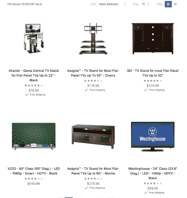

# 什么是 AI 搜索排名？-阿尔戈利亚博客|阿尔戈利亚博客

> 原文：<https://www.algolia.com/blog/ai/what-is-ai-search-ranking/>

**AI 排名是指用于优化搜索结果顺序的多种机器学习算法。**

用任何搜索查询，都可能有很多 *相关的* 结果。这就是搜索结果排名发挥作用的地方。排名越来越多地由人工智能(AI)驱动，人工智能包括各种机器学习算法。

在这篇文章中，我将描述一些不同的人工智能排名方法，并简要讨论一些提供更好结果的挑战。

## 精度 vs 召回

为了提高搜索结果排名，你需要能够衡量它。相关性的两个简单度量是 [精度和](https://en.wikipedia.org/wiki/Precision_and_recall) 。

*   **精度** 是 *检索到的* 文档中 *相关* 的百分比。理想情况下，搜索结果只包含相关条目，但情况并非总是如此。例如，搜索“iphone”可能会返回 iPhone 案例，而实际上客户正在寻找一部手机。
*   **Recall** 是所有 *相关* 文档中 *被检索* 的百分比。 理想情况下，每个与查询相关的记录都会出现在结果中，但是有些相关的文档可能找不到 。例如，对于查询“纽约”，包含“NYC”的记录。

这些是帮助我们确定结果是否好的有用指标。理想情况下，召回率和准确率都将达到 100%，但实际上这非常困难。而且，相关性可以是主观的！

举例来说，假设是时候买一台新电视了，你在你最喜欢的卖家网站上搜索“大电视”你得到 119 个结果。在这些结果中，有些项目非常相关。但有些不是(比如下面的电视柜和柜子)。这就是 *精度* 。网站上还有许多其他相关产品没有包含在搜索结果中。我们称此为 *回忆* 。

为了获得更好的精确度和召回率，您可以细化搜索查询。你可以搜索“40 岁以上的电视”，这次(见下文)你会得到 262 个结果！看起来新结果中的电视机更多，但实际上只有一部分满足 40 英寸以上的查询参数。

事实上，精确和回忆之间可以有一个阴阳两极；改善其中一个可能会对另一个产生不利影响。

在上面的例子中，可以有许多相关的电视。而 *最佳* 结果是客户最感兴趣的结果，可以通过点击量、购买量、评分、最低收益等来确定。排名靠前的结果获得最高的参与度；相反，当人们不容易找到最好的结果时，他们很可能会放弃你的网站，或者找到另一种方式来回答他们的问题，比如开一张支持票。

精确和回忆可以帮助我们从概念上开始理解人工智能排名。当执行一个查询时，搜索引擎必须确定某个东西是否相关，然后按照从最好到最差的顺序对它们进行排序。

传统上，有多种 [统计方法](https://en.wikipedia.org/wiki/Learning_to_rank#List_of_methods) 用于基于一组文档内的术语频率对结果进行排名。关键词搜索引擎寻找查询词及其替代词，然后该算法可用于按最相关到最不相关对这些结果进行排序。这些方法非常高效和快速，但需要许多额外的启发。一些改进纯统计排名模型的新增功能包括:

*   同义词库，为初始查询术语提供更多选项(例如，“电视”或“电视机”或“电视机”)
*   规则处理某些类型的查询(如 )(如果查询包含“以上数字”则在尺寸上进行过滤变换，如“27 寸以上的电视机” )
*   查询处理技术，如错别字容差、分类、词干等
*   参与度指标(如点击量、受欢迎程度和转化率)

这些“信号”可以为结果提供一个很好的反馈回路。正如我将展示的，更高的参与度意味着结果可以相应地重新排序，这反过来可以产生更多的参与度。有各种各样的机器学习方法效果很好，我将在下面描述这些方法。

## 学习排名

[Learning-to-rank](https://www.algolia.com/blog/ai/an-introduction-to-machine-learning-for-images-and-text-now-and-in-the-near-future/)(LTR)是一种机器学习的类型，提高排名，辅助精准。它包括监督学习、非监督学习和强化学习。也有类似半监督学习的变体。这些解决方案中的每一个都提供了人工智能排名功能，以提供比更简单的统计方法更好的结果。

例如，监督学习是一种使用数据集或标签来分类和预测搜索结果的机器学习。在“大电视”的例子中，您需要将结果的子集标记为“大电视”，以便算法知道人们在搜索什么。这方面的问题是，它存在认知偏差——什么构成了一台大电视？每一个训练这种算法的人都会有不同的看法，而且会随着时间的推移，随着新产品的出现而改变。电视没有屏幕怎么办，比如投影电视？你怎么给它贴标签？

无监督学习旨在部分消除监督学习的人为偏见，而是让机器学习在个体查询级别进行优化。通常，这意味着使用静态的人工配置方法计算结果，然后使用机器学习模型重新排列前 X 个结果。

这种方法非常聪明，已经被一些主要的开源搜索技术采用，产生了很好的结果。然而，也有不利的一面。

*   它仍然需要大量的工程工作来启动和运行，并且
*   查询-结果对索引分数是固定的，或者至多很少更新。这意味着算法输入保持静态。这是向前迈出的一步，但是通过使用强化学习和动态重新排序，我们可以做得更好。

在这两种情况下，您都可以手动调整排名，但结果是，这些排名通常对部分查询有效，但对其他查询无效。修复故障而不引起其他地方的问题是非常困难的(精确和召回！).一个很好的类比是拉动一堆杠杆，头脑中最重要的问题得到改善，但目前还不清楚这会如何影响其他一切。搜索不是一个简单的问题，人们无法在数千甚至数百万个不同的查询中平衡这个问题。

强化学习是另一种学习排序方式，它使用反馈根据积极的结果对结果进行排序。强化学习根据点击、销售、转换、注册和其他积极反馈等信号进行频繁的增量改进，并可以反馈到系统中。

在搜索领域，正面评价可能意味着不同的事情，搜索结果被点击，或导致后来的事件，如销售等。在 Algolia，我们主要关注点击，因为有更多的可用数据(更快地获得更高的可信度)，但如果有足够的数据，我们也使用后来的事件。

使用点击量确定评分时，您需要修正位置偏差、短暂点击(对点击结果不满意)以及其他各种因素。然后，正面评级与更频繁点击的结果大致相关，负面评级与那些不太频繁点击的结果大致相关。置信区间通过计算概率分布来帮助校正样本大小。

已经有了 [很多被开发出来的学习排序算法](https://en.wikipedia.org/wiki/Learning_to_rank#List_of_methods) 。在 Algolia，我们提供了一种 [动态重新排序](https://www.algolia.com/doc/guides/algolia-ai/re-ranking/) 解决方案，这是一种强化学习。在引擎计算出您的结果的文本相关性并应用了您的 [自定义排名](https://www.algolia.com/doc/guides/managing-results/must-do/custom-ranking/) 后，动态重新排名开始生效。它可以用来发现用户行为的趋势。它不仅可以提升更好的结果，还可以降低不相关或转换的结果。例如，两个网站可以有完全相同的目录或搜索索引，但根据客户对内容的反应，对搜索结果进行不同的排序。

## 个性化、商品化等等

关于排名，还有很多其他因素我还没有提到。比如个性化。使用地理位置、过去的搜索历史、过去的购买历史和其他因素，您可以提高搜索结果的精确度。如果做得好，个性化是改善客户体验的最有力的工具之一。如果做得不好——而且做起来非常复杂——会破坏体验！

通常需要“覆盖”基于短期优先级的有机搜索排名。例如，您可能希望对新产品发布、产品促销或新闻发布的某些结果进行优先级排序。当你向你的网站添加新产品或页面时，它还不会有任何点击或转换事件——这是强化学习算法进行动态排名所需要的。这就是为什么搜索引擎提供额外的功能，如自定义排名、销售、规则和“锁定”,让客户控制任何给定时间的结果。

## 脏数据和差排名

机器学习对于改善信息检索和排名非常有用。然而，正如谚语所说，坏数据进来，坏数据出去。机器学习模型的好坏取决于它们必须处理的数据。正如一篇关于 [的文章，HBR 简洁地指出](https://hbr.org/2018/04/if-your-data-is-bad-your-machine-learning-tools-are-useless) ，“糟糕的数据质量是机器学习的广泛、有益使用的头号敌人。”

强化学习只有在你有足够的数据可以学习的时候才会起作用。人工智能排名对于全新的网站、产品或页面，或者数据质量差的网站来说效果不好。你需要数据——好的数据——来进行排名。

坏数据可能是一个质量问题——拼写错误、描述不当等。—它也可能是一个糟糕的信噪比。例如，搜索引擎优化策略会严重破坏谷歌搜索结果和排名。随着网站所有者争夺更高的排名，SEO 产生了很多“噪音”。网站搜索也有同样的问题。

Bad data in, bad results out. The meme illustrates how even great AI algorithms can lead to poor decisions when they have bad data. [Image via Reddit](https://www.reddit.com/r/Damnthatsinteresting/comments/yijd3c/they_asked_an_ai_engine_to_recreate_a_salmon/).

你的网站也可能有相互竞争的所有者、糟糕的元数据和文档描述问题。市场是一个很好的例子，说明它可以有多复杂。市场拥有他们自己创建的或来自卖家的产品数据，以及用户提交的评论、常见问题解答、评级等其他数据。此外，产品目录会不断更新和更改。对于相同的查询，结果可能会越来越差。

市场是一个极端的例子，但它们说明了日复一日处理产品排名的困难。你不需要有一个市场来体验这些问题。 [改进你的搜索索引](https://www.algolia.com/blog/engineering/12-ways-to-improve-your-search-index/) 可以包括更新你的 HTML 模式，添加开放图元数据，增加你的搜索索引，等等。

## 智能搜索革命

按排名学习，尤其是强化学习，是改进排名的有力解决方案。它有自己的挑战，例如能够用很少的历史性能数据提供更好的结果，或者解释概率优化，但尽管如此，它仍比传统的排名算法提供了许多优势。

然而，这并不完全是黑白分明的。两阶段 [学习排序解决方案](https://en.wikipedia.org/wiki/Learning_to_rank) 将利用搜索引擎的现有排序(可以是更简单的统计方法，如 TF-IDF 或 BM25，或更复杂的统计方法，如 [Algolia 平局决胜](https://www.algolia.com/doc/guides/managing-results/must-do/custom-ranking/#:~:text=Algolia%20has%20built%20its%20own,the%20second%20criterion%20(geolocation).) 或向量相似度)，然后采用一种或多种机器学习算法对 *前 K 名* 结果进行重新排序

人工智能排名也可以与混合搜索( [矢量搜索](https://www.algolia.com/blog/ai/what-is-vector-search/) 和关键词搜索技术)相结合，以提供有力的 1-2 拳:令人难以置信的相关性和排名。混合搜索和人工智能排名之间存在微妙的相互作用。更好的初始混合搜索结果将影响点击、转换和其他信号，然后影响动态重新排名结果。这是一个改善结果的良性循环。

这些技术现在很少见，但随着机器学习进一步影响数据和底层存储结构，它们将成为未来几年的标准。