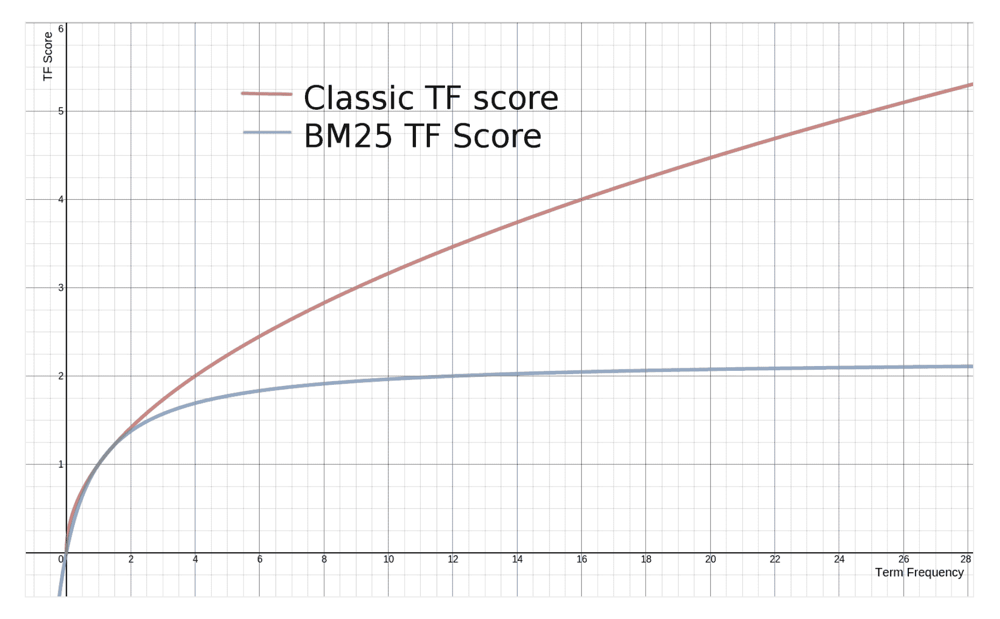
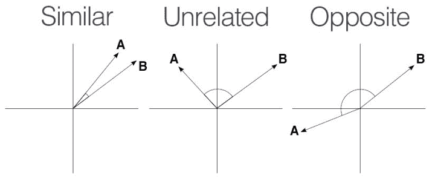
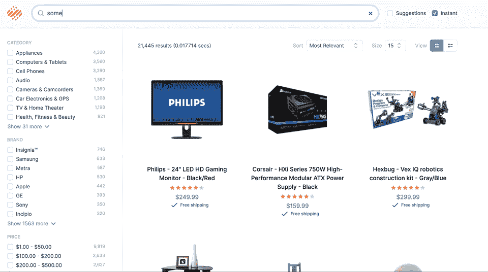

# 什么是概念搜索？-阿尔戈利亚博客|阿尔戈利亚博客

> 原文：<https://www.algolia.com/blog/ai/what-is-concept-search/>

多年来，搜索引擎主要依赖关键词，就像你在书后面找到的索引一样。除非查询与索引中的关键字匹配，否则搜索引擎可能会空手而归。 当“匹配”的概念传统上驱动着搜索引擎的时候， 一场从“匹配”到“理解”的重大转变正在进行中。这是由人工智能驱动的，人工智能用于以数学方式表示文本，以便机器可以在概念上理解它。概念正在取代关键词，这对每个人来说都是好消息。

在这篇文章中，我将解释一下什么是概念搜索，以及围绕它的语义机器学习技术是如何变化的。首先理解传统的基于关键词的模型的局限性是有帮助的。

## 背景上搜索

围绕 [所有适用于业务的数据中有 80%是非结构化的](https://breakthroughanalysis.com/2008/08/01/unstructured-data-and-the-80-percent-rule/) (与年龄、体重、价格、地址等结构化数据相反。).为了在非结构化信息中找到东西，搜索引擎已经成为首选工具。这背后的主要方法是关键字的标记化，它将文本分割成公共部分(本质上是查找键)，然后用于构建索引。

每个单词(单词、短语、ngram、词干、词条等)都链接到它出现的记录。然后将相同的标记化过程应用于查询，得到的标记可用于查找匹配项，并且该“匹配”过程形成了关键字搜索检索的基础。在这个上下文中，检索意味着检索查询的相关匹配。然后，排序通常用于以最有用的顺序对结果进行排序。

### 词频——逆文档频率(TF-IDF)

有一段时间[TF-IDF](https://en.wikipedia.org/wiki/Tf%E2%80%93idf)是关键词搜索的标准。此公式查看术语频率(TF)和逆文档频率(IDF)，前者是关键字在匹配文档中出现的次数(越多越好)，后者查看关键字在文档语料库中的受欢迎程度(受欢迎程度越低越好，因此称为“逆”)。

### BM25

TF-IDF 还行，但是今天的金本位是[BM25](https://en.wikipedia.org/wiki/Okapi_BM25)的变种。BM25 希望解决 TF-IDF 的一些不足，主要是 TF 非常容易受到垃圾邮件的攻击。它为 TF 公式引入了一个阻尼，所以更多的匹配越来越不重要，如下所示。它还使用文档长度来校正包含更多关键字的较长文档。

via [GitHub](https://ethen8181.github.io/machine-learning/search/bm25_intro.html&sa=D&source=docs&ust=1674197835672091&usg=AOvVaw2iJ2EIseXzi6YBd0eakOGb)

### BM25F

目前最重要的变体是 BM25F，它在计算中包含了相对字段重要性。这允许标题匹配不仅仅是文档文本等中间的匹配。

在指出 BM25F、 **的问题之前，请记住这仍然是 2023 年关键字搜索的黄金标准** 。这是学术界要击败的基准技术。

上面提到的一切都是基于“词汇袋”的方法。单词序列被忽略，只有它们与目标文档的个别交集才是重要的。这在现实世界的搜索场景中有很多问题，尤其是较短形式的结构化数据。

随着组织转向在线，企业搜索成为知识管理的一项关键要求。随着数据和信息资产在总体上进一步爆炸式增长，企业搜索的重要性也呈指数级增长。然而，如果没有智能元数据、自动分类、分类管理和其他增加结构的方法来丰富文档，相关性通常会很差。结果是工作中的人们找不到相关的文档——这是一个大问题。

## 为什么关键词搜索有问题？

关键词对于搜索引擎来说很难。你有同义词(多个单词有共同的意思)、多义词(单词有多个意思)、顺序(顺序有时很重要，但并不总是)、缩写、不对称(查询单词不应该出现在目标结果中)等等。

一般来说，关键词搜索意味着你已经知道你要找的答案，以及它将如何被明确描述。例如:

*   你搜索“圆领”，却找不到“t 恤”。
*   “usbc”vs“USB-c”或“usbc”。有些变体有很多结果，有些没有结果。
*   “连衣裙衬衫”和“衬衫连衣裙”返回相同的结果，尽管它们的含义非常不同
*   “房间保险箱”和“安全室”使用相同的术语，但意思完全不同！

这些问题有解决方法，但它们可能会很耗时，而且永无止境。

从传统意义上来说，搜索的目标是获取一个查询，并尝试在一组项目中找到它的出现，就像书后面的索引一样。这假设查询和结果文本之间的关系是对称的，也就是说，您搜索的是答案，而不是问题。对称性假设你已经知道答案。

关键词的上下文通常不足以用来确定搜索者的意图。拿“银行”这个简单的例子。当有人键入这个时，他们的意思可能是:

*   金融机构
*   河边
*   篮球投篮
*   飞机转弯

以上是一词多义的好例子。这也可以扩展到不对称。例如，如果有人搜索“飞机转弯”，可能不会返回“飞机倾斜”的结果，但意思是相似的。“飞机”本身也是一词多义的例子，是“飞机”的缩写！

[复合术语处理](https://en.wikipedia.org/wiki/Compound-term_processing) 用于将术语组合成具有不同于单个术语的含义的组。“新泽西”就是一个例子，作为单独的术语，它与“新”和“泽西”具有完全不同的含义。在实践中，关键字搜索通常可以很好地处理复合查询；它通常要求所有术语都匹配，比包含所有单个术语的序列得分更高。然而，它与部分复合条款斗争，“银行”是一个很好的例子。它将匹配“bank”的所有上下文出现，因为没有办法确定哪个上下文是正确的。

注意:以上还假设查询被视为 AND(要求所有术语匹配)。在实践中，一些关键字搜索使用 OR，它可以匹配任何查询词，因此更有可能返回上下文无关的结果。一些搜索技术还使用混合方法，将一些文本视为 AND，而将其他文本视为 OR，这在本质上可能是聪明的，也可能是幼稚的。这可能是有用的，但一般人搜索时通常无法理解。

关键字搜索对代表最流行搜索的“大头”查询很有效。然而，“长尾”搜索经常失败，它们可能占目录中查询的 50%或更多。关键词搜索失败的方式层出不穷。人们花了大量的时间编写规则、字典、同义词库等等。正如我将要展示的，关键词仍然非常有用，但是当它们与人工智能配对时就更好了。

## 概念搜索如何工作

关键词(及其相关标记)相对于搜索来说是二元的，特定的单词要么存在，要么不存在。概念搜索基于 [向量](https://www.algolia.com/blog/ai/what-is-vector-search/) 。向量的数学允许测量接近度，因此文本的关系不再是二元的，而是一种分布。

How vector search algorithms measure closeness.

文本表现为向量，概念意义相近的文本共享非常相似的向量。通常使用矢量方向而不是幅度，因此矢量之间的角度成为相似性的度量。这叫做 [余弦相似度](https://en.wikipedia.org/wiki/Cosine_similarity) ，任何做过高中数学的人都会非常熟悉！唯一的区别是，表示文本的向量使用数百个维度，因此很难按照上面的方式(2 个维度)直观地表示。

## 文字到数学

文字是如何变成矢量的？ [神经网络](https://en.wikipedia.org/wiki/Neural_network) 用于查看单词序列，构建基于向量的模型，可以将文本转换为向量，称为 [嵌入](https://towardsdatascience.com/neural-network-embeddings-explained-4d028e6f0526) 。这样的例子有很多，而且还在不断出现。例如，AirBnB 使用嵌入来帮助增强他们的相似列表功能。

## 使用概念进行搜索

概念很棒，但是它们也模糊了查询的含义，所以关键词实际上还是有用的。因此，最先进的搜索技术实际上是建立在所谓的“混合检索”之上的，这是基于关键字和概念的搜索的结合。

下面是我们在新的人工智能引擎中设计混合检索的一些方法。

*   **稀疏检索** 基于关键词。这就好比你在一本书的背面查找一个单词以及它出现在哪个页面。有一些语言上的调整，比如词汇、停用词、同义词等等，但是大多数情况下，查询要么在目标结果中，要么不在目标结果中。
*   **密集检索** 基于矩阵。文本被转换成数学形式(矢量或散列),邻近性被用来推断相关性。这解决了许多关于关键字搜索准确性的问题，但是这样做的成本会很高。也就是说，如果不与另一种称为神经哈希的技术相结合。对于稀疏检索，您查看与每个关键字匹配的项目列表(通常这是少量项目)。对于密集检索，你不知道向量/散列中的任何一个数字，所以你需要扫描大量的信息。虽然这使得它到目前为止成本相对较高且速度较慢，但 [哈希已经改变了这种](https://www.algolia.com/blog/ai/vectors-vs-hashes/) 。
*   **混合检索** 结合了密集和稀疏检索。关键字匹配找到适合对称的精确匹配(通常是头部查询词)，密集检索填补了长尾空白，并处理上述关键字搜索的所有问题。密集检索消除了对同义词的需求&大多数规则，理解问题(不对称)，等等。

随着神经哈希技术的加入，Algolia 成为唯一一家拥有可扩展混合产品的公司，能够开箱即用地支持多种不同的使用情形。我们现在可以提供和只搜索关键词一样快(通常更快)而且更准确的搜索。我最喜欢的一个例子是在 Best Buy 数据集上运行一个查询，查找短语“让我的啤酒保持凉爽的东西”如果有人走进你的商店，并要求“保持我的啤酒冷的东西”，你会知道他们的意思。一个只有关键词的搜索引擎会有一段艰难的时间。然而，混合检索引擎能够理解这些概念，在 0.001043 秒内提供令人难以置信的结果！

An example of concept search.

我们的演示站点不包含任何额外的元数据。“冷”和“啤酒”这两个词没有出现在网站的任何记录上，但是网站理解这些概念！

敬请关注。全新的 Algolia 搜索体验即将推出！或者， [报名，有空通知](https://www.algolia.com/dg/neuralsearch-coming-soon/p/1)。