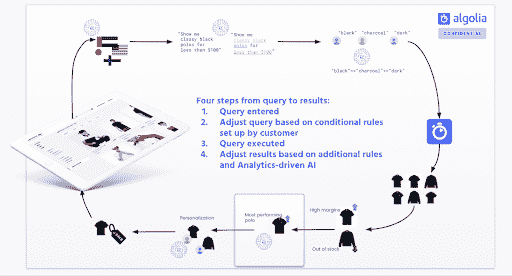
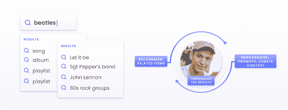

# 在浏览、发现和推荐的时代，搜索相关性是什么？-阿尔戈利亚博客|阿尔戈利亚博客

> 原文：<https://www.algolia.com/blog/product/what-is-search-relevance-in-the-era-of-browsing-discovery-and-recommendations/>

良好的搜索相关性是指找到正确的信息，以及 将客户和在线业务置于平等的地位。搜索相关性不仅试图满足顾客在他们的搜索查询中表达的 *意图* ，它还使在线商家能够最有利地呈现他们的产品和服务，而不打破他们的顾客的相关性期望。

在本文中，我们将看到这种更广义的搜索相关性如何扩展到包括 *浏览* 和 *发现* ，这些活动不一定需要从搜索框开始。

## 有什么关联？或者更好地说，相关性试图完成什么？

相关性算法试图(1)将查询文本与一些潜在内容进行匹配，同时(2)预测并满足客户和企业的需求。这个定义是一个相当好的总结，在某些方面很简单，但承载着大量未言明的潜力和力量——或复杂性，这取决于你看到的是半满还是半空。

### **推/拉的关联性**

如果我们把 *搜索* 关联简化为关于 *寻找信息* ，那么更一般意义上的 *关联* 可以指除此之外的东西。我们的文章对 [搜索和浏览](https://www.algolia.com/blog/ecommerce/search-vs-browse-satisfying-user-intent/) 讨论了 *拉动* 和 *推送* 内容的优点，即搜索和浏览。用户 *在主动搜索并期望找到合适信息的时候拉* 内容。一个业务 *在用户搜索(或浏览)公司的各种数字界面时，当它主动建议或浮出信息时，就会推送* 内容。

我们来对比一下两者:

| **拉取/搜索内容** | **推送/浏览内容** |
| 

*   将字母、单词和短语与内容进行匹配，并过滤以向下钻取
*   权衡某场比赛的强弱(下面讨论)
*   结果排名:根据相关性对结果进行排序(首先显示最强的匹配)
*   添加自定义排名，根据受欢迎程度、利润或其他此类业务指标以及业务需求进行排序

 | 

*   通过营销活动推广您的产品和服务
*   管理内容和媒体
*   使用用户资料个性化搜索结果
*   根据快速变化的市场趋势和用户行为动态调整结果
*   推荐相关和“经常一起购买”的商品
*   还有更多

 |

拉和推是一个整体的两个部分。你不能真的把它们分开。 *适时推送合适的信息* (浏览)与一个用户 *在搜索* (搜索)时拉取合适的内容没有太大区别。换句话说，它们都是为了满足用户意图而设计的——尽管方式不同。虽然本文更侧重于拉而不是推(搜索而不是浏览和发现)，但在实践中，它们从未分开；他们总是作为一个完整的整体行动。我们称这个完整的画面为 **关联循环** 。

本文的第一部分着重于基本的搜索算法。有一篇配套文章深入探讨了搜索引擎如何实现最佳搜索相关性。在文章的最后，我们提供了关于循环的第二部分，浏览/推送功能的进一步阅读的链接。

## 关联循环解释

### **技术相关性循环——搜索引擎如何管理相关性:**

### **功能关联循环——用户对关联的期望:**

从两幅图中可以看出， [关联沿着一个循环](https://www.algolia.com/doc/guides/managing-results/relevance-overview/in-depth/defining-relevance/) 行进，这个循环包括拉和推信息。完整的搜索体验始于搜索查询，其中搜索引擎应用查找和排序算法来返回一组相关的搜索结果。然后，搜索引擎通过商品销售、内容管理、人工智能驱动的个性化和推荐来增强搜索结果——所有这些都取决于您如何在系统中配置这些功能。

## 好的搜索相关性——看到就知道

一个 *衡量* 好的相关性就是最佳匹配出现在你搜索结果的第一页。但那真的没有什么关联 *就是* 。

搜索相关性更恰当的定义是:无论什么 *最佳* 匹配一个搜索查询。但是“最佳匹配”是什么意思呢？是某种抽象的相关性分数吗？还是随便什么 *感觉* 对？如:如果它 *感觉* 像是匹配查询的结果，或者 *看起来就是我要找的* ，那么它的相关 *？*

可惜，这有点太主观了。如果我输入甲虫，看到很多看起来很吓人的虫子，引擎会显示相关的搜索结果吗？是的——即使我在寻找著名的长发音乐家，披头士。

其实，什么 *看似* 相关和什么 *实际上* 相关是有区别的。好的相关性本身没有意图。只有查询中的单词才重要。

然而，最好的搜索引擎也能读懂字里行间的意思。如果你在卖音乐，查询“甲壳虫”应该可以找到甲壳虫乐队的音乐——这可以通过打字错误容忍和同义词等技术来实现。

再假设你既卖甲壳虫又卖甲壳虫。在这种情况下，两个其他方面的相关性可能会派上用场:

*   *过滤* ，可以按类别过滤(虫子 vs .音乐)
*   *用户界面* ，可以显示一组 *查询建议* ，比如“甲壳虫 bugs”和“甲壳虫音乐”，或者多个结果——一边是音乐，另一边是 bugs

搜索结果页面还有许多其他的用户界面，例如分类页面和重定向。这些技术有很多，目标是满足搜索者的意图和客户体验的所有可能性。

## 但仍然，有什么关联？相关性既有主观的也有客观的

考虑到以上所有情况，有一件事(很不幸)是真的:你认为相关的可能 *没有* 显示在第 1 页上。这可能是一种令人沮丧的用户体验，应该尽可能避免。然而，在某些情况下，比如音乐，总会有强烈的主观因素。

例如:对于查询“著名摇滚团体”，我们是否应该在第 1 页显示滚石乐队？结果应该只显示英美摇滚歌手吗？其他国家也在 60 年代摇摆不定。再说了，一个搜索引擎是怎么知道哪些音乐团体“出名”的？

另一个常见的问题是如何解决平局？例如，“bea”同样可以培养出像 Beans on Toast 和 Joe“Bean”Esposito 这样的艺术家，他们拥有忠实的观众，但人数较少。对此有解决方案(将结果分成不同的类别，或者限制同一艺术家的结果数量)。但是对这个问题最重要的“修复”是 *as-you-type，instant-results* 界面，在这里搜索结果会立即出现在网页上作为人的类型。有了即时结果，乔“豆子”埃斯波西托的粉丝可以继续输入，直到他们的艺术家出现。这种额外的输入很好，因为今天的用户乐于更精确地找到不太知名的商品。

幸运的是，并不是每个话题都有如此强烈的主观因素。如果有人在寻找“合适”的鞋子，一个好的搜索引擎应该引导用户找到最佳答案。这是通过 *构造* 鞋子数据来实现的。

## 结构化与非结构化信息

获得恰当的相关性并非易事。谷歌搜索或任何网络搜索引擎都必须让数十亿人正确筛选数万亿条(主要是)无组织的信息。

在小范围内，比如说像亚马逊这样的在线市场，搜索引擎可以更加稳定。亚马逊 *知道* 它的内容，知道它的客户经常使用的查询。它因此可以 *构造* 其内容围绕这一知识展开。

这就是像 Algolia 这样的搜索引擎的用武之地，它允许你根据你对内容的了解来定制你的搜索。Algolia 的搜索引擎不知道它搜索什么。它的 algorothms 可以搜索电影、电子商务网站上的产品、博客、医院和客户记录、Salesforce 数据集、报纸文章和其他用例。你需要以最能代表主题的方式来组织你的内容。

我们将在本文的姊妹篇中讨论这个问题。但是有必要快速了解一下构建数据集意味着什么。

## 创建结构化， *可搜索* 内容

这里有一个很好的例子来说明我们所说的结构。一只鞋有:

*   名称
*   描述
*   品牌
*   流派
*   颜色
*   价格
*   图片
*   人气

Algolia 的相关性算法完全依赖于你如何让搜索引擎知道它在搜索什么信息。如上所述，它从创建有价值的数据集开始。但是，您还需要告诉引擎这些数据的含义。听起来很复杂，但其实很直观:

*   你告诉引擎“名字”、“颜色”和“品牌”对查找记录很重要，而不是“形象”或“受欢迎程度”。
*   您告诉它根据匹配的 *质量* 对结果进行排序，同时考虑输入错误、精确或部分匹配以及许多其他细节。例如，查询“Bee”应该在 Bee 之前显示 Bee，因为 Bee 是精确的单词匹配。同一查询还应该显示"**Bee**tles " before "**Bea**tles "，因为错别字匹配不如非错别字匹配好。
*   你可以 *自定义* 带有商业指标的订单，如人气、畅销书、最受听次数、点赞数和利润率。例如，显示首先匹配的所有热门项目。
*   您可以添加过滤器、同义词和其他此类基于逻辑和语言的方法。
*   最后，你可以添加关键功能，如销售、策展、人工智能、自然语言处理、机器学习、AB 测试和分析，以实现相关性优化(换句话说，浏览和发现技术可以启动 *推送* 相关内容)。

## 什么是“最佳搭配”？相关性如何衡量匹配的优势和劣势

我们经常使用“最佳匹配”、“高质量匹配”和“排名”这些术语。他们的意思是这样的。我们说“相关性”，往往是指“ *文本* 相关性”，是指搜索引擎如何将用户查询的词与内容进行比较，返回匹配结果。但我们也指 *排名* ，这是关于按最佳匹配对结果进行排序，通常被称为“按相关性排序”。

因此，如果一个项目与搜索框中的词匹配，搜索引擎会确定匹配是强还是弱。我们已经看到上面用查询“蜜蜂”，其中 **蜜蜂** 比 **蜜蜂** tle 强。

最佳的比赛是最强的比赛。

为了说明这一点，想象一个使用最简单的相关性形式——逐字母比较——的搜索体验。

这里有四句名言

1.  “要 **是，** 还是不要: **那** 就是这个问题”(作者威廉·莎士比亚)
2.  “那是 **成为** 的时代，那是最坏的时代”(作者狄更斯)
3.  “不要问**你的国家能为你做什么——问问你能为你的国家做什么”(美国总统约翰·肯尼迪)**
***   “很长一段时间我习惯于去 **做** d 早”(作者马赛尔·普鲁斯特)**

 **文本匹配可以是精确的，也可以是部分的。搜索“**be**”“匹配 3 条记录的文本:记录 1(“**be**”)、记录 2(“**be**ST”)、记录 4(“**be**d”)。在本例中，记录 1 是最强的，因为它是完全匹配的，而记录 2 和 4 较弱，因为它们只是部分匹配。

继续这个例子，如果我们允许 1 个单词的错别字，那么搜索“ **that** ”将找到记录 1 和 3，其中记录 1(“**that**”)比记录 3(“**w**hat”)强，这与查询相差 1 个字母。

## 超越搜索——浏览和发现

既然搜索引擎已经找到了最好的记录，并根据最匹配的记录进行排序，那么是时候继续前进了。此时，企业可以考虑根据当前的促销活动或行业趋势添加或重新排序记录。它还可以将用户重定向到为他们感兴趣的项目或类别设计的页面。它还可以个性化结果，支持用户喜欢的项目(通过分析、人工智能、自然语言处理和机器学习学习)。最后，它还可以在搜索结果旁边开始推荐相关项目。我们在博客的其他地方讨论了这些。比如:

## 结论——各种关联

我们将以一个新的搜索示例结束。取一个相当合理的查询:“跳舞用的深色尖头鞋”。

如前所述，相关性不仅始于查询，也始于你如何组织内容。因此，“尖头舞鞋”查询的结果来自于您的数据结构如何回答这些问题:

*   我卖什么样的鞋(颜色、形状、品牌等。)?
*   普通用户输入什么搜索词？
*   我的顾客想要和寻找什么样的鞋子？
*   什么鞋最流行或最畅销？
*   我的目标群体是什么(儿童、成人、青少年)？
*   我应该添加同义词吗(例如，“尖尖的”=“尖锐的”，“跳舞的”=“舞蹈俱乐部”)
*   我应该为颜色和流派添加滤镜吗？

然后坐下来放松，知道那些尖头舞鞋会升到顶端。**