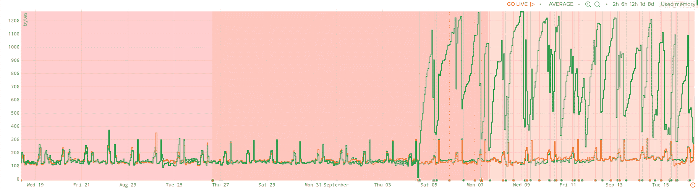
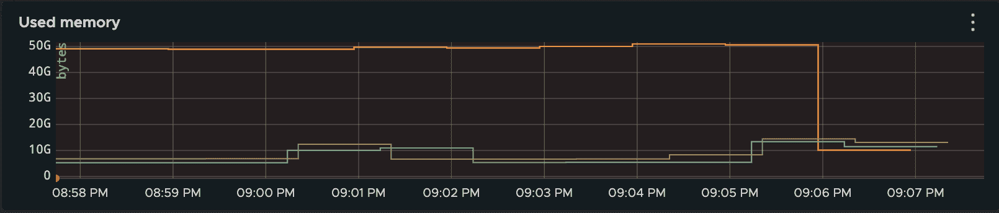
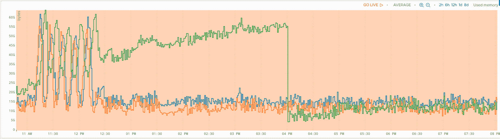
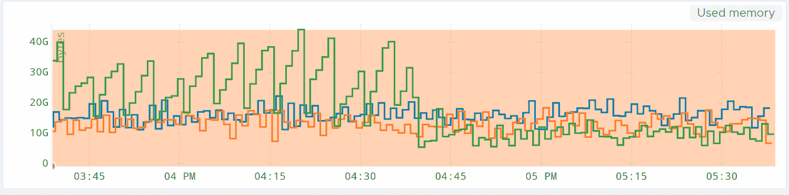
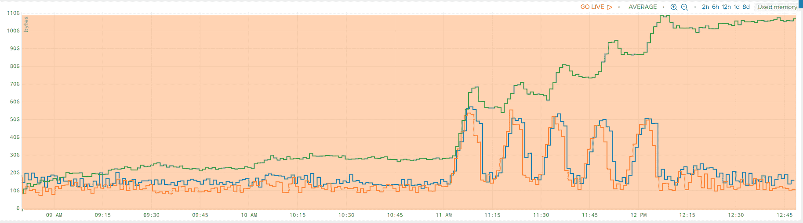
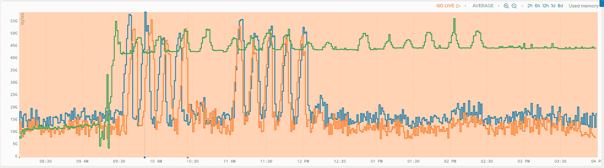

# 当分配器囤积你宝贵的记忆时

> 原文：<https://www.algolia.com/blog/engineering/when-allocators-are-hoarding-your-precious-memory/>

虽然切换到最新的流行框架或语言已经成为工程界的老生常谈，但有时升级是有保证和必要的。对于我们致力于维护核心引擎功能的搜索工程团队来说，这包括升级操作系统版本以获得最新的内核或库功能，以便快速适应我们最新的代码发布。我们总是急切地等待着操作系统的升级，并且已经推动了很长一段时间。

当您处理遍布全球 70 个数据中心的数百台服务器时，在生产环境中升级操作系统可能是一件大事。对于我们的生产服务器，我们目前使用的是 [Ubuntu](https://ubuntu.com/) 16.04(四年多前发布的)，我们的基础团队(管理所有生产服务器，并确保我们始终有一个超过我们的 [SLA](https://www.algolia.com/policies/sla/) 的运行服务)在过去几个月里一直在准备升级到最近的 20.04 长期版本。

## [](#but-upgrading-is-tough)但是升级是艰难的

当你改变许多组件的版本时，你需要准备好不愉快的惊喜:内核及其相关驱动程序、操作系统的 C 库、各种库，但也可能是操作系统附带的许多策略、政策、默认配置设置。

升级时我们遇到的一个令人不快的意外是整体内存消耗。一张图表(承蒙[波前](https://www.wavefront.com/)度量)比其他任何东西都好，下面我让你猜猜“绿色”服务器是什么时候升级到更高的操作系统版本的:

[](https://blog-api.algolia.com/wp-content/uploads/2021/01/image1-1.png)

如果您设法发现了内存消耗的轻微增加，是的，我们从 10 到 30 GB 的内存消耗(平均 12)转移到 30 到 120 GB 的内存消耗(平均 100 以上)。公平地说，消耗甚至会更高，但我们在这台特定的机器上只有 128GB(绰绰有余，通常用作大页面缓存)，内存消耗的下降是当消耗我们宝贵内存的进程要么被我们强制重新加载，要么被愤怒的内核强制屠杀(这有点麻烦，因为它在这里和那里触发了许多警报)时发生的事件。

总而言之，我们有一个问题。作为一家创业公司，我们被期望满足 10x 工程师的刻板印象，但这可能不是我们谈论的 10x。

## [](#investigating-excessive-memory-hoarding)调查过度的记忆囤积

讽刺的是，我们没有忘记:我们推动系统升级，现在我们要为服务器占用这么多内存负责。嗯，只有一件事要做:我们需要了解为什么升级会有如此巨大的影响。

### [](#the-leak)泄密

我想到的第一个想法是怀疑某种内存泄漏。但是有一个问题:只有最近的 Linux 版本才有。会不会是以前系统上没有满足的条件触发的内存泄漏？

为了验证这一假设，我们通常利用来自 Brendan Gregg 的极其强大的 Linux [性能分析器](https://www.brendangregg.com/perf.html)。每个对性能感兴趣的开发者都应该知道这个工具，我们强烈推荐观看[大师亲自做的一些演示](https://www.youtube.com/watch?v=nhxq6jLGc_w)。

一种典型的方法是连接正在运行的守护进程，并不时地寻找未释放的内存(10 分钟后):

```
sudo memleak-bpfcc -a --older 600000 --top 10 -p 2095371 120
```

不幸的是，我们没有看到任何泄漏——即使在此期间该进程吃掉了我们宝贵的 RAM。

所以这不是泄露，而是我们失去了记忆。下一个逻辑疑点是底层内存分配器。

### [](#the-greedy-allocator)贪婪的分配器

好吧，你可能会感到困惑，因为我们这里有几个分配器。作为一名开发人员，您可能听说过 `malloc`，它通常位于 C 库(glibc)中。我们的进程使用的是默认的 glibc 分配器，它可以被看作是任何大小的内存分配的零售商。但是 glibc 本身不能分配内存，只有内核可以。内核是批发商，只卖大批量。所以分配器通常会从内核中获得大块的内存，并按需分配。当释放内存时，它会合并空闲区域，并且通常会通过调用内核来释放大块内存。

但是配置者可以改变他们的策略。您可能有几个零售商，以适应在一个流程中运行的多个线程。并且每个零售商可以决定保留一些释放的大内存块供以后重用。零售商可能会变得贪婪，可能会拒绝释放他们的库存。

为了验证这个新的假设，我们决定直接使用 glibc 分配器，调用它非常特殊的“垃圾收集器”:

```
MALLOC_TRIM(3)             Linux Programmer's Manual            MALLOC_TRIM(3)

NAME
       malloc_trim - release free memory from the top of the heap

SYNOPSIS
       #include <malloc.h>

       int malloc_trim(size_t pad);

DESCRIPTION
       The  malloc_trim()  function attempts to release free memory at the top
       of the heap (by calling sbrk(2) with a suitable argument).
       The pad argument specifies the amount of free space to leave  untrimmed
       at the top of the heap.  If this argument is 0, only the minimum amount
       of memory is maintained at the top of  the  heap  (i.e.,  one  page  or
       less).   A nonzero argument can be used to maintain some trailing space
       at the top of the heap in order to allow future allocations to be  made
       without having to extend the heap with sbrk(2).

RETURN VALUE 
       The  malloc_trim()  function  returns 1 if memory was actually released 
```

一个简单而笨拙的解决方案是用调试器(gdb -p pid)连接到进程，并手动调用 malloc_trim(0)。结果不言自明:

[](https://blog-api.algolia.com/wp-content/uploads/2021/01/image5-2.png)

橙色是升级后的服务器内存消耗，另外两条曲线是以前的操作系统版本。09:06 左右的突然下跌是对 `malloc_trim function`的叫牌。

为了解决这个问题，我们还使用了另一个非常有用的特定于 glibc 的函数，转储分配器的一些状态:

```
MALLOC_INFO(3)             Linux Programmer's Manual            MALLOC_INFO(3)

NAME
       malloc_info - export malloc state to a stream

SYNOPSIS
       #include 

       int malloc_info(int options, FILE *stream);

DESCRIPTION
       The  malloc_info()  function  exports  an XML string that describes the
       current state of the memory-allocation implementation  in  the  caller.
       The  string  is printed on the file stream stream.  The exported string
       includes information about all arenas (see malloc(3)).
       As currently implemented, options must be zero.

RETURN VALUE
       On success, malloc_info() returns 0; on  error,  it  returns  -1,  with
       errno set to indicate the cause.
```

是的，这里再次附上并直接使用 gdb:

```
(gdb) p fopen("/tmp/debug.xml", "wb")
$1 = (_IO_FILE *) 0x55ad8b5544c0
(gdb) p malloc_info(0, $1)
$2 = 0
(gdb) p fclose($1)
$3 = 0
(gdb) 
```

XML 转储确实提供了有趣的信息。有将近一百个堆(“经销商”)，其中一些显示了令人烦恼的统计数据:

```
<heap nr="87">
  <sizes>
    ... ( skipped not so interesting part )
    <size from="542081" to="67108801" total="15462549676" count="444"/>
    <unsorted from="113" to="113" total="113" count="1"/>
  </sizes>
<total type="fast" count="0" size="0"/>
<total type="rest" count="901" size="15518065028"/>
<system type="current" size="15828295680"/>
<system type="max" size="16474275840"/>
<aspace type="total" size="15828295680"/>
<aspace type="mprotect" size="15828295680"/>
<aspace type="subheaps" size="241"/>
</heap> 
```

在浏览了 glibc 的源代码之后,“rest”部分似乎是自由块:

```
fprintf (fp,
"<total type=\"fast\" count=\"%zu\" size=\"%zu\"/>\n"
"<total type=\"rest\" count=\"%zu\" size=\"%zu\"/>\n"
"<total type=\"mmap\" count=\"%d\" size=\"%zu\"/>\n"
"<system type=\"current\" size=\"%zu\"/>\n"
"<system type=\"max\" size=\"%zu\"/>\n"
"<aspace type=\"total\" size=\"%zu\"/>\n"
"<aspace type=\"mprotect\" size=\"%zu\"/>\n"
"</malloc>\n",
total_nfastblocks, total_fastavail, total_nblocks, total_avail,
mp_.n_mmaps, mp_.mmapped_mem,
total_system, total_max_system,
total_aspace, total_aspace_mprotect); 
```

并且占用了 901 个块，超过 15GB 的内存。总体统计数据与我们看到的一致:

```
<total type="fast" count="551" size="35024"/>
<total type="rest" count="511290" size="137157559274"/>
<total type="mmap" count="12" size="963153920"/>
<system type="current" size="139098812416"/>
<system type="max" size="197709660160"/>
<aspace type="total" size="139098812416"/>
<aspace type="mprotect" size="140098441216"/> 
```

是的，这是 137GB 未被系统回收的空闲内存。说说贪心吧！

## [](#tuning-the-internals-with-glibc)用 glibc 调优内部

在这个阶段，我们[联系了](https://sourceware.org/pipermail/libc-help/2020-September/005457.html)glibc 邮件列表来提出这个问题，如果这被证实是 glibc 分配器的问题，我们将很乐意提供任何信息(在撰写本文时，我们还没有了解到任何新的情况)。

与此同时，我们尝试使用 `GLIBC_TUNABLES`特性(通常是`glibc.malloc.trim_threshold`和 `glibc.malloc.mmap_threshold`)来调整内部组件，但没有成功。我们还试图禁用最新的特性，比如线程缓存(`glibc.malloc.tcache_count=0`)，但显然每线程分配缓存是针对小块(最多几百字节)的。

从这里，我们设想了几个前进的选择。

### [](#the-temporary-fix-%e2%80%93-the-garbage-collector)【临时】修复-垃圾收集器

定期调用 `malloc_trim` 是一种相当肮脏的临时手段，但看起来相当有效，每次运行有时需要几秒到 5 分钟:

```
{
  "periodMs": 300000,
  "elapsedMs": 1973,
  "message": "Purged memory successfully",
  "rss.before": 57545375744,
  "rss.after": 20190265344,
  "rss.diff": -37355110400
} 
```

值得注意的是，GC 时间似乎与累积的空闲空间成线性关系。将时间段除以 10 还会将回收的内存和花费在 GC 中的时间除以相同的因子:

```
{
  "periodMs": 30000,
  "elapsedMs": 193,
  "message": "Purged memory successfully",
  "rss.before": 19379798016,
  "rss.after": 15618609152,
  "rss.diff": -3761188864,
}
```

调用 GC 对这个图的影响相当明显:
[](https://blog-api.algolia.com/wp-content/uploads/2021/01/image6-4.png)

绿色表示新的 glibc，蓝色表示以前的版本。橙色曲线是带有常规 GC 的 forcer glibc。

嵌入新 glibc 的服务器缓慢漂移，占用越来越多的空间(这里几乎是 60GB)。

下午 4:00，GC 在新的(绿色)glibc 代码中启动，您会看到内存消耗统计数据很低。

下面的绿色曲线展示了将 GC 周期从 5 分钟更改为 30 秒的影响:

[](https://blog-api.algolia.com/wp-content/uploads/2021/01/image3-3.png)

最后，我们还成功测试了 free 的一个覆盖，它在释放一定量的内存时触发 trim 操作:

```
#include 
#include 

#if (!__has_feature(address_sanitizer))

static std::atomic freeSize = 0;
static std::size_t freeSizeThreshold = 1_Gi;

extern "C"
{
    // Glibc "free" function
    extern void __libc_free(void* ptr);

    void free(void* ptr)
    {
        // If feature is enabled
        if (freeSizeThreshold != 0) {
            // Free block size
            const size_t size = malloc_usable_size(ptr);

            // Increment freeSize and get the result
            const size_t totalSize = freeSize += size;

            // Trigger compact
            if (totalSize >= freeSizeThreshold) {
                // Reset now before trim.
                freeSize = 0;

                // Trim
                malloc_trim(0);
            }
        }

        // Free pointer
        __libc_free(ptr);
    }
};
#endif 
```

所有这些测试都是在几个集群上执行的，以确认不同的工作负载。

GC 的成本是多少？我们在 CPU 使用率方面没有看到任何负面影响(特别是系统 CPU 使用率)，而且，看一下 `malloc_trim implementation`，似乎每个区域都被单独锁定并逐一清理，而不是有一个“大锁”模型:

```
int
__malloc_trim (size_t s)
{
  int result = 0;

  if (__malloc_initialized < 0) ptmalloc_init (); mstate ar_ptr = &main_arena; do { __libc_lock_lock (ar_ptr->mutex);
      result |= mtrim (ar_ptr, s);
      __libc_lock_unlock (ar_ptr->mutex);

      ar_ptr = ar_ptr->next;
    }
  while (ar_ptr != &main_arena);

  return result;
}
```

### [](#dedicated-allocator)专用分配器

使用不同的分配器(可能包括 [jemalloc](https://jemalloc.net/) 或 [tcmalloc](https://github.com/google/tcmalloc) )是另一种有趣的可能性。但是转移到一个完全不同的分配器代码有一些缺点。首先，它需要长时间的验证，在半生产和生产阶段。差异可能与我们通常拥有的非常具体的分配模式有关(我可以保证，我们有时真的会有奇怪的分配模式)。因为我们使用的是不太常见的 C++库(来自 llvm 的`libc++`),将这种不太常见的情况与更不常见的分配器混合在一起可能会在生产中产生全新的模式。而所谓的*新*，意味着可能存在其他人之前没有发现的 bug。

### [](#investigating-the-bug)调查 bug

潜在的缺陷一点也不明显。

#### 竞技场泄漏

2013 年填补的一个错误， [malloc/free 无法在 main_arena 不连续时将内存归还给内核](https://sourceware.org/bugzilla/show_bug.cgi?id=15321)，看起来有点像我们正在经历的问题，但这在我们的系统中并不是什么新问题，尽管在 glibc 2.23 中有 `malloc_trim`回收内存，但我们当前问题的数量级完全是前所未有的。然而，这个错误仍然悬而未决，可能只影响到角落的情况。

#### 竞技场数量

竞技场的增加可能是另一种可能性。在相同的硬件和环境下，我们从 2.23 中的 57 个竞技场增长到 2.31 中的 96 个竞技场。虽然这是一个显著的增长，但这一数量级太大，不足以成为触发因素。Alex Reece 在他的博客上建议 glibc 中的[竞技场“泄漏”,通过 `glibc.malloc.arena_max`可调参数将竞技场的数量减少到内核的数量。当您的进程没有比内核更多的线程时(在我们的例子中是这样)，这完全有意义，并且在理论上可以减轻浪费内存的问题。不幸的是，实际情况并非如此:将竞技场的数量从 96 个减少到 12 个仍然存在同样的问题:](https://codearcana.com/posts/2016/07/11/arena-leak-in-glibc.html)

[](https://blog-api.algolia.com/wp-content/uploads/2021/01/image4-2.png)

甚至还原到 1(也就是主 `sbrk()` 竞技场)，其实:

[](https://blog-api.algolia.com/wp-content/uploads/2021/01/image2-3.png)

#### 竞技场门槛

有趣的是，每个增长的竞技场过一会儿就停止增长，达到进程历史中分配的最大内存。自由但未发布的块可能很大(高达千兆字节)，这相当令人惊讶，因为这些块应该由 mmap 提供服务。

#### 待续

我们将继续尝试不同的场景，最好有一天能重现一个平凡的案例，帮助修复根本原因。与此同时，我们有一个变通方法(一种 GC 线程),它远非完美，但将允许我们继续前进。

## [](#the-takeaway)外卖

升级操作系统和库具有潜在的影响，但这些影响常常被忽视。限制风险可以包括在一段时间内一个接一个地升级不同的组件(例如将内核或链接库升级到最新的组件)，每次升级的时间足够长，以检测回归(内存或 CPU 使用、行为变化、不稳定性……)。更有规律地升级也是有帮助的另一点(一次升级两个系统版本可能不是最安全的选择)。最后，执行滚动升级并仔细查看收集的指标集应该是健康的生产部署过程的一部分。我们当然已经学到了这些经验，并将在今后的流程中加以应用。