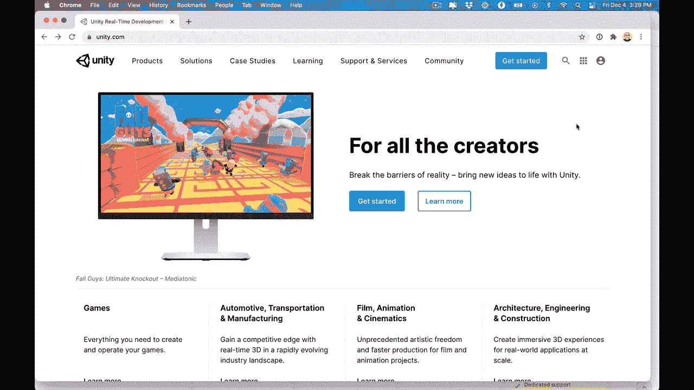
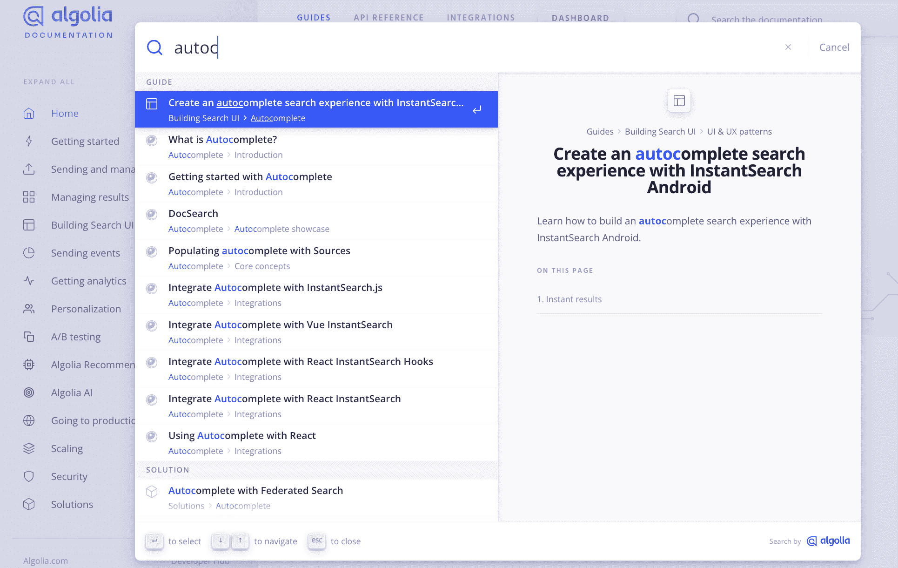
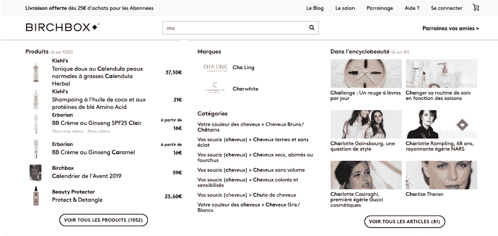
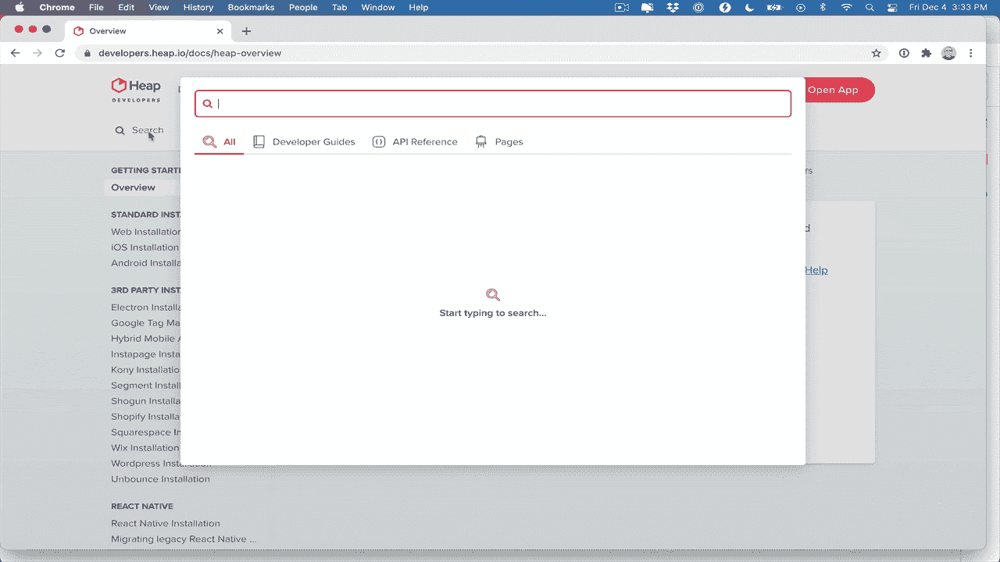
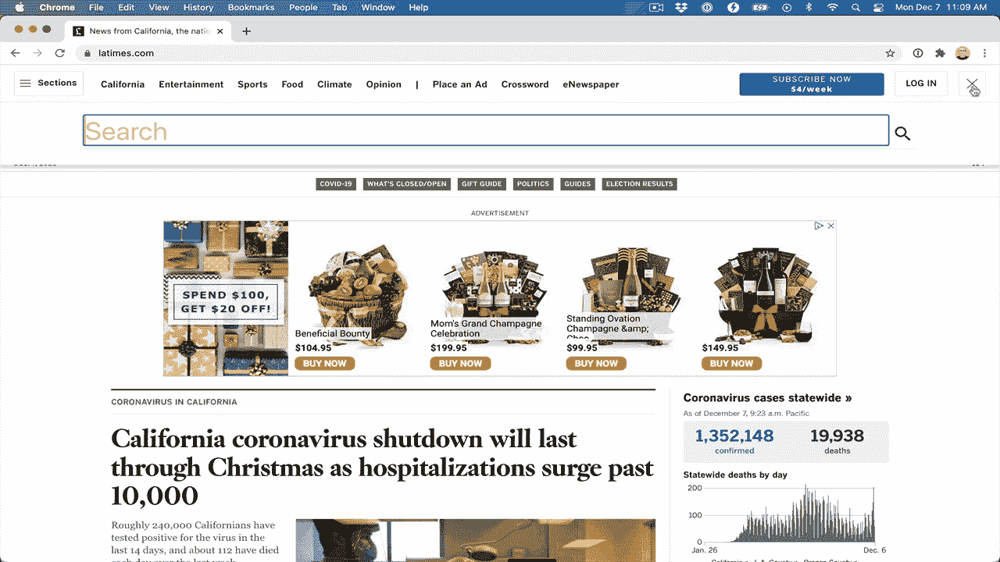
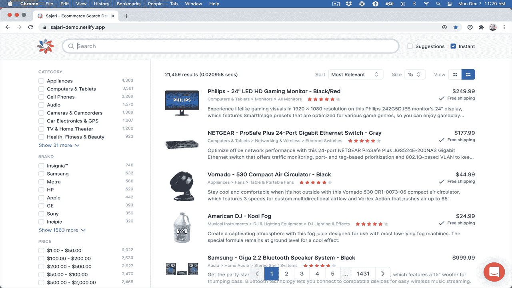
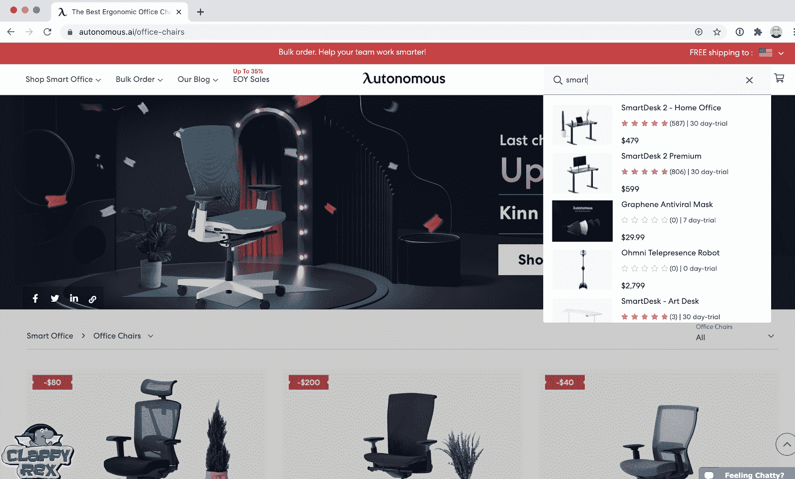
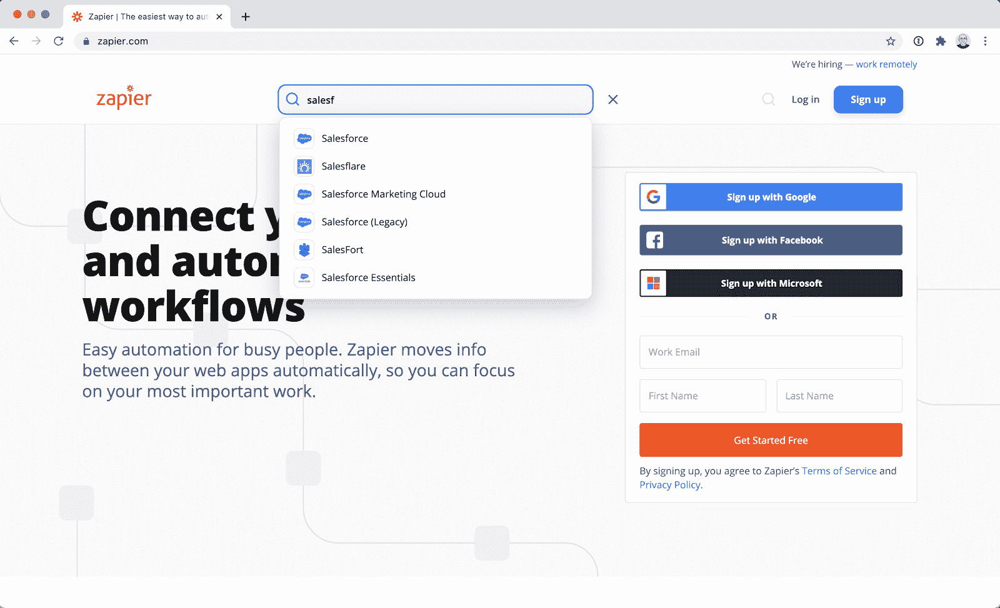
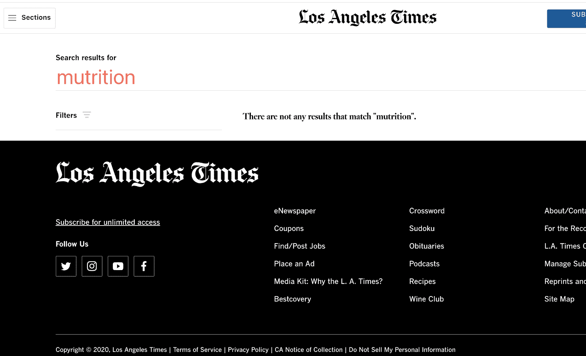
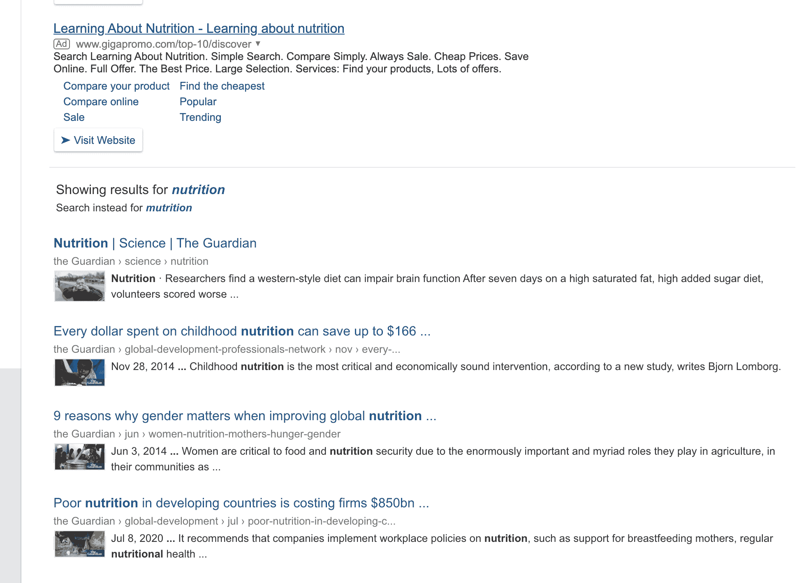

# 为什么网站搜索在今天的数字经济中至关重要

> 原文：<https://www.algolia.com/blog/product/why-is-site-search-so-essential-in-todays-digital-economy/>

如果你正在实施一个新的网站搜索项目，或者刚刚开始这方面的研究，这篇博文就是为你准备的。我们将简要介绍站点搜索能为您的业务做些什么，以及一些如何实现站点搜索的例子。

## 什么是站点搜索，它能为你的在线业务做些什么？

**站点搜索** 是一种使用户能够以 **速度和** 相关性搜索在线公司内容或产品目录的技术。伟大的网站搜索是为你的业务量身定做的。

一个优秀的网站搜索不仅会不断地对网站进行索引，以确保最新的内容易于访问，它还会引导用户探索和发现网站的内容，帮助他们连接到他们可能甚至不知道自己感兴趣的内容。

最佳网站搜索 **通过捕捉访问者最感兴趣的内容和产品的有价值数据，个性化购物体验** 。

## 更好的网站搜索案例:增加转化率，降低支持成本，增加客户忠诚度

站点搜索在发展业务、降低支持成本和创造更好的客户体验方面有着巨大的潜力。

当一家公司让他们的**搜索栏** **[更加可见](https://totheweb.com/blog/b2b-website-usability/increase-website-engagement-with-more-prominent-on-site-search/)** 时，他们看到了:

*   网站搜索量攀升了 439%
*   当访问者使用搜索时，他们在网站上停留的时间增加了 110%
*   页面浏览量增长 45%
*   目标完成量增加了 242%

搜索还可以 **增加点击量和** [**转化率**](https://resources.algolia.com/ecommerce/casestudy-gymshark-retail-2?utm_campaign=FY23_%5Bcust%5D&utm_medium=email&utm_source=one_off&utm_content=BlackFriday_Recommend&utm_2nd_camp=B2B_Ecomm) 对于电商之类的商家:

*   在黑色星期五，新用户的订单率增加了 150%，而“加入购物车”率增加了 32%
*   回头客的订单率和“加入购物车”率分别提高了 13%和 10%
*   每用户 1.4 次点击，而之前的解决方案为 1.1 次

### 显示搜索栏前端和中心

谷歌、亚马逊和 YouTube 是我们互联网体验不可或缺的一部分，它们都是从搜索开始的。因此，毫不奇怪，当搜索单个网站的产品、内容或信息时，访问者希望获得与这些网站相同的便捷性和速度。

平均来说，你有 15 秒的时间来吸引顾客，直到他们离开你的电子商务网站。 [大约 30%](https://cxl.com/blog/convert-visitors-improving-internal-site-search/#:~:text=According%20to%20Econsultancy%2C%20up%20to,average%20non%E2%80%93site%20search%20visitor.) 的访问者会使用你的搜索栏找到他们想要的东西，其余的会浏览你的网站。

研究表明，使用搜索的访问者找到他们正在寻找的东西并转化为客户或潜在客户的可能性是仅仅浏览的用户的 3 倍。

## 商家受益于网站搜索

有几种类型的网站从有效的网站搜索中获益最多:

### 电子商务网站

当购物者知道他们在寻找什么时，他们不会想在众多产品类别中寻找。你也不希望他们这样做，因为浪费时间就等于失去客户。因此，在任何时候，尤其是在 [最繁忙的购物季节，](https://www.algolia.com/blog/ecommerce/black-friday-site-search/) 给你的访客最好的网上购物体验是至关重要的。帮助他们轻松搜索、查找和购买，并看到投资回报的增加。

### 媒体网站

媒体网站上的内容不断扩展和变化。读者和视频观看者很容易在这样一个内容丰富的环境中迷失方向。网站搜索可以帮助他们找到它，引导他们到感兴趣的新的相关主题，并延长他们在网站上停留的时间。

### 【SaaS 公司】

软件即服务(SaaS)平台允许客户搜索他们创建的数据，可以极大地增强用户体验。而且随着每一家 SaaS 公司现在平均面临几乎10 个竞争对手，提供一个更好的 UX 比竞争对手更重要。

### 其他业务

受益于内部网站搜索的其他类型的高搜索网站包括网络论坛、维基和知识库。 [医疗保健和金融行业](https://www.algolia.com/blog/algolia/time-of-transformation-look-ahead/) 的企业也能从顺畅的网站搜索中受益匪浅。

## 数据驱动的分析——分析并利用有价值的数据

用户每次搜索你的网站，都会产生有价值的用户意向数据。 用户在用自己的话告诉你他们的欲望。借助网站搜索分析功能，您可以实施战略变革，例如:

*   **优化结果** :一旦你评估了趋势和自己的业务目标，一个强大的网站搜索将允许你根据人气等属性微调相关性，以确保 [最相关的结果](https://www.google.com/url?q=https://www.algolia.com/blog/how-algolia-tackled-the-relevance-problem-of-search-engines/&sa=D&source=editors&ust=1677766943506228&usg=AOvVaw3B74v-F9wrl-pr2cqNYKX-) 在网站用户中排名最高。
*   **填补内容空白** :访问者可能会搜索你甚至还没有考虑过要写的内容。
*   **更好地理解您的用户** :谁在搜索您的产品？他们住在哪里？哪些产品在哪个月最受欢迎？网站搜索分析有助于市场细分。

## 定制网站搜索示例及最佳做法

有许多 [标准](https://www.algolia.com/blog/ecommerce/15-best-practices-for-ecommerce-on-site-search/) 和[高级](https://www.algolia.com/blog/product/the-ultimate-guide-to-site-search/)站点搜索功能，包括 [AI](https://www.algolia.com/blog/product/how-any-business-can-benefit-from-personalization-and-recommendations/) 站点搜索。但我们会保持简短，并专注于关键的网站搜索功能。

### 搜索叠加

搜索覆盖是一个弹出窗口，让您在不影响底层屏幕的情况下搜索。

### 联邦搜索

您可以添加 [联合搜索](https://www.algolia.com/blog/ux/what-is-federated-search/) 来返回来自多个域的结果，包括您的网站、支持和社区页面。在这张图片中，您可以看到描述性搜索结果和每个页面的预览。

这是一个全面的联合体验，为您的用户显示信息和许多选项。

### 搜索结果高亮显示

在搜索结果中突出显示查询短语是搜索的基本 UI/UX 部分。

### 过滤器和刻面搜索

《洛杉矶时报》(下图)有一个庞大的文章数据库。为了帮助用户导航，他们在搜索结果页面中加入了 [过滤器](https://docs.sajari.com/user-guide/integrating-search/filters/) 。

公司可以在搜索中应用过滤器和方面。 [面](https://www.algolia.com/blog/ux/faceted-search-an-overview/) 类似于过滤器，它们缩小了 结果的范围，但是它们是动态的，可以根据结果的上下文而改变。动态分面搜索如下例所示:

### 即时搜索与可视化结果

[即时搜索](https://www.search.io/blog/improve-your-site-search) 和 [搜索建议](https://www.search.io/blog/improve-ux-using-site-search/)——将结果显示为用户类型——是站点搜索的最佳实践。可视化结果为用户提供结果预览，帮助他们缩小搜索范围。“当然，”你可能会想，“这对于电子商务商店来说是有意义的，但是其他网站呢？”

B2B 网站也可以更直观地显示网站搜索结果，如下图所示——Zapier 在自动完成建议中使用徽标，帮助访问者更直观地发现结果。

### 处理搜索错别字和拼写错误

对于网站搜索来说，一个不可见且经常被忽视的 UI 元素是如何处理打字错误和拼写错误。介于 [之间的某处 10-25%的搜索](https://linguistics.stackexchange.com/questions/35732/what-percentage-of-words-or-queries-are-misspelled-in-search-queries) 可能包含一个拼写错误！包括 [错别字容忍度](https://support.algolia.com/hc/en-us/articles/4406975253649-How-does-Algolia-handle-typing-mistakes-) 的一些味道是站点搜索的最佳实践。

《洛杉矶时报》不能很好地处理拼写错误，所以一个不经意的搜索者可能会返回到谷歌。

下面是《洛杉矶时报》和《卫报》如何处理拼错的“营养”搜索的两个例子。通过显示修正后的结果,《卫报》提供了比《洛杉矶时报》更好的用户体验。这是一个明显的拼写错误，但不太明显的拼写错误会导致用户认为该网站没有他们搜索的答案。

‍

## 底线

搜索栏是网站功能和设计的重要组成部分，对我们大多数人来说，使用没有搜索栏的网站会显得——嗯，很奇怪。设计网站时，搜索栏是显而易见的，但是真正有用的网站搜索不仅仅是有一个搜索栏。

世界知名品牌如 Lacoste、Stripe、Twitch 和 Birchbox 都将网站搜索 Algolia 作为他们首选的网站搜索引擎。其强大的搜索功能、分析、安全性和易用性值得信赖，它是一个开箱即用的解决方案，深受 web 访问者和开发人员的喜爱。

要了解 Algolia 能为您做什么， [开始免费建造。](https://www.algolia.com/users/sign_up)