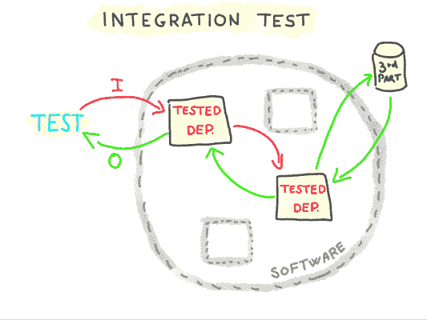
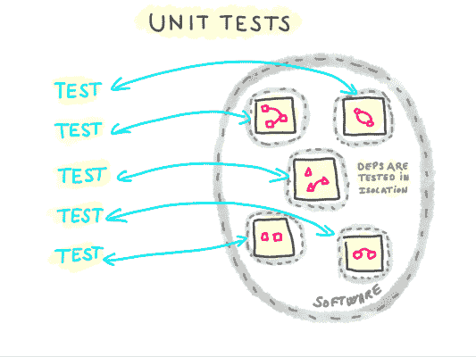
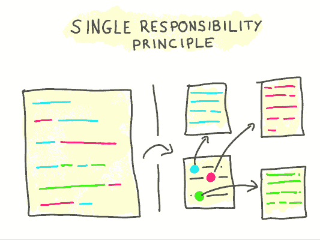
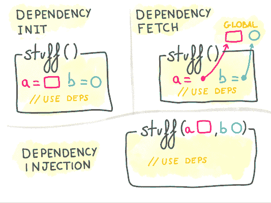
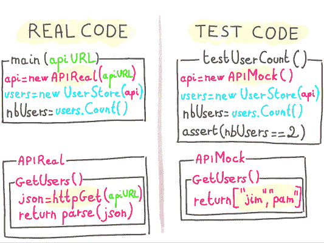
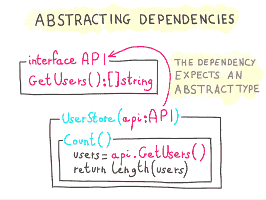

# 编写可测试、可维护、可用的代码

> 原文：<https://www.algolia.com/blog/engineering/writing-usable-code/>

写代码很难。写高质量的代码，更难。

对于一个依赖团队工作的软件公司来说，或者对于跨越多年的代码项目来说，一个经常相关的代码质量度量标准是它的可维护性(可修复、可修改)和可扩展性(可重用、可组合)；换句话说，从开发人员的角度来看，代码是否可用。

让我们来看看设计可用代码的方法。我们将看到可测试性和松散耦合技术如何使我们的代码更易于维护。我们将介绍使我们的代码可组合和(可重用)的方法。

## 可测性

测试代码是指对其进行受控输入，以验证其产生预期的输出，并表现出预期的行为。

测试代码有很多方法；我们将关注集成测试和单元测试。

我们将会看到这些类型的测试在验证我们的代码在常规和 **边缘情况** (即在可能发生的事情的边缘的情况)下的行为时是如何互补的

### 集成测试

集成测试是孤立地测试软件 的 **部分，将它们暴露给真实的输入，并使用** **真实的 I/O 系统** 。

检查软件的 **部分在暴露于真实 I/O 系统时是否如预期的那样运行** 。集成测试用于常规用例(所谓的“快乐路径”)， **，因为在真实的 I/O 系统中通常很难诱发边缘情况行为** (数据库连接出错、数据损坏、文件系统故障、网络超时等)。

### 单元测试

这是隔离测试软件 的 **部分，控制它们的输入，以及** **使用虚拟 I/O 系统和依赖关系** 。当暴露于输入和依赖关系的常规情况 **以及边缘情况** (慢依赖关系、损坏的依赖关系、出错的依赖关系、无效输入等)时，它验证它们的输出和行为。).

**我们所说的“依赖”是指一段代码不拥有但使用** 的所有东西(通常是同一软件的其他部分，如服务、模块等)。)

**单元测试** 一段常规以及边缘情况下的代码需要 **对其使用的依赖关系**(API 客户端、数据库连接、邮件程序、日志程序、授权层、路由器等)进行精细控制。).

简而言之， **单元测试** 检测发生在边缘案例上的问题(即，在可能发生的事情的边缘)，这是集成和端到端测试所不能做到的。

( [)重新解读马丁·福勒的单位测试图](https://martinfowler.com/bliki/UnitTest.html) )

当然，有时候， [我们的软件在野外接触到的案例太多了](https://blog.algolia.com/tech-startup-dilemmas-resilient-deployment-vs-exhaustive-tests/) 无法完全测试；但是即使这样，单元测试仍然是一个有效的工具，以确保被识别的边缘情况得到正确的处理。

## 检测所有的东西，以及如何到达那里

为了对我们的代码进行单元和集成测试，我们需要这样的能力:

*   **独立运行部分软件**
    *   我们将通过将每个关注点隔离在其自己的范围内来做到这一点
*   **归纳我们代码中的边缘情况**
    *   我们将通过控制依赖行为，使用依赖模仿来做到这一点
*   **用虚拟依赖替换依赖的实现**
    *   我们将通过注入模拟依赖关系来实现这一点

### 单一责任原则:隔离软件的各个部分，让它们独立运行

通常，一个软件不止做一件事，甚至一个单独的特性也可能依赖于其他几个特性。

然而我们想要隔离软件的特性，因为一次测试一个单独的特性:

1.  使测试的设置更容易
2.  使我们需要测试所有情况变得更加明显，而
3.  帮助查明测试失败的原因

为了达到期望的隔离级别，我们将 [**单一责任原则**](https://en.wikipedia.org/wiki/Single_responsibility_principle) (SRP)应用到我们的代码中，声明我们软件的每个部分都应该 **处理一个单一关注点** 。

关注的范围与软件相关；例如，在大多数发送电子邮件的软件中，邮件服务是一个单一的职责，将电子邮件发送到 SMTP。但是在电子邮件平台的代码中，邮件发送者可能跨越许多关注点(SMTP、模板、安全性、权限、速率限制等)

既然我们有了与清晰关注点的依赖关系，让我们看看如何在代码中自适应地选择和初始化它们。

### 

一段代码获取其依赖项的传统方式是自己构建或获取它们；例如，负责在 JSON API 上查询用户的服务构建自己的 API 客户端，或者从全局单例中获取它。

将初始化的依赖关系传递给一段代码，而不是让它构建或获取它们 让我们能够控制依赖关系如何初始化。

代码失去了对其依赖项的控制，并期望接收完全初始化的依赖项。

这种模式被称为 [【控制反转】(IoC)，或者“依赖注入”(DI)](https://martinfowler.com/articles/injection.html) 。

这本身是一个强有力的原则，但是当谈到可测试性时，它需要一个完全不同的维度，我们将在下一节中看到。

### 用虚拟依赖替换依赖的实现

我们看到注入依赖项是一种在使用它们的代码之外控制它们的初始化(进而控制它们的行为)的方法。

继续我们之前的例子，一个依赖于 JSON API 客户端的例子，我们如何在边缘情况下(响应缓慢、超时、JSON 中断、响应无效等等)使用这个 API 测试我们的代码？

我们可以操纵 API 客户端，人为地增加它的延迟，破坏服务器返回的 JSON。然而，这也会给实际的 API 客户端添加大量的“测试”代码，有可能成为产品使用中的一个问题。

为了解决这个问题，我们可以一起使用 API 客户端的另一个实现，能够 **模拟常规和边缘情况:模拟实现** 。

模仿依赖是一种完全控制它们暴露给被测试代码的行为的方法，用更少的努力模拟各种边缘情况。

一个 mock 在外表上看起来和真实的东西一模一样(公开了相同的方法)，但实际上是中空的，并且只会产生测试用例所需的输出(正常输出、缓慢输出、错误等)。)

对于一段代码来说，接受一个模仿而不是真实的东西， **它不应该期望被注入一个具体的类型，而是用一个抽象来表示依赖** 。

这种抽象将关注依赖能够做什么(它的方法的签名)，而不是它是如何实现的。

为了在支持它们的语言中实现这一点，我们通常使用接口。

接口抽象了代码中的实现，因此一个实现可以被遵循相同接口的另一个实现所替代。

注意:我们使用术语 **接口** 作为它的广义理解，但是不支持 API 级接口或类型的语言仍然可以依靠 [鸭类型](https://en.wikipedia.org/wiki/Duck_typing) 来应用这个原则。

## 可用性

> 在软件可以重用之前，它首先必须是可用的–拉尔夫·约翰逊  —编程智慧(@ code Wisdom)[2020 年 2 月 17 日，推特上](https://twitter.com/CodeWisdom/status/1229465545315147782?ref_src=twsrc%5Etfw)

好了，现在我们可以测试了。我们如何使我们的代码可用？

重申一下，我们所说的代码可用性是指:

*   **可维护性** 轻松修改或修复代码的能力
*   **可组合性** (或可重用性)，通过轻松组合代码的各个部分来扩展代码的能力

事实证明，我们用来编写可测试代码的那些步骤实际上同时也使它变得更加可用。

### 可维护性

可测试性对于可维护性来说是一个巨大的胜利，因为通过测试，我们可以验证所有被测试的案例在代码库更新后仍然工作。

**单一责任原则** 确保:  –代码是:以精确映射我们的应用程序的关注点的方式进行分区；

*   每个关注点都是清晰可辨的，这增加了代码库的可发现性，在维护过程中也很有帮助
*   SRP 让我们的代码 [高内聚低耦合](https://en.wikipedia.org/wiki/Cohesion_(computer_science)) 。

**依赖注入** 确保代码每一部分的 API 都明确了它所需要的依赖。软件的依赖图通过代码的 API 变得可见，这也有助于维护。

依靠抽象类型 (接口)来模仿我们代码中的依赖关系会产生更干净、耦合度更低的 API。与 SRP 相结合，抽象依赖隐藏了实现细节，否则这些细节会通过具体类型泄露，这正是我们想要的，因为:

*   遵循 [接口隔离原则](https://en.wikipedia.org/wiki/Interface_segregation_principle) 使我们的软件的耦合性变松
*   它遵循德米特 的 [定律，说明 **在没有关于其结构的先验知识的情况下提供可用的信息降低了相互作用部分的耦合**](https://en.wikipedia.org/wiki/Law_of_Demeter)

**这些原则导致的松散耦合** 限制了当需求变化时需要重构的代码数量，从而简化了可维护性。

### 可组合性、(再)可用性

**可组合性:** SRP 和 DI 结合使用产生了 **一个软件，它的各个部分是可组合的** ，因为特性可以彼此独立地使用，这使得通过利用现有代码在软件中构建新特性变得更加容易。

**可重用性:** 我们软件各部分的松散耦合(见上文)使得我们的代码具有可重用性。

## 模仿“不可模仿”的依赖关系

有些依赖可能不容易被模仿。这有很多原因；以下是其中一些，以及可能的解决方案。

### 依赖关系暴露了一个“开放”的 API，太宽泛而无法抽象

你可能会处理期望无限变化的输入的方法，这可能导致无限不同的输出。例如，公开 `GetTodos(additionalSqlFilter: string)` 方法的依赖项。

现在想象测试 `additionalSqlFilter` 所有可能的值(剧透:不能，因为依赖关系暴露了一个开放的 API: SQL)。

为了解决这个问题，我们可以 **将依赖** 封装在一个抽象中，以 **公开一个带有有限数量方法** 的封闭 API。

继续我们的例子， **我们将只暴露必要的预定用例** 用于数据获取；比如 `GetAllTodos(done: boolean)` 和 `GetLateTodos(done: boolean)` 。

这种模式被称为 [数据访问层](https://en.wikipedia.org/wiki/Data_access_layer) ，这是一种以可测试的方式抽象数据库和其他可查询 API 交互的好方法。

### 依赖性暴露了许多不同的关注点，使得抽象变得困难

通常情况下，第三方依赖者会提供一个 API，为不同的用途提供不同的关注点。

在你的代码中使用它们作为具体类型会使测试变得复杂，因为它们比严格必要的更具欺骗性，因为被测试的代码片段很可能不会立刻使用依赖关系所暴露的所有问题。

SRP 告诉我们解决方案是让每个依赖集中在一个领域；但是，如何在第三方依赖上实现这一点，因为我们不拥有 API？

让我们以 Algolia API 客户端为例。如果您的软件使用的 API 客户端只是它的“搜索”功能，您可能希望将客户端抽象在一个接口之后，只暴露一个“搜索”方法；这样做会有一些好的副作用:

*   测试将保证被测代码永远不会使用 API 客户端上除“搜索”方法之外的其他方法(只要我们不愿意更新接口),从而减少所需的测试设置
*   很明显，我们使用 API 客户端只是为了搜索，如果只是在界面的命名上(像 SearchClient 这样的东西适合我们的用例)

如果反过来我们需要在同一个软件中添加索引操作，很可能应用程序的“搜索”和“索引”关注点会被用在不同的上下文中。我们可能希望他们将同一个 Algolia API 客户端包装在另一个只包含相关“索引”操作方法的接口 IndexerClient 下。

这个原理叫做 [界面分离原理](https://en.wikipedia.org/wiki/Interface_segregation_principle) 。

## 这不是固若金汤吗？

是的！有些 [实心](https://scotch.io/bar-talk/s-o-l-i-d-the-first-five-principles-of-object-oriented-design) 的原理与本文介绍的相同。

固然把这些原则的重点放在了 **面向对象编程**(OOP)——例如 **开闭原则** 。

我相信人们也可以接受 SRP、DI、抽象和嘲讽(或者它们的子集),不管这种语言是否是面向对象的。

同样，

## 是关于控制代码的

软件开发应该总是包括为可测试性设计代码，以迫使我们精细地控制它的行为。事实证明，这正是我们首先需要使我们的代码(可重用)可用的东西。

如果你对以上任何一个话题有任何疑问或观察，请随时 ping 我:我是 Twitter 上的 [@jeromeschneider](https://twitter.com/jeromeschneider) 。