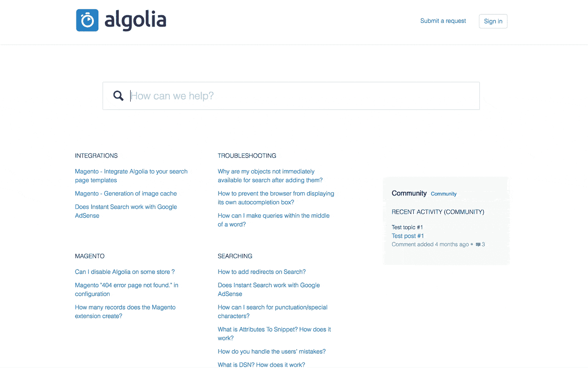

# Zendesk + Algolia:愉悦客户的发现体验- Algolia 博客

> 原文：<https://www.algolia.com/blog/product/zendesk-guide-search/>

Forrester Research 告诉我们，76%的消费者使用自助服务帮助中心来寻找问题的答案。你的支持团队花费数小时来创造这些答案——如果找不到这些答案，所有的工作又有什么用呢？在 Algolia，我们致力于加快发现和改善客户体验。

不到两年前，我们发布了 Zendesk 的[扩展，这是我们第一次与帮助中心解决方案集成。今天，我们很荣幸成为 Zendesk 官方指南和 Zendesk 指南企业合作伙伴。](https://community.algolia.com/zendesk/)

### 打造更好的客户体验

Zendesk 和 Algolia 有一个共同的目标，即让企业变得更加可靠、灵活和可扩展，最重要的是，让它们能够建立一流的客户体验。我们的伙伴关系使目标很容易实现。

在寻求支持时感到沮丧和浪费时间的概念正迅速变得过时。为了提供出色的客户体验，我们必须达到或超过谷歌和亚马逊等大公司之前设定的用户预期。搜索是网上发现的主要方式:让它变得强大对于减少用户寻找正确答案的摩擦至关重要。

以下是 Algolia 为您的 Zendesk 帮助中心带来的内容:

*   **即时回答(即使是输入错误的问题)。**您可以将客户引向正确的内容，结果会随着每次击键而更新，而不考虑打字错误。高级搜索减少了支持票证的数量，同时提升了客户体验。

*   **联合搜索。**这不仅仅是支持中心的问题。打破内容孤岛，让您的客户能够在您的所有内容中找到答案。
*   **分析学&见解。**真正了解用户的意图是改进支持中心内容的关键。大多数公司基于客户的重复请求来构建他们的支持中心内容。这是区分哪些内容与用户最相关的好方法，但这里有一个更好的方法:一个强大的分析工具。查看您的搜索分析将有助于根据您的客户正在搜索的内容(包括没有返回结果的查询)对新的帮助中心内容进行优先排序。

【T2

*   **完全可定制。**我们的代码是[开源](https://github.com/algolia/algoliasearch-zendesk)。让它成为你自己的，设计最适合你品牌的体验。

## 赢在客户支持的第一线

对于在 [Handshake](https://www.joinhandshake.com/) 的 Derek Daniels 来说，自助知识库是帮助他们的三个不同客户群快速、轻松地找到正确信息的必备工具。在寻找将客户与内容联系起来以解决他们的问题的解决方案时，Handshake 团队发现了用于 Zendesk Guide 集成的 Algolia。自从启用集成后，Derek 发现浏览类别页面的数量显著下降，“因为人们开始使用搜索来找到他们需要的文章来解决他们的问题，而不是漫无目的地在帮助中心闲逛。”

## *“Algolia 增强了 Handshake 的帮助中心搜索，为 Handshake 团队提供了更好的用户搜索分析，并通过展示更多相关文章来帮助客户。”*

我们的客户看到的结果包括:基本支持问题减少了 27%,提交支持的票证数量减少了，票证解决时间减少了，联合多语言搜索得到了改进，所有查询的相关性增强了。

## 入门

对于 Algolia 和 Zendesk 客户，我们将其简化为一个简单的 3 步流程；详情[此处](https://www.algolia.com/integrations/zendesk/)。

如果您还没有试用过我们，请注册使用 [Zendesk](https://www.zendesk.com/register/#getstarted) 和 [Algolia](https://www.algolia.com/users/sign_up) 进行免费试用。我们承诺为您和您的客户改善您的帮助中心体验。